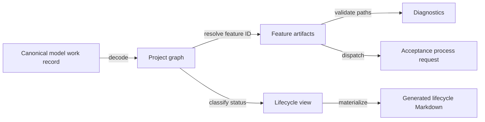

# Design spec 0049: canonical work lifecycle

Status: draft pending operator review

Date: 2026-08-02

Design-Lens-Version: open-semantic-system-v1

## Problem

Work lifecycle is authored in several independent places:

- `model/work/*.json` records work status, phase, plan path, and completion evidence;
- plan directory names and headings repeat `active`, `completed`, or `superseded`;
- plan `Status:` prose repeats current execution or review state;
- acceptance programs repeat lifecycle-dependent plan paths; and
- `CONTRIBUTING.md` and design spec 0005 prescribe only the active path and do not define the completion transition.

These copies have drifted. The canonical model marks features 0017, 0018, 0019,
0031, and 0046 complete, while plan headings, status prose, or acceptance-program
paths still describe earlier lifecycle states. The project model already treats
canonical JSON as authored truth and generated Markdown as projection. Work
lifecycle must follow the same rule.

The important claim is:

> One decoded canonical work record determines a feature's lifecycle and stable
> artifacts; every lifecycle view and acceptance lookup is a deterministic,
> checked projection of that record.

## Felt journey

An operator completes one feature by changing its canonical work record from
`in_progress` to `complete` and recording completion evidence. The operator does
not move the plan or edit its heading, current-status prose, acceptance program,
or navigation links.

`semproj validate` accepts the one coherent feature record. `semproj generate`
then moves the feature from the active section to the completed section of the
generated lifecycle view. `just accept <id>-<slug>` resolves the same stable
design spec, plan, model record, and acceptance program by feature ID and runs
the feature gate.

A missing artifact, duplicate feature ID, invalid status, lifecycle-dependent
plan path, or terminal state without completion evidence fails with a typed,
source-located diagnostic. No derived view is presented as canonical state.

## Open semantic system design lens

### Boundary and warranted state

The feature boundary is the repository-local work-lifecycle module inside the
TypeScript/Effect project-model tooling.

It owns:

- the work-status vocabulary and lifecycle classification;
- the decoded feature metadata attached to canonical `work_item` entities;
- stable resolution from feature ID to design spec, plan, model source, and
  acceptance program;
- structural coherence diagnostics; and
- deterministic lifecycle projections.

Warranted state is a successfully decoded and validated `ProjectGraph` plus
filesystem observations made for the same repository root. Markdown prose,
directory names, generated views, Git history, agent reports, and Control Room
screens are not lifecycle authority.

The following state remains environmental:

- who is authorized to edit the canonical model;
- whether a claimed commit, review, test, deployment, or external observation
  actually occurred;
- Git branch protection and remote merge policy; and
- filesystem and process behavior outside the returned Effect observations.

### Semantic inputs

| Input                       | Category                                | Authority and limits                                                                                     |
| --------------------------- | --------------------------------------- | -------------------------------------------------------------------------------------------------------- |
| `model/**/*.json` document  | Authored assertion decoded at runtime   | Canonical only after schema and repository validation; does not establish semantic completion by itself. |
| `validate` command          | Query                                   | Requests diagnostics; never changes canonical state.                                                     |
| `generate` command          | Command                                 | Requests deterministic projection writes; does not change lifecycle authority.                           |
| `generate --check` command  | Query                                   | Compares expected and observed projection bytes; performs no write.                                      |
| feature ID                  | Query input                             | Selects exactly one canonical feature record or returns a typed rejection.                               |
| repository path observation | Runtime observation                     | Establishes local existence/type for this checkout only.                                                 |
| changed Git paths           | Runtime observation                     | Scopes feature-loop execution; does not establish acceptance or completion.                              |
| completion evidence fields  | Authored evidence references/assertions | Preserve their declared categories; they are not converted into proof.                                   |

Feature-managed `work_item` entities declare these canonical attributes:

```text
feature_id        = <four digits>-<slug>
design_spec       = design-specs/<feature_id>.md
plan              = plans/<feature_id>.md
acceptance_program = scripts/accept/<feature_id>.ts
completion        = absent for nonterminal work; required for complete work
```

The model entity ID remains a semantic work identity such as
`work.control-room-reconstruction`; it is not replaced by the numeric feature
identity.

### Semantic outputs

| Output                              | Kind                                            | Canonical status                                              |
| ----------------------------------- | ----------------------------------------------- | ------------------------------------------------------------- |
| Decoded feature record              | Returned observation                            | Projection of one canonical work entity.                      |
| Validation issue                    | Diagnostic                                      | Evidence of one observed structural inconsistency.            |
| Resolved feature artifacts          | Returned observation                            | Deterministic projection used by feature dispatch.            |
| `generated/08-feature-lifecycle.md` | Materialized view                               | Generated, noncanonical, and linked to model sources.         |
| Feature acceptance process launch   | Effect request interpreted by the command layer | Runtime validation only for the invoked program and checkout. |
| Exit status and captured output     | Runtime observation                             | Does not prove semantic validity or external policy.          |

No plan file is generated. Its execution ledger remains authored mutable state at
a stable path. Its first heading is lifecycle-neutral:

```text
# Plan <feature_id>: <title>
```

Current lifecycle labels appear only in canonical model data and generated
projections.

### Effect protocols and uncertainty

Resolution fails closed for:

- an unknown or duplicate feature ID;
- a missing, malformed, or non-`work_item` feature record;
- a status outside the work-status vocabulary;
- a lifecycle-dependent or mismatched artifact path;
- a missing or non-file artifact;
- a non-executable acceptance program;
- a terminal `complete` record without completion evidence; or
- a plan heading that embeds an obsolete lifecycle label.

Validation returns all deterministic diagnostics it can collect for the decoded
graph. An undecodable canonical document prevents a warranted project graph and
therefore prevents feature resolution and generation.

Projection generation has no retry loop. `--check` is read-only. Write mode
requests bounded filesystem writes through the existing Effect filesystem
layer. An I/O failure returns a typed error and does not authorize changing the
canonical model to match a partial projection.

Acceptance dispatch launches only the resolved checked-in program with an argv
array. It never constructs shell input. Timeout, interruption, nonzero exit, or
unknown process outcome is reported as runtime evidence, not completion.

### Components and orthogonal structures



Legend: solid arrows are deterministic derivations or explicit effect requests;
only the model work record is lifecycle authority.

The work-lifecycle module is one deep module at the project-model seam. Its
small interface hides status decoding, feature indexing, artifact-path rules,
completion checks, and lifecycle-view ordering. The existing loader remains the
canonical JSON decoder. The command layer remains the interpreter of filesystem
and process effects.

The following structures stay distinct:

- **authority:** authored model records;
- **work dependency:** `blocks` and `requires` relations;
- **derivation:** feature resolution and generated lifecycle views;
- **observation:** filesystem, Git, process, test, and review results;
- **execution ledger:** authored plan history;
- **contract lifecycle:** design-spec status and semantic diffs;
- **work lifecycle:** the canonical `work_item.status`; and
- **evidence state:** typed completion and review evidence.

No message cycle exists in resolution or generation. Acceptance programs may
contain their own bounded process graphs; this feature does not redefine them.

### Bounded autonomy and resources

- One invocation scans the finite checked-in model and resolved feature
  artifacts under one repository root.
- Feature resolution returns at most one record and never searches the network.
- Lifecycle generation emits one deterministic document ordered by feature ID.
- Validation accumulates finite diagnostics; it does not repair files.
- No watcher, daemon, retry queue, background task, or provider mutation is
  introduced.
- Existing command timeouts and process custody remain unchanged.
- Migration is one clean cutover. No aliases, duplicate plan paths, or deprecated
  resolver remain afterward.

### Evidence, assumptions, and unsupported claims

| Claim                                                                    | Evidence category and gate                                                  |
| ------------------------------------------------------------------------ | --------------------------------------------------------------------------- |
| Status and feature metadata decode to one typed record                   | Type/Schema boundary plus focused tests.                                    |
| Known historical drift is rejected                                       | Example tests over fixtures derived from 0017/0018/0019/0031/0046 failures. |
| Stable resolution is deterministic and duplicate-safe                    | Focused example and property tests.                                         |
| Generated lifecycle bytes are stable                                     | Bun/Node parity observation and `semproj generate --check`.                 |
| Acceptance dispatch uses the resolved program without shell construction | Static inspection, focused command tests, and runtime observation.          |
| Full repository remains compatible after migration                       | `just check` and exact feature acceptance runtime observations.             |
| Contract and implementation match                                        | Independent exact-head review assertion.                                    |

Assumptions:

- canonical model authors state work and evidence truthfully;
- the repository root and filesystem observations refer to one coherent
  checkout during an invocation;
- Git reports the requested changed paths and executable bits correctly; and
- Effect filesystem/process adapters preserve their documented semantics.

Unsupported claims:

- that a `complete` status proves semantic correctness, deployment, merge,
  review independence, or absence of defects;
- that local filesystem existence establishes remote availability;
- that generated navigation replaces the authored execution ledger;
- that one scalar status captures contract, work, review, evidence, deployment,
  and question lifecycles; or
- that lifecycle validation can judge the quality or truth of prose evidence.

## Deep-module contract

### Work status

Feature-managed work uses exactly these statuses:

| Status        | Meaning                                                                      | Lifecycle projection |
| ------------- | ---------------------------------------------------------------------------- | -------------------- |
| `planned`     | Contract or prerequisites are not ready for execution.                       | active               |
| `ready`       | Frozen contract and prerequisites permit execution.                          | active               |
| `in_progress` | Bounded execution is underway.                                               | active               |
| `blocked`     | Execution is paused on an explicit unresolved dependency.                    | active               |
| `complete`    | The bounded feature journey is accepted and completion evidence is recorded. | completed            |
| `superseded`  | A named replacement or invalidation ends this work item.                     | superseded           |

`accepted` is a decision/evidence term, not a work status.
`resolved_negative` is a question outcome, not a work status. A negatively
resolved experiment is `complete` work with an explicit negative result.

### Feature record

A feature-managed work item has one `feature_id`, `design_spec`, `plan`, and
`acceptance_program`. All four use the same `<feature_id>`. Paths are stable and
contain no lifecycle directory segment.

Terminal `complete` work has a `completion` object with exact evidence
references. `superseded` work names its replacement or invalidation record.
These requirements are structural; the validator does not promote the evidence
category of their contents.

### Module interface

The semantic interface is:

```text
resolveFeature(ProjectGraph, FeatureId) -> FeatureArtifacts | FeatureDiagnostic
classifyWorkStatus(WorkStatus) -> active | completed | superseded
validateFeatureArtifacts(ProjectGraph, RepositoryRoot) -> FeatureDiagnostic[]
renderFeatureLifecycle(ProjectGraph) -> deterministic Markdown bytes
```

`FeatureArtifacts` exposes the canonical model source, design spec, plan, and
acceptance program. Callers do not reconstruct paths or interpret statuses.
The exact TypeScript representation and internal module split remain
implementation freedom.

### Invariants

1. **WL1 — one authority:** one canonical work entity owns each feature ID.
2. **WL2 — stable artifacts:** lifecycle changes never change feature artifact
   paths.
3. **WL3 — typed axes:** work, contract, review/evidence, question, and deployment
   statuses are never collapsed into one field.
4. **WL4 — fail-closed resolution:** missing, duplicate, malformed, or incoherent
   feature metadata cannot dispatch acceptance.
5. **WL5 — neutral authored plan:** plan heading and path contain identity, not
   current lifecycle.
6. **WL6 — derived navigation:** lifecycle indexes and Control Room status derive
   from canonical work records and retain source provenance.
7. **WL7 — evidence honesty:** terminal status requires evidence references but
   does not upgrade their evidence category.
8. **WL8 — clean cutover:** no lifecycle-path alias or caller-side path
   reconstruction remains after migration.

## Oracle-first counterexamples

The implementation must first demonstrate failures for:

1. canonical `complete` work whose plan still resolves under
   `plans/active/`;
2. completed plan headings that still say `Active plan`;
3. current status prose that contradicts canonical completion evidence;
4. acceptance artifact lists that hardcode `plans/active/` or
   `plans/completed/`;
5. a feature plan with no canonical feature-managed work row;
6. two work entities claiming the same feature ID;
7. an invalid or cross-axis work status such as `accepted`;
8. `complete` work without completion evidence;
9. mismatched IDs or slugs among model, design, plan, and acceptance paths;
10. a missing or non-executable acceptance program;
11. nondeterministic lifecycle ordering under permuted model-file order; and
12. a generated lifecycle view edited by hand.

Positive oracles cover one active, one completed, one superseded, and one
negatively completed feature; stable plan resolution before and after the status
transition; Bun/Node projection parity; and exact source links in generated
output.

## Acceptance

The feature is accepted only when:

1. `model/work` is the sole work-lifecycle authority;
2. every checked-in feature plan has one canonical feature-managed work record;
3. every plan has one stable `plans/<feature_id>.md` path and lifecycle-neutral
   heading;
4. no executable source or current artifact metadata reconstructs
   `plans/active/`, `plans/completed/`, or `plans/superseded/`; historical
   ledger entries and named counterexample fixtures remain truthful;
5. the active/completed/superseded plan directories no longer exist;
6. work status, phase, feature metadata, terminal evidence, and artifact
   coherence are runtime-decoded and validated;
7. feature contract selection and acceptance dispatch resolve artifacts from the
   canonical model by feature ID;
8. the generated lifecycle view is deterministic, source-linked, and checked for
   drift;
9. known-bad fixtures for the observed 0017/0018/0019/0031/0046 drift fail for
   their intended reasons before the correction;
10. focused project-model and feature-contract tests pass under Bun and Node
    where runtime parity is claimed;
11. `bun run semproj -- validate` and `bun run semproj -- generate --check`
    succeed;
12. `just accept 0049-canonical-work-lifecycle` succeeds on the exact head;
13. `just check` succeeds on the exact head; and
14. independent review reports no unresolved Critical or Important findings.

The acceptance program must report exact commands, counts, revisions, and
unrun checks. Tests and validation are evidence over their observed scope, not
proof of lifecycle truth.

## Kill or redesign criteria

Stop or recut the feature if:

- one numeric feature legitimately owns multiple independent work entities such
  that one canonical feature record cannot resolve artifacts without hiding
  semantic distinctions;
- stable plan paths cannot preserve required external references and a checked
  redirect mechanism is unavailable;
- terminal evidence cannot be modeled without collapsing evidence categories;
- the project graph cannot validate repository artifacts without importing
  process or Git authority into the pure graph core; or
- the migration requires compatibility aliases or dual canonical sources.

If one work status cannot represent execution without overloading review,
contract, question, or deployment state, add an orthogonal typed field. Do not
expand the status string into prose.

## Non-goals

- Generate or rewrite plan ledger prose.
- Infer completion from tests, commits, reviews, merges, or deployments.
- Make plan frontmatter a second lifecycle authority.
- Replace design-spec contract status or semantic-diff handling.
- Redefine evidence categories, acceptance semantics, branch policy, or merge
  authority.
- Add a lifecycle mutation daemon, watcher, provider integration, or network
  service.
- Repair unrelated canonical model drift.
- Preserve old lifecycle-dependent plan paths through aliases or compatibility
  shims.

## Semantic diff

This feature changes feature lifecycle custody:

```text
Before: model status + lifecycle directory + plan heading/status + caller literals
After:  canonical model status -> checked resolution + generated projections
```

Plan identity becomes path-stable. Active/completed/superseded become derived
classifications rather than authored directory structure. Acceptance programs
receive resolved canonical artifacts rather than reconstructing paths.

Unchanged:

- design specs remain frozen problem contracts;
- plans remain mutable authored execution ledgers;
- canonical model JSON remains the federated graph source;
- acceptance programs remain executable runtime-validation artifacts;
- generated Markdown and the Control Room remain projections;
- evidence categories and unsupported claims retain their meanings; and
- operator authority remains required for external effects and truth-bearing
  completion assertions.
