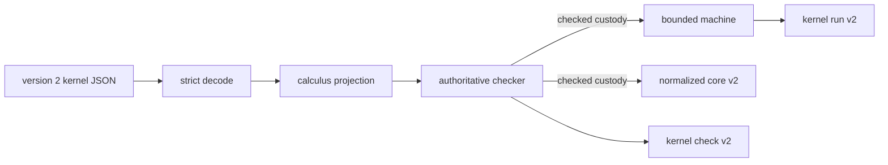

# Design spec 0051: kernel finite sums and case

Status: frozen for implementation

Date: 2026-08-02

Depends-On-Feature-IDs: 0018-minimal-kernel-calculus, 0019-normalized-core-format, 0020-agent-facing-kernel-json, 0022-kernel-reference-interpreter

Design-Lens-Version: open-semantic-system-v1

## Problem

The accepted kernel separates values from computations and supports products,
functions, effects, and one-shot handlers. It cannot represent a binary choice.
Messages and domain outcomes are described elsewhere as sum values, but the
executable language cannot type, encode, inspect, or run one.

Adding constructors only to the TypeScript AST would create a second language
outside the normalized artifact, agent-facing JSON, and reference interpreter.
Adding variants to the closed version 1 formats without a version change would
silently change their semantic identity. This feature therefore adds one small
semantic capability and cuts the active kernel pipeline over to explicit
version 2 formats.

## Felt journey

An agent submits one canonical version 2 kernel document. Its program injects
an integer into the right side of `Unit + Int`, then performs an exhaustive
case. The checker records the two branch binders and their quantitative use.
The reference interpreter selects the right branch and returns the integer.
Bun and genuine Node emit the same canonical checked and run observations.

Changing the selected branch, duplicating a branch payload, mismatching branch
result types, or presenting version 1 to the active decoder produces the
specific static or representation outcome frozen below.

## Open semantic system design lens

### Boundary and warranted state

Feature 0051 changes the project-owned kernel language family and all canonical
representations that claim to encode that family:

- the immutable in-process calculus AST and checked-program custody;
- the bounded abstract machine and direct normalized reports;
- `semantic.kernel-json` and `semantic.kernel-check` version 2;
- `semantic.normalized-core` version 2;
- `semantic.kernel-run` version 2; and
- the active JSON Schema artifact for those version 2 documents.

The checker remains the sole authority for typing and usage judgments. The
machine still accepts only privately custodied checked programs. JSON decoding
establishes shape and bounds, not semantic validity. Normalization derives an
artifact and identities from a checked program; it does not create a judgment.
The reference interpreter composes those owners and adds no alternate
semantics.

Version 1 design documents and the checked-in
`spec/kernel-json/kernel-json-v1.schema.json` remain historical evidence. The
v1 schema bytes, whose recorded SHA-256 is
`43760534c0c08a3ab9626f624cd1789c3803002d26f3bb73a6c048b57926eee8`, must not
change. Active public decoders accept version 2 only. They reject version 1
rather than maintaining an unreviewed compatibility interpreter.

### Semantic inputs

| Input                                   | Category                 | Authority and limits                                                                                          |
| --------------------------------------- | ------------------------ | ------------------------------------------------------------------------------------------------------------- |
| direct immutable value/computation term | Command payload          | Uses the version 2 calculus constructors. A TypeScript object does not become checked authority by shape.     |
| operation signature                     | Authored declaration     | Supplies operation argument and result types. Sum types can occur recursively in either position.             |
| version 2 kernel JSON bytes/value       | Untrusted representation | Strict bounded decoder input. Exact markers, fields, tags, and bounds are checked before semantic projection. |
| privately custodied checked program     | Authenticated command    | The only input the machine can execute or normalization can emit.                                             |
| evaluation bounds                       | Configuration            | Positive safe-integer fuel and trace limits; no termination claim.                                            |
| emission metadata                       | Authored artifact input  | Retains the accepted normalized-core ownership and assumption rules.                                          |

A case scrutinee is a value. A computation that produces a sum must first be
sequenced through the existing `let` rule; this keeps CBPV value/computation
separation explicit.

### Semantic outputs

The checker returns the existing typed accepted or rejected result. Accepted
case judgments retain three premises in order: scrutinee, left branch, right
branch. Each branch context records its payload binder at index zero.

The machine returns the existing returned, suspended, exhausted, or
runtime-rejected outcome. A returned sum is observable recursively as:

```text
inject-left(value)
inject-right(value)
```

Checked, normalized-core, and run observations carry the version 2 kernel
identity. Canonical bytes and identities change when any tag, branch, absent-side
type annotation, marker, or nested value changes.

### Effect protocols and uncertainty

Sum introduction is an inert value operation. Case inspects one already formed
value and selects exactly one branch. It requests no external effect and
creates no background work.

Branch computation effects are possible-effect sets. The case effect row is the
set union of both branch rows because either branch can be selected. Branches
must return the same computation type, including the return grade or function
shape.

Quantitative usage remains an inferred upper bound over `0 <= 1 <= omega`.
Feature 0051 adds the least-upper-bound operation:

```text
join(0, q)       = q
join(1, 1)       = 1
join(1, omega)   = omega
join(omega, q)   = omega
```

The operation is commutative; usage-vector join is pointwise and requires equal
lengths.

Assume:

```text
Sigma ; Gamma |-v V : A + B                    ! uV
Sigma ; A,Gamma |-c ML : C ; epsilonL           ! qL,uL
Sigma ; B,Gamma |-c MR : C ; epsilonR           ! qR,uR
```

Here `qL` and `qR` are the index-zero branch-payload uses, while `uL` and `uR`
are the remaining ordinary context uses. Let `q = join(qL, qR)`. Then:

```text
Sigma ; Gamma |-c case(V, ML, MR) : C ; epsilonL union epsilonR
  ! q * uV + join(uL, uR)
```

Let `rV`, `rL`, and `rR` be the resumption-usage vectors of the scrutinee and
the two branches. A case branch binds one ordinary value entry and no
resumption binder, so all three vectors already have the resumption-context
length and none is sliced. The case resumption usage is:

```text
q * rV + join(rL, rR)
```

The branch contribution is a pointwise join because the branches are mutually
exclusive. The scaled scrutinee contribution is sequential with the selected
branch and is therefore added. One affine resumption may appear once in each
branch, but an affine resumption used by both the scrutinee and a selected
branch must be rejected when the formula yields `omega`.

Both branch payload judgment entries record the inferred derived usage limit
`q`; it is not an authored limit and creates no additional acceptance check. The
checker rejects unequal branch computation types before it returns the case
judgment.

There is no `atLeastOnce` floor in the case rule. The scrutinee is a pure value,
not a computation. When both branch payload uses are zero, `q = 0` and neither
ordinary nor resumption use captured only by the scrutinee is charged to the
case result. A focused oracle must retain this zero-use outcome. Existing `let`
sequencing retains its floor, so a computed scrutinee still runs once. This
rule does not prove grade-zero observational erasure or permit the machine to
skip constructor inspection.

### Components and orthogonal structures



The representation graph, checking derivation, runtime transition graph, and
artifact-identity graph remain distinct. One version marker aligns them; it
does not collapse their evidence categories.

Case adds no continuation frame. The machine evaluates the scrutinee value,
observes its injection tag, prepends the payload to the selected branch
environment at de Bruijn index zero, and continues with that branch. Trace rules
are exactly `computation.case-left` and `computation.case-right`.

### Bounded autonomy and resources

The exact version 2 raw bounds remain:

```text
maximumBytes=1048576, maximumDepth=128, maximumNodes=524288,
maximumStringBytes=4096, maximumCollectionLength=4096,
maximumOperations=256, maximumOperationClauses=256,
maximumEffectLabels=256
```

The exact version 2 checked-observation envelope bounds remain:

```text
maximumObservationBytes=33554432, maximumObservationNodes=4194304,
maximumObservationCollectionLength=1048576, maximumObservationDepth=128,
maximumObservationStringBytes=4096, maximumLabels=1048576,
maximumTypeNodes=16384, maximumJudgments=16384,
maximumContextEntries=256, maximumDiagnostics=1024
```

Every new sum type, injection, annotation, case, and branch counts through the
same recursive decoder rules. The version 2 bound gate must re-derive the
largest sum type node, the case judgment, both branch-context entries, and the
new diagnostic facts against these named maxima. Retaining only the version 1
arithmetic is not acceptance evidence, even though the numeric public maxima
remain equal.

The existing evaluation fuel and trace bounds remain. One case selection is one
machine transition. Sum runtime values are finite recursive values. This feature
adds no recursion, recursive type, scheduler, cache, network, file, clock,
random, process, or console capability.

### Evidence, assumptions, and unsupported claims

The implementation can provide:

- static rejection and derivation examples;
- runtime examples for both injections and branch selection;
- property tests for type, term, checked-view, canonical, and interpreter
  behavior over bounded generated cases;
- schema and strict-decoder checks;
- canonical identity and Bun/Node parity observations;
- the existing accepted v1 regression suite migrated to active v2 markers; and
- independent exact-head review.

Apache-2.0 `lang-bang` at
`5b8e032bcffefb23a3a153d3f5cea99050e589c1` is independent prior art. Its Lean
core uses `inl`, `inr`, one de Bruijn payload binder per branch, and a shared
branch grade context with outer usage `q * gammaV + gammaN`. It proves selected
substitution, inversion, and canonical-form statements for its own definition.
Feature 0051 adapts the syntax and exclusive-branch accounting technique to this
project's upper-bound checker by using pointwise join. It copies no source.

The implementation assumes the correctness of the existing checker custody,
canonical JSON, SHA-256 implementation, Effect schemas, and JavaScript exact
safe-integer behavior. Tests over this implementation are not proof of
preservation, progress, type soundness, grade-zero erasure, branch-join
principality, termination, or equivalence with `lang-bang`. The upstream
`zero_usage_erasable` statement is incomplete at the cited head and supplies no
proof for this project.

## Deep-module contract

### Version 2 semantic alphabet

Version 2 retains every version 1 type and term and adds:

```text
A ::= ... | A + B

V ::= ...
    | inject-left(V, B)
    | inject-right(A, V)

M ::= ...
    | case(V, ML, MR)
```

The absent-side type annotation makes introduction syntax-directed without
inference metavariables.

Internal TypeScript discriminants and fields are exact:

```text
ValueType:
  { kind: "sum", left, right }

ValueTerm:
  { kind: "inject-left", value, rightType }
  { kind: "inject-right", leftType, value }

ComputationTerm:
  { kind: "case", value, leftBranch, rightBranch }
```

Public constructors are `sumType`, `injectLeft`, `injectRight`, and `caseTerm`.
Runtime value constructors are `runtimeInjectLeft` and
`runtimeInjectRight`.

JSON and normalized-core discriminants and fields are exact snake-case data:

```text
ValueType:
  { "tag": "sum", "left": A, "right": B }

ValueTerm:
  { "tag": "inject-left", "value": V, "right_type": B }
  { "tag": "inject-right", "left_type": A, "value": V }

ComputationTerm:
  {
    "tag": "case",
    "value": V,
    "left_branch": ML,
    "right_branch": MR
  }
```

The checked observation type table adds
`{"tag":"sum","left":TypeIndex,"right":TypeIndex}`. Binder origin kinds add
`case-left-payload` and `case-right-payload`. Direct and run observations use
`{"kind":"inject-left","value":...}` and the corresponding right form.

### Active version markers

The active exact markers are:

```text
kernel family:              semantic.kernel-calculus/0018/v2
semantic.kernel-json:       version 2
semantic.kernel-check:      version 2
semantic.normalized-core:   version 2
semantic.kernel-run:        version 2
machine snapshot format:    kernel-machine-v2
JSON Schema $id:            https://semantic.phibkro.org/spec/kernel-json/kernel-json-v2.schema.json
normalized identity domains:
  semantic.normalized-core/operation/v2
  semantic.normalized-core/assumption/v2
  semantic.normalized-core/source-unit/v2
  semantic.normalized-core/semantic/v2
  semantic.normalized-core/artifact/v2
```

The active decoders reject every other version or kernel marker before deeper
inspection. There is no v1-to-v2 implicit conversion, alias, fallback, or dual
interpretation. Existing v1 source documents can be migrated by changing the
markers because every v1 term remains a valid v2 term, but semantic and artifact
identities must be recomputed.

The checked-in v1 JSON Schema remains byte-identical historical evidence. The
active embedded schema must be generated verbatim from the checked-in v2 schema
and tested for exact data equality.

### Static rules and diagnostics

Sum type equality is recursive and ordered: `A + B` differs from `B + A` unless
the components themselves are equal in those positions.

Injection checking preserves payload usage and resumption usage. It constructs
the annotated sum type. Case checking requires a sum scrutinee and exact branch
computation-type equality. It joins branch effects and quantitative upper uses
as frozen above.

Required diagnostics are:

```text
type.expected-sum
  rule: computation.case
  path: <case>.value

type.case-branch-mismatch
  rule: computation.case
  path: <case>.rightBranch
```

The closed checked-observation vocabularies add exactly these members:

```text
judgment rules:
  value.inject-left
  value.inject-right
  computation.case

diagnostic codes:
  type.expected-sum
  type.case-branch-mismatch

diagnostic rules:
  computation.case
```

The strict version 2 checked-observation decoder must accept the checker's own
accepted sum judgments and both authored rejection facts. It must reject every
other vocabulary member. The checked type table must preserve effect labels
inside sum children, including thunk and function children with non-empty rows.

Existing decoder diagnostics cover missing/excess properties, unknown tags,
bounds, invalid markers, and malformed absent-side type annotations. The JSON
schema adds the new closed variants; it does not claim to enforce scope,
typing, usage, or semantic identity.

### Operational rules

```text
case(inject-left(v), ML, MR), env
  --> ML, [v, ...env]

case(inject-right(v), ML, MR), env
  --> MR, [v, ...env]
```

The selected branch receives one fresh ordinary value-context entry at index
zero. Existing environment custody and runtime-value type checks apply
recursively to sums. The unselected branch is not evaluated and contributes no
runtime effect or trace entry.

No raw checked-program constructor, machine environment, branch closure, or
mutable value is exported.

## Oracle-first counterexamples

Retain executable rejection or runtime observations for:

1. an injection whose absent-side type annotation is malformed;
2. a case whose scrutinee is not a sum;
3. branches that return different value types;
4. branches that return the same value type under different return grades;
5. adding mutually exclusive branch uses and falsely rejecting one affine outer binder;
6. joining sequential uses and falsely accepting affine duplication;
7. duplicating one branch payload without propagating `omega` to the scrutinee use;
8. adding the same resumption occurrence across exclusive branches;
9. omitting `q * rV` and falsely accepting one affine resumption used by the
   scrutinee and a selected branch;
10. applying a non-zero floor when `q = 0` and both branch payloads are ignored;
11. evaluating the unselected branch or reporting its operation;
12. swapping left and right payload types;
13. losing a branch binder through de Bruijn index handling;
14. rejecting the checker's own sum judgment or diagnostic vocabulary during
    strict checked-observation decoding;
15. dropping a non-empty effect row from a sum child in the checked type table;
16. losing a sum value through external resumption or machine snapshot projection;
17. changing a sum child without changing canonical bytes and normalized identity;
18. accepting version 1 through the active decoder;
19. changing the historical v1 schema bytes;
20. Bun and Node producing different version 2 observations; and
21. a property generator omitting any new constructor.

## Acceptance

`bun scripts/accept/0051-kernel-finite-sums.ts` must establish:

1. the frozen design spec, active plan, managed feature record, lifecycle
   record, implementation, v2 schema, and sum-case tracer artifacts exist;
2. the historical v1 schema has the recorded SHA-256 and the active embedded v2
   schema equals its checked-in artifact;
3. the strict v2 decoder accepts exactly the three new judgment rules, two
   diagnostic codes, and `computation.case` diagnostic rule frozen above;
4. direct checker tests cover both introductions, both branches, branch type
   mismatch, pointwise usage join, zero payload use, payload duplication, the
   full `q * rV + join(rL, rR)` resumption formula, its affine shared-resumption
   rejection, and exact derivation premises;
5. checked observations retain non-empty effect rows in sum child thunk and
   function types and strict re-decoding preserves their label table;
6. machine tests cover both branch transitions, de Bruijn payload custody,
   unselected-branch non-evaluation, runtime sum typing, an external resumption
   that returns a sum, sum-valued machine snapshots, and bounded traces;
7. normalized-core v2 covers every sum/type/term child in canonical identity
   and source correspondence, uses exactly the five `/v2` domain separators
   frozen above, and changes no v1 artifact in place;
8. strict JSON v2 decode, checked view, type table, binder origins, canonical
   encoding, and the exact re-derived v2 bounds cover every new variant;
9. the smallest version 2 tracer returns the right-injected integer through case
   and has checked, normalized, and run goldens;
10. the reference interpreter's seeded generators cover every v2 type and term
    constructor, use consuming contexts for sums, shrink, replay, and reject
    inconclusive agreement;
11. active decoders reject v1 markers and all current examples use v2 markers;
12. Bun and genuine Node produce byte-identical canonical checked, normalized,
    and run observations;
13. exact acceptance for 0018, 0019, 0020, and 0022 remains green and directly
    asserts the active v2 marker at each migrated boundary;
14. the version 2 bounds test derives the widest sum node and both branch
    context entries against the exact maxima frozen above;
15. project-model validation and generated-view drift checks pass; and
16. focused type, lint, formatting, and full integration gates pass.

## Kill or redesign criteria

Stop and revise this contract if:

- sums require collapsing values and computations;
- case requires a host callback or runtime type inference;
- branch usage cannot be combined without changing the accepted meaning of sequential addition;
- version 2 cannot retain deterministic canonical identities;
- the v1 schema artifact must be mutated rather than preserved;
- a v1 decoder fallback is needed to pass the active tracer;
- the implementation requires exporting checked-program or environment constructors;
- the full v2 cutover cannot keep prior v1 term behavior under migrated markers; or
- the slice expands into surface syntax, recursive data, general pattern matching, or exhaustiveness over open variants.

## Non-goals

- n-ary variants or row-polymorphic variants;
- recursive types, inductive declarations, or recursion;
- surface syntax, names, patterns, guards, or exhaustiveness diagnostics beyond binary case;
- changing products, functions, effects, handlers, or one-shot semantics;
- a proof of preservation, progress, soundness, erasure, or join principality;
- v1 runtime compatibility or automatic migration;
- a compiled backend or differential compiler;
- a new normalized-core storage representation;
- optimized case lowering; and
- changes to STM, actors, inventory, resolver, project-model, or Control Room semantics.

## Prior art and provenance

The implementation may adapt the sum syntax, one-payload de Bruijn branch
technique, and exclusive-branch resource accounting from Apache-2.0
`lang-bang` commit `5b8e032bcffefb23a3a153d3f5cea99050e589c1`.
Relevant upstream definitions live in `Bang/Core/IR.lean`,
`Bang/Core/Typing.lean`, and `Bang/Core/Semantics/Eval.lean`. The implementation
must retain this provenance in the plan and copy no source or comments.

The existing Semantic Systems v1 implementation is the primary implementation
scaffold. Extend its constructors, exhaustive switches, strict decoders,
canonical projections, schemas, generators, and custody tests rather than
adding a parallel calculus.

## Semantic diff

Before this feature, the active kernel family is
`semantic.kernel-calculus/0018/v1`, and its values cannot encode a binary
choice. After this feature, the active family is
`semantic.kernel-calculus/0018/v2`; all canonical active formats use version 2,
and the checker and reference machine execute binary sum introduction and
case elimination.

CBPV separation, de Bruijn ordinary and resumption binders, grades, effect rows,
products, thunks, functions, handlers, one-shot custody, finite bounds, and
evidence categories retain their prior meaning. Version 1 remains historical,
not silently reinterpreted.
