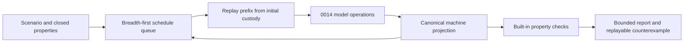

# Design spec 0052: bounded STM schedule explorer

Status: frozen for implementation

Date: 2026-08-02

Depends-On-Feature-IDs: 0014-stm-effect-handler-laws, 0050-bounded-stm-runtime

Design-Lens-Version: open-semantic-system-v1

## Problem

Feature 0014 defines a deterministic transaction model. Feature 0050 interprets
that model under the host Effect scheduler. The project cannot yet enumerate
small semantic schedules, report a minimal failing schedule, or replay one
without depending on host timing.

Runtime tests observe selected executions. They do not establish what every
schedule within an explicit finite bound does. This feature adds a bounded
model-checking adapter over the accepted 0014 operations. It must not claim
properties outside the explored state space or transfer simulator results to a
production scheduler.

## Felt journey

A developer describes two custodied transactions over two TVars and selects
closed property names plus finite exploration bounds. The explorer enumerates
runnable semantic steps in stable order. It reports that commit histories are
serially equivalent within the completed state space.

A second scenario has one transaction that waits forever because no writer can
change its dependency. The `all_transactions_terminal` property returns one
counterexample with the exact schedule and trace. Replaying that schedule
reproduces the same deadlock and property finding byte-for-byte.

## Open semantic system design lens

### Boundary and warranted state

Feature 0052 owns one pure, process-local schedule exploration module under
`src/stm-explorer/`. It consumes only handler-custodied 0014 `Store` and `Txn`
values plus closed property and bound data. It calls the accepted 0014
`beginAttempt`, `settleAttempt`, `rerunAttempt`, `changedDependencies`,
`wakeAndRerun`, `projectStore`, and serial-history functions. It does not modify
`src/stm/model.ts` or `src/stm/runtime.ts`.

One replay owns one current store, one state for each declared transaction, one
commit history, and one trace prefix. The explorer does not copy custodied
attempts between branches. It recreates every explored schedule prefix from the
authenticated initial store and transaction descriptions, because an 0014
attempt is one-shot custody.

The 0014 model remains semantic authority for attempt evaluation and
settlement. The explorer warrants only its deterministic traversal, replay,
property classification, and bounded report. A report is a derived artifact.

### Semantic inputs

| Input | Category | Authority and limits |
| --- | --- | --- |
| `Store` | Authenticated initial state | Must be an 0014 custodied store. It remains immutable. |
| named `Txn` entries | Command payload | IDs must be unique. Descriptions must belong to the store domain. |
| property names | Query policy | Closed literals select built-in observations. No callback predicate is accepted. |
| `ExplorerBounds` | Configuration | Positive integers within the fixed library ceilings below. |
| replay schedule | Command payload | Exact ordered semantic choices. Disabled, unknown, or trailing choices are rejected with their index. |

The closed property vocabulary is:

```text
serializable_commits
no_partial_publication
relevant_retry_wakeup
all_transactions_terminal
```

The first three are safety observations over explored prefixes. The last is a
bounded progress query. A counterexample to it is not a proof of production
starvation.

### Semantic outputs

`exploreScenario` returns one deeply immutable report:

```text
ExplorationReport {
  format: semantic.stm-exploration/v1
  scenario_id
  bounds
  status: complete | bounded
  visited_state_count
  explored_transition_count
  terminal_state_count
  deadlock_state_count
  properties: PropertyFinding[]
  assumptions: string[]
  unsupported_claims: string[]
}

PropertyFinding {
  property
  outcome: holds_within_bounds | counterexample | unknown_due_to_bound
  counterexample: null | {
    schedule: ScheduleChoice[]
    trace: TraceStep[]
    terminal_projection
  }
}
```

A schedule choice contains only a transaction ID and one closed action:
`begin`, `settle`, `rerun`, or `wake`. A trace step records its zero-based
index, selected choice, transaction state before and after, projected store
before and after, settlement kind when present, changed retry dependencies, and
commit-history projection. BigInt attempt and version counters are decimal
strings.

`replaySchedule` returns the same terminal projection and property findings for
one exact schedule, or a typed `ReplayRejected` diagnostic with the first bad
index and enabled choices.

### Effect protocols and uncertainty

Exploration is synchronous and deterministic. It requests no file, network,
clock, random, process, console, or host-concurrency effect. Bun and Node entry
points may print the returned report, but they do not change exploration.

For one state, enabled choices are sorted first by transaction ID and then by
action. Breadth-first traversal therefore chooses the shortest counterexample;
ties use that order. State deduplication uses the complete observable machine
projection: store cells, every transaction phase, live attempt read/write sets
and evaluation, retry dependencies, terminal result, and commit history. It
must not use a hash without comparing the canonical projection bytes.

A state with no enabled choice and at least one nonterminal transaction is a
deadlock observation. Reaching a configured limit before all enabled successors
are visited changes the report to `bounded`. Any property without a witnessed
counterexample then becomes `unknown_due_to_bound`, not
`holds_within_bounds`.

A wake choice is enabled only when `changedDependencies` is nonempty. A conflict
creates a separate `rerun` choice. A settlement that commits is the only step
allowed to replace the current store or append commit history. The explorer
records but never interprets commit or abort actions.

### Components and orthogonal structures



The schedule queue owns traversal. A replay owns transient machine state. The
0014 model owns transaction judgments. Property checks observe projections.
The report owns no live attempt or store.

### Bounded autonomy and resources

The accepted bounds are:

```text
1 <= maximumTransactions <= 8
1 <= maximumSteps <= 64
1 <= maximumStates <= 10000
```

The number of declared transactions must not exceed
`maximumTransactions`. The queue never retains more than `maximumStates`
canonical schedules and projections. A schedule never contains more than
`maximumSteps` choices. When a successor would cross either limit, the report
is `bounded`.

These ceilings limit retained JavaScript data. They are not a universal memory
bound because transaction values and projected JSON payloads have no byte limit
in 0014. The feature adds no background worker, retry timer, fairness policy, or
parallel branch evaluation.

### Evidence, assumptions, and unsupported claims

The implementation can produce bounded-model-check evidence for the exact
scenario, property vocabulary, source revision, and recorded bounds. Focused
tests, Bun/Node report parity, type analysis, strict lint, formatting, and
independent exact-head review are separate evidence.

The feature assumes the accepted 0014 model implements its documented
transition rules and custody checks. It also assumes deterministic canonical
JSON encoding for report comparison.

It does not prove serializability, liveness, fairness, lock freedom, starvation
freedom, production scheduler behavior, host memory safety, or correctness of
Effect primitives. `holds_within_bounds` must never be rendered as `proved`.

## Deep-module contract

The public seam exports only closed data and these operations:

```text
makeScenario(id, initialStore, transactions, properties, bounds)
  -> Scenario | InvalidScenario

exploreScenario(scenario)
  -> ExplorationReport

replaySchedule(scenario, schedule)
  -> ReplayReport | ReplayRejected

encodeExplorationReport(report)
  -> canonical UTF-8 JSON bytes
```

The exact TypeScript generic parameters may preserve transaction result types,
but no callback, custom predicate, mutable queue, live attempt, live store, or
host scheduler crosses this seam.

## Oracle-first counterexamples

Retain executable observations for these cases:

1. a schedule settles one 0014 attempt twice;
2. a branch copies a one-shot attempt instead of replaying the prefix;
3. a conflict changes the store or leaks commit actions;
4. a suspension wakes after only unrelated TVar changes;
5. a relevant dependency changes but no wake choice appears;
6. a non-commit step changes the projected store;
7. a duplicate terminal result appears for one transaction;
8. a non-serial commit history is classified as holding;
9. a depth or state limit is reported as complete;
10. a disabled replay choice is silently skipped;
11. a deadlocked retry is classified as terminal;
12. canonical traversal depends on declaration or map insertion order.

## Acceptance

The exact acceptance program is
`scripts/accept/0052-stm-schedule-explorer.ts`. It must establish:

1. a two-transaction, two-TVar contention scenario completes within declared
   bounds and reports all three safety properties as `holds_within_bounds`;
2. a retry scenario reports a shortest `all_transactions_terminal`
   counterexample and exact replay reproduces its terminal projection;
3. relevant and unrelated wake-up cases remain distinct;
4. invalid bounds, duplicate transaction IDs, cross-domain descriptions, and
   invalid replay choices are typed rejections;
5. reports expose bounds, assumptions, unsupported claims, and never use proof
   language;
6. Bun and genuine Node emit byte-identical canonical reports; and
7. the exact 0014 and 0050 predecessor gates still pass.

## Kill or redesign criteria

Stop and recut the feature if complete state projection requires access to
private 0014 custody, if replay cannot recreate branches without weakening
one-shot attempts, if the accepted model cannot expose a serial-history
observation, or if safe exploration requires caller callbacks. Do not add
privileged test hooks to 0014.

## Non-goals

No production scheduler, probabilistic scheduler, partial-order reduction,
symbolic values, arbitrary temporal logic, property callbacks, distributed
model checking, proof generation, persistent exploration database, UI, or
changes to the 0014/0050 semantics.

## Semantic diff

The project gains a deterministic bounded observation over semantic STM
schedules and exact counterexample replay. Transaction meaning, runtime
publication, host scheduling, evidence categories, and production guarantees
remain unchanged.
