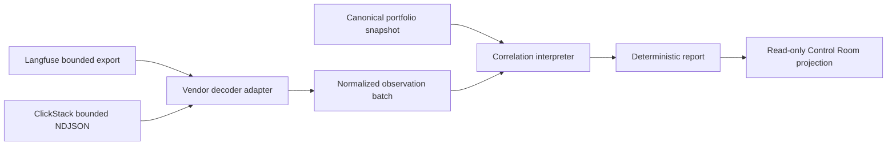

# Design spec 0057: Control Room agent observation correlation

Status: draft

Date: 2026-08-02

Design-Lens-Version: open-semantic-system-v1

## Problem

Control Room owns project, work, receipt, and artifact views. It has no source-verified view of agent execution traces.

Agent observability products record runtime events. They do not own project goals, work status, evidence acceptance, or semantic truth. A direct telemetry-to-status path would merge observation with authority.

This feature must correlate bounded agent observations with canonical PBK identities. It must not create a second telemetry store or let telemetry mutate canonical work.

## Felt journey

An operator supplies one bounded vendor export and one canonical portfolio snapshot. The tool produces one deterministic correlation report.

The report shows:

- the explicit project, work, attempt, and revision bindings;
- the observed trace and span tree;
- failures and incomplete capture state;
- unmatched or stale bindings; and
- the exact source digest and query bounds.

A missing root, an unconsumed cursor, an unknown work identity, and a false completeness claim remain visible. No result changes work status.

## Storage and platform decision

| Option | Strong fit | Material cost or risk | Decision |
| --- | --- | --- | --- |
| Langfuse with ClickHouse | Agent traces, sessions, observations, public read API, JSON or JSONL export | Full self-host stack; retention policy can require a commercial license; internal ClickHouse schema is unstable | Supported read adapter |
| ClickStack | OTLP traces, generic logs and metrics, ClickHouse queries, open component licenses | No PBK goal or evidence model; deployment TTL and schema vary | Supported read adapter |
| Direct custom ClickHouse store | Maximum query control | We would own ingestion, schema, retention, and operational UI | Rejected for this feature |
| New Control Room telemetry database | Local semantic customization | Duplicates mature ingestion and storage systems | Rejected |

The first slice uses bounded offline exports. It does not deploy either platform. This preserves a vendor-neutral semantic seam before an operator selects infrastructure.

## Open semantic system design lens

### Boundary and warranted state

The feature contains:

- strict vendor-capture decoders;
- one normalized agent-observation value;
- a pure correlation interpreter;
- a deterministic report renderer; and
- a read-only Control Room projection.

The feature owns no agent runtime, vendor database, credential, retention process, portfolio record, or work transition. It warrants only that accepted bytes match the declared capture format and bounds.

Canonical portfolio and project records remain authoritative for project, work, receipt, artifact, and evidence identities. Vendor telemetry is a revision-bound runtime observation.

### Semantic inputs

`ObservationCaptureInput` contains:

- `vendor`: `langfuse` or `clickstack`;
- exact capture bytes and SHA-256 digest;
- `captured_at`;
- a closed time interval;
- a row limit;
- `complete` and `truncated` assertions; and
- one canonical portfolio snapshot.

The Langfuse adapter accepts one captured v2 Observations API response or one `observations_v2` JSONL export. Rows must share one non-null `traceId`. A complete API capture has no remaining cursor and has a root observation.

The ClickStack adapter accepts NDJSON from one explicit bounded `SELECT` over `otel_traces`. The query must alias trace, span, parent, time, duration, name, service, status, span attributes, and resource attributes. Rows must share one `TraceId` and sort by timestamp and span identity.

Semantic correlation uses only explicit attributes:

- `pbk.project.id`;
- `semantic.work.id`;
- `semantic.attempt.id`;
- `semantic.project.revision`; and
- `semantic.evidence.refs`.

The interpreter never derives these values from trace names, service names, prompts, URLs, or vendor project IDs.

### Semantic outputs

`AgentObservationReport` contains:

- one immutable normalized trace tree;
- exact vendor trace and span identities;
- source bounds, digest, and capture state;
- explicit semantic bindings;
- correlation results for project, work, attempt, revision, and evidence references;
- typed diagnostics; and
- unsupported claims.

Correlation states are `matched`, `unbound`, `unknown_project`, `unknown_work`, `revision_mismatch`, and `invalid_reference`.

The report is a derived artifact. A future Control Room panel is a projection of this report. Neither is canonical state.

### Effect protocols and uncertainty

The first slice performs no network request. File reads are explicit effects. Decoding and correlation are pure after the bytes enter the module.

A later live adapter can request a bounded vendor read. It must return `accepted`, `unavailable`, `invalid`, `incomplete`, or `cancelled`. It must not retry without an explicit bounded policy.

Deduplication uses vendor identity, vendor project identity, trace identity, span identity, and capture digest. The system never assumes that Langfuse and ClickStack identities name the same execution.

A declared complete capture is rejected when it has a remaining cursor, missing root, row overflow, conflicting trace identity, or truncation marker. An explicitly incomplete capture remains inspectable and cannot support a completeness claim.

### Components and orthogonal structures



The diagram shows one-way observation flow. No arrow writes to canonical portfolio state or a vendor.

The trace tree, project ownership graph, work dependency graph, receipt history, evidence graph, and artifact derivation graph remain separate structures.

The vendor adapter crosses from a vendor vocabulary into the normalized observation vocabulary. The correlation interpreter crosses from runtime observations into derived PBK references. It does not increase evidential force.

### Bounded autonomy and resources

One capture contains at most:

- 1 trace;
- 1,000 observations;
- 8 MiB of input bytes;
- 64 attributes per observation;
- 32 resource attributes per observation;
- 64 evidence references; and
- 24 hours of query time.

Strings, arrays, nesting depth, and map keys have explicit decoder bounds. Traversal is linear after stable sorting. The first slice has no queue, retry, background process, credential, database write, or external effect.

### Evidence, assumptions, and unsupported claims

Runtime-decoder tests can show selected accepted and rejected captures. Property tests can show permutation and report determinism for generated bounded cases. End-to-end fixture runs can show selected correlation behavior. Independent review remains a human assertion.

The design assumes that vendor exports and portfolio snapshots identify their source honestly. It assumes that explicit semantic attributes were emitted by an authorized caller.

The feature does not prove or establish:

- trace completeness beyond declared and checked capture bounds;
- causal truth from parent span links;
- cross-vendor identity equality;
- semantic correctness of an agent action;
- evidence authenticity or sufficiency;
- work readiness, completion, or acceptance;
- project health;
- retention history; or
- telemetry freshness after `captured_at`.

## Deep-module contract

```ts
analyzeAgentObservationCapture(input: unknown): Effect<AgentObservationReport, AgentObservationError>
```

The interface accepts one runtime-decoded value. It hides vendor decoding, normalization, stable ordering, tree validation, PBK correlation, completeness checks, and report rendering.

The report preserves vendor-native identities and explicit semantic bindings. Adding a vendor requires a new internal adapter. It cannot add correlation semantics.

## Oracle-first counterexamples

1. A bounded Langfuse capture with explicit valid bindings returns `matched` and one deterministic trace tree.
2. A bounded ClickStack capture with the same explicit PBK identities returns the same PBK correlation, not equal vendor identity.
3. A permuted capture yields byte-identical canonical report bytes.
4. A remaining Langfuse cursor rejects `complete: true`.
5. A ClickStack truncation marker rejects `complete: true`.
6. A missing root is visible and cannot support completeness.
7. An unknown work identity returns `unknown_work` and does not create a work record.
8. A revision mismatch remains distinct from an unknown project.
9. A trace name that resembles a work ID does not create a binding.
10. An evidence reference remains an observed reference and never becomes accepted evidence.

## Acceptance

A future `just accept 0057-control-room-agent-observation-correlation` must:

1. run focused decoder, normalization, correlation, and canonical-report tests;
2. exercise one bounded Langfuse fixture and one bounded ClickStack fixture;
3. show one match, one explicit incomplete capture, and each typed rejection above;
4. show byte-identical output under row permutation;
5. show that the Control Room projection has no write or status-transition path;
6. run project-model validation and generated-view checks; and
7. print source digests, bounds, unsupported claims, and checks that did not run.

## Source custody

| Claim used by this design | Source |
| --- | --- |
| Langfuse accepts OTLP over HTTP and does not support gRPC | [Langfuse OpenTelemetry integration](https://langfuse.com/integrations/native/opentelemetry#L63-L75) |
| Langfuse v2 observations are rows that callers group by `traceId` | [Langfuse Observations API](https://langfuse.com/docs/api-and-data-platform/features/observations-api#L23-L33) |
| Langfuse internal ClickHouse schema is not a stable interface | [Langfuse ClickHouse infrastructure](https://langfuse.com/self-hosting/deployment/infrastructure/clickhouse#L98-L108) |
| Langfuse self-hosting uses Web, Worker, Postgres, Redis, ClickHouse, and blob storage | [Langfuse self-hosting](https://langfuse.com/self-hosting#L49-L68) |
| ClickStack receives OTLP HTTP and gRPC | [ClickStack OpenTelemetry ingestion](https://clickhouse.com/docs/clickstack/ingesting-data/opentelemetry#L52-L59) |
| ClickStack trace rows expose trace, span, parent, service, attributes, duration, and status | [ClickStack trace schema](https://clickhouse.com/docs/clickstack/ingesting-data/schemas#L70-L109) |
| ClickStack retention is table-level and deployment-specific | [ClickStack TTL](https://clickhouse.com/docs/clickstack/managing/ttl#L24-L26) |
| OTel trace and span IDs have fixed byte and hex forms | [OpenTelemetry SpanContext](https://opentelemetry.io/docs/specs/otel/trace/api/#spancontext) |

## Kill or redesign criteria

Redesign if a supported read interface cannot preserve exact trace, span, parent, capture-bound, and explicit semantic-binding data.

Stop if the first slice needs live credentials, direct access to an unstable vendor table, a new telemetry database, or a write to canonical work.

## Non-goals

- Reopening or renaming Control Room 0017.
- Building an observability platform.
- Deploying Langfuse, ClickStack, ClickHouse, an OTel collector, or object storage.
- Defining universal agent telemetry semantics.
- Importing prompts, model content, or secrets into canonical project state.
- Inferring project goals from traces.
- Updating work status, receipts, priorities, or evidence acceptance.
- Claiming complete history from a bounded export.
- Comparing agent quality, model quality, or developer productivity.

## Semantic diff

Before: Control Room shows canonical project and work projections without source-bound agent runtime observations.

After the proposed slice: Control Room can inspect a deterministic, bounded correlation report from vendor exports. Canonical work authority and evidence meaning remain unchanged.
