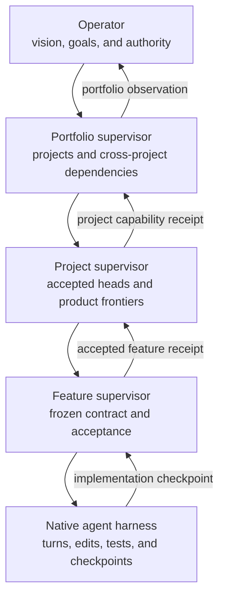

# Autonomous project system architecture

## Status

This document records an architecture direction. It does not freeze a wire
protocol, scheduler, storage engine, or user interface.

## Goal

Build the operator's projects continuously from the operator's goals and
vision. The system must produce accepted product capability, not activity
reports as a substitute for capability.

The system is recursive. A portfolio supervisor coordinates projects. A
project supervisor coordinates feature contracts. A feature supervisor
coordinates bounded implementation and review work.

Each layer has the same feedback shape. Each layer has a different unit of
work, time scale, dependency graph, and evidence boundary.



## Nested feedback loops

| Layer | Unit of intent | Reusable result | Typical loop |
| --- | --- | --- | --- |
| Agent | One bounded turn or task | Checked checkpoint | Seconds to hours |
| Feature | One frozen product contract | Accepted feature receipt | Hours to days |
| Project | One product frontier | Accepted head or deployment receipt | Days to weeks |
| Portfolio | One operator goal | Cross-project capability receipt | Weeks to months |

The layers resemble the kernel, compiler, and build-system loops. Their graph
edges do not share one meaning.

- An agent edge records a turn, file, test, or artifact dependency.
- A feature edge records a contract, implementation, review, or acceptance dependency.
- A project edge records a product capability or release dependency.
- A portfolio edge records a cross-project capability or operator-goal dependency.

The implementation must not use one undifferentiated work graph for all four
meanings.

## Common supervisor envelope

Each supervisor should expose the same small semantic envelope:

- stable identity and explicit parent identity;
- desired outcome and current frozen contract;
- direct children and their current observed states;
- dependencies and the receipts that satisfy them;
- accepted checkpoints and evidence;
- active blockers with an accountable owner;
- an ordered event cursor;
- declared authority and effect boundaries;
- liveness policy and terminal conditions.

The common envelope supports recursive supervision. It does not force every
layer to share one state machine.

## Authority and ownership

| Fact | Authoritative owner |
| --- | --- |
| Vision, priorities, and external authority | Operator |
| Cross-project goal graph | Portfolio supervisor |
| Accepted project head and product frontier | Project supervisor |
| Frozen feature contract and acceptance decision | Feature supervisor |
| Native runtime state | Herdr and the native harness |
| Durable child relationship and event cursor | Supervisor service |
| Source, commits, and test artifacts | Repository and build systems |

A supervisor owns decisions at its layer. It does not become the authority for
facts owned by a child runtime or repository.

## Receipt boundaries

Each layer hides its internal work behind a receipt that the parent can
validate.

```text
operator goal
  -> portfolio goal receipt
       -> project capability receipt
            -> accepted feature receipt
                 -> implementation checkpoint
                      -> turn, edit, test, and artifact evidence
```

A status message is not a receipt. A receipt identifies the contract, exact
checkpoint, evidence, unresolved assumptions, and accepting owner.

## Liveness

The system must keep product work moving without manufacturing work.

- An unblocked supervisor with an active goal must advance a product frontier.
- An idle child must return capacity to its parent.
- A blocked child must name the missing fact, owner, and safe alternatives.
- A failed child must preserve its exact checkpoint and evidence.
- A completed child must not retain a live runtime without an explicit policy.
- A notification is a wake hint. Durable state remains authoritative.
- Reconnection must replay missed events before live events continue.
- The system must not require an operator to poll normal child progress.

## Runtime and protocol split

Herdr remains the runtime multiplexer for installed native harnesses. A durable
supervisor service owns parent-child identity, event replay, and liveness.

The preferred native supervisor channel is a WebSocket protocol with durable
event cursors and explicit acknowledgements. WebSocket provides live,
bidirectional delivery. The durable event log provides recovery.

MCP remains a compatibility adapter for harnesses that can call tools. It is
not the only internal supervisor protocol.

On reconnect, a client presents:

- its stable supervisor handle;
- a separate resume capability;
- its last acknowledged event cursor.

The service first returns missed durable events. It then switches the same
connection to live delivery.

## Native subscription constraint

Provider usage must continue through installed Codex and Claude Code harnesses
that use the operator's existing account access. The supervisor must not
silently replace them with usage-priced provider API calls.

Flue can own scheduling, policies, receipts, and recursive supervision. Herdr
can own native runtime placement. The installed harness remains the model
execution boundary.

## First tracer

The first end-to-end tracer should prove one recursive path:

1. A project supervisor connects and receives a stable supervisor identity.
2. It creates one direct native child through Herdr.
3. The child reaches ready, busy, and settled states.
4. The supervisor receives each attention event without calling a wait operation.
5. The connection drops after one acknowledged cursor.
6. The supervisor reconnects with its stable handle and cursor.
7. The service replays the missed event exactly once in the reconstructed view.
8. The supervisor accepts the child's exact repository checkpoint.
9. The project layer emits one accepted feature receipt.

This tracer proves the seam from agent execution to project capability. It does
not claim autonomous portfolio planning yet.
