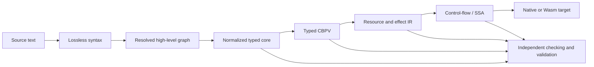

# Compiler and Semantics Reference Specification

## Objective

The compiler should preserve a traceable chain from human-oriented source to
executable artifacts while keeping the trusted semantic checker substantially
smaller than the production toolchain.

The compiler is the middle feedback loop between kernel checking and package
building. See
[Language system incremental architecture](language-system-incremental-architecture.md)
for the graph granularities, receipt boundaries, and cache rules that connect
these systems.

## Architectural overview



Each representation has a specific responsibility. Information is discarded
only after the consumer no longer requires it or an evidence artifact records
why erasure is valid.

## Frontend architecture

### Lossless syntax

The parser produces a tree containing every token and error node. The tree must
support incomplete and malformed programs because editor tooling is a primary
consumer.

Required properties:

- source can be reconstructed exactly when unedited;
- trivia and documentation remain attached;
- nodes and tokens carry precise ranges;
- recovery produces structured errors rather than aborting;
- immutable structure permits sharing across edits;
- typed wrappers provide ergonomic access without changing the underlying tree.

### Stable semantic identities

Text positions are insufficient as durable identities. Declarations receive
semantic identities derived from package identity, module path, declaration
role, and normalized binder context.

Source locations remain navigation metadata. Renames and moves may generate
migration mappings rather than silently changing every downstream identity.

### Explicit name-resolution graph

Name resolution should produce a graph of definitions, imports, openings,
instances, and ambiguities. Later stages consume resolved identifiers rather
than repeating textual lookup.

The resolver should retain explanations:

```text
name selected
candidate set
scope and import path
implicit or explicit qualification
reason alternatives were rejected
```

## Elaboration

### Bidirectional checking

Use bidirectional typing where inference is tractable and checking is guided by
an expected type where richer dependent, polymorphic, or effectful structure is
present.

This limits global inference complexity and gives useful annotation points.

### Elaboration as evidence production

The elaborator emits:

- explicit type arguments;
- resolved implicit parameters;
- effect rows;
- usage grades;
- coercions and adapters;
- instance and realization evidence;
- generated obligations;
- source-to-core provenance.

The core checker does not trust that inference was correct; it validates the
explicit result.

### Constraint partitioning

Keep constraint classes distinguishable:

- type equality and subtyping/refinement;
- effect-row inclusion;
- usage and capture inequalities;
- kind and universe constraints;
- trait/theory instance resolution;
- realization compatibility;
- proof obligations.

A solver may coordinate them, but diagnostics and evidence should retain their
origin.

### Ambiguity policy

The language should reject unresolved semantic ambiguity rather than allow
resolution to depend on package load order or unstable search. When several
valid realizations exist, require an explicit deployment choice or a declared
selection policy.

## Normalized semantic core

### Purpose

The normalized core is the durable semantic artifact used for:

- independent checking;
- contract hashing;
- proof obligation identity;
- external proof translation;
- package compatibility;
- reference evaluation;
- differential testing.

### Required explicitness

The core should make explicit:

- binders and scopes;
- value versus computation distinction;
- evaluation order;
- effects and handlers;
- continuation multiplicity;
- usage grades and erasure;
- ownership-relevant transfers;
- type and proof arguments;
- inductive/coinductive eliminators;
- pattern-match compilation;
- imported assumptions.

### Canonicalization

Contract identity should hash a deterministic semantic normalization, not
surface text, formatting, source order where irrelevant, or host-language
serialization details.

Canonicalization must define:

- alpha-equivalence treatment;
- declaration ordering rules;
- normalized names and references;
- universe and implicit parameter ordering;
- law and obligation inclusion;
- recognized opaque definitions;
- version of the normalization algorithm.

Do not make general evaluation-to-normal-form the package hash algorithm if it
could be nonterminating or computationally unstable.

## Trusted checker

### Responsibilities

The checker validates:

- well-scoped core;
- kinds and universes;
- typing and definitional equality;
- effect and handler rules;
- usage constraints;
- proof-term validity;
- totality/productivity for the proposition fragment;
- imported assumption declarations;
- normalized contract structure.

### Non-responsibilities

The checker should not perform:

- package discovery;
- heuristic instance search;
- optimization;
- complex proof search;
- network access;
- source parsing;
- native code generation.

### Independent implementations

The normalized core format should be sufficiently precise to permit a second
checker. Agreement between independently written checkers is stronger evidence
than a large compiler checking its own internal structures.

## Call-by-push-value layer

CBPV provides a semantic intermediate form where values and effectful
computations are distinct. This is useful for:

- making evaluation order explicit;
- elaborating call-by-value source constructs;
- representing thunks and forcing;
- locating effect operations and handlers;
- controlling continuation capture;
- connecting functional and imperative interpretations;
- defining operational equivalence before low-level optimization.

The project should keep the source language ergonomic and use CBPV as an
internal semantic discipline rather than exposing all administrative forms.

## Quantitative usage and resources

Usage grades annotate binders and captures. The initial algebra may distinguish:

```text
0   erased
1   exactly once
?   at most once
ω   unrestricted
```

The design should allow later generalization without requiring every grade to
mean runtime ownership.

Usage information supports:

- proof erasure;
- affine and linear APIs;
- one-shot continuation checking;
- closure capture constraints;
- ownership transfer;
- uniqueness-based update;
- protocol-state transitions.

The checker validates usage laws; a later lowering decides whether a value is
stack allocated, moved, borrowed, region allocated, or reference counted.

## Effect representation

### Effect rows

A computation type records the effects it may request. Rows should support
polymorphism and explicit handling without turning implementation details into
public capabilities.

### Effect declarations as theories

An effect declaration may include:

- operations;
- parameter and result types;
- continuation multiplicity;
- equations or laws;
- admissible handler properties;
- transactional or retry-safety metadata;
- capability and platform requirements.

### Handler checking

A handler is checked both structurally and semantically:

- it handles the declared operations;
- resumptions obey multiplicity restrictions;
- captured resources satisfy capture rules;
- it declares which effect laws it preserves;
- evidence supports stronger behavioral claims.

## Multi-level lowering

### High-level resolved representation

Preserves source constructs, declarations, modules, inferred information, and
rich diagnostics.

### Semantic core

Optimized for metatheory and checking.

### CBPV representation

Makes computation structure and effects explicit.

### Resource and representation IR

Introduces:

- storage classes;
- region and ownership operations;
- retain/release or borrow operations where selected;
- concrete data layouts;
- actor and transaction runtime calls;
- explicit commit-action values.

### Control-flow or SSA IR

Introduces blocks, branches, phi/block arguments, memory operations, and target
calling conventions. It is the natural level for conventional dataflow
analysis and many optimizations.

### Target bridge

Maps to Wasm, MLIR/LLVM, or a direct backend. Target-specific undefined
behavior must be explicit and must not retroactively alter source semantics.

## Proof-producing and validating transformations

Use several assurance patterns according to transformation complexity.

### Checked construction

Build the target with smart constructors whose invariants are enforced by the
host types and then checked again structurally.

### Certificate generation

The transformation emits a compact witness checked by an independent
validator.

### Translation validation

After transformation, prove or check a relation between the particular source
and target artifacts. This avoids placing the entire optimizer in the trusted
base.

### Differential semantics

Execute or symbolically compare source and target forms over generated cases.
This is weaker than proof but valuable for unstable stages and finding bugs in
formal models.

### Proof-preserving rewrite

For small equational optimizations, select a theorem or law instance and record
its instantiation.

## Incremental query architecture

Treat semantic work as pure queries over versioned inputs. Queries should be:

- deterministic for identical inputs;
- cancellation-safe;
- free of hidden global state;
- dependency tracked;
- independently testable;
- capable of returning partial results and diagnostics.

Suggested query boundaries:

```text
syntax(file)
module_graph(package)
resolve(declaration)
infer_signature(declaration)
elaborate_body(declaration)
check_core(definition)
normalize_contract(theory)
collect_obligations(realization)
resolve_evidence(obligation, policy)
select_deployment(application, target, policy)
lower(definition, stage, target)
```

## Relational analysis plane

Export selected compiler and ecosystem facts to a typed relational schema.
Datalog-style analyses can derive:

- transitive effects;
- capability reachability;
- implementation impact;
- assumption propagation;
- recursive protocol dependencies;
- evidence gaps;
- dead or conflicting package declarations.

The compiler remains responsible for local typing and definitional equality;
the relational plane handles large graph-shaped analyses.

## Diagnostics and explanations

Every error should be an explanation over semantic facts, not only a failed
internal assertion.

Useful explanation objects include:

- inference derivation slices;
- effect inclusion paths;
- usage conflict paths;
- instance search trees;
- realization rejection reasons;
- evidence dependency chains;
- source-to-lowered operation mappings;
- counterexample traces.

These objects should be structured data that the CLI, LSP, web explorer, and
agents can render differently.

## Testing strategy

### Golden tests

Cover syntax, formatting, diagnostics, normalized core, and generated
explanations.

### Property tests

Cover parser round trips, substitution, alpha equivalence, normalization,
usage accounting, and derived laws.

### Differential tests

Compare production evaluator, formal executable semantics, optimized runtime,
and alternate handlers.

### Mutation tests

Ensure evidence and tests fail when semantic rules or realization behavior are
intentionally corrupted.

### Conformance suites

Every realization of a theory runs a generated suite based on examples, laws,
and state-machine traces.

### Proof regression

Proof artifacts attach to exact normalized identities; a semantic change should
invalidate only evidence whose subjects changed.

## Acceptance criteria for the first compiler architecture

The architecture is demonstrated when:

1. source elaborates to a serializable normalized core;
2. a separate process checks that core;
3. the reference evaluator and one runtime realization agree on inventory
   traces;
4. the compiler can explain inferred effects and selected realizations;
5. changing an unrelated source file avoids recomputing unaffected queries;
6. one lowering step emits independently checked translation evidence;
7. published artifacts retain source, semantic, and evidence provenance.
