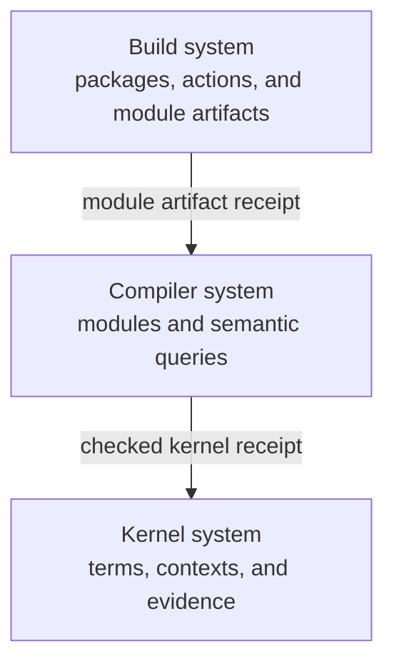

# Language system incremental architecture

## Status

This document records an architecture direction. It does not freeze a wire
format, hash algorithm, storage engine, or build tool.

The agent-facing kernel contract remains a tagged JSON document. A Merkle graph
can be a derived internal representation. It must not leak into the public
language contract without a separate decision.

## Purpose

The language system has three nested feedback loops:

1. The kernel checks explicit semantic terms.
2. The compiler transforms and checks one module.
3. The build system coordinates modules and packages.

Each loop has a different unit of work. Each loop also has a different useful
cache lifetime. One universal cache model would hide these differences.



## The scale model

| System       | Scope of one operation           | Typical reusable component                  | Expected loop                |
| ------------ | -------------------------------- | ------------------------------------------- | ---------------------------- |
| Kernel       | One explicit semantic judgment   | Term, context, or evidence node             | Microseconds to milliseconds |
| Compiler     | One edited module                | Parse, resolve, check, lower, or emit query | Milliseconds to seconds      |
| Build system | One package or workspace request | Module artifact or build action             | Seconds to minutes           |

This model needs one qualification. An AST node is not usually an honest
compiler cache key by itself. Name resolution, typing, and lowering can depend
on the surrounding semantic environment.

The compiler can use AST nodes as structural inputs. Its reusable units should
be explicit semantic queries. A query key must include all context that can
change its result.

## Separate graph meanings

The three systems can all use directed graphs. Their edges do not have the same
meaning.

### Kernel graph

A kernel edge names a semantic dependency. Examples include a child term, a
binder context, a type, or checking evidence.

The kernel asks:

> Which meaning or checked judgment can this operation reuse?

### Compiler graph

A compiler edge records a query dependency. Examples include a parsed file, a
resolved declaration, an imported interface, or a lowering result.

The compiler asks:

> Which computations must run again after this edit?

### Build graph

A build edge records an artifact or action dependency. Examples include a
module interface, generated source, linked library, toolchain, or package
output.

The build system asks:

> Which artifacts must this request build, fetch, or retain?

The implementation must not treat these edge types as interchangeable.

## Authority and ownership

| Fact             | Authoritative owner                       | Derived consumers                            |
| ---------------- | ----------------------------------------- | -------------------------------------------- |
| Authored source  | Source repository                         | Parser, compiler, and build system           |
| Kernel document  | Compiler front end or explicit API caller | Kernel checker                               |
| Kernel judgment  | Kernel checker under a named policy       | Compiler                                     |
| Module interface | Compiler                                  | Downstream compiler queries and build system |
| Module artifact  | Compiler or linker action                 | Build system and runtime                     |
| Package recipe   | Build description                         | Build executor                               |
| Cache entry      | Cache implementation                      | The layer that validates its receipt         |

A cache never becomes semantic authority. It returns a candidate result and its
receipt. The consuming layer validates the receipt before it uses the result.

## Receipt boundaries

Each layer hides its internal graph behind a small receipt.

```text
package action
  └─ module artifact receipt
       └─ semantic interface receipt
            └─ checked kernel receipt
                 └─ term, context, and evidence graph
```

### Checked kernel receipt

A checked kernel receipt should identify:

- the canonical kernel document;
- every explicit context that affects the judgment;
- the checker and semantic policy;
- the judgment result;
- the evidence root;
- declared bounds and assumptions.

A naked variable index is not a self-contained cache key. Its binder context
must affect the checked identity.

### Semantic interface receipt

A semantic interface receipt should identify:

- the package and module;
- exported semantic identities;
- normalized exported types, effects, and obligations;
- imported interface receipts;
- the checked kernel roots that warrant the interface;
- the compiler configuration that changes interface meaning.

An internal implementation edit can preserve this receipt. Downstream modules
can then remain valid.

### Module artifact receipt

A module artifact receipt should identify:

- the semantic interface receipt;
- the compiler and target configuration;
- relevant toolchain and generated-input identities;
- emitted artifact digests;
- source-to-artifact explanation data;
- unresolved assumptions or unsupported claims.

### Build action receipt

A build action receipt should identify:

- the normalized action recipe;
- declared input artifacts;
- dependency module receipts;
- toolchain inputs;
- output content digests;
- the execution observations needed by the selected build policy.

Recipe identity and output identity are different facts. The system should keep
both when both are useful.

## Cache rules

Use the smallest cache unit that meets both conditions:

1. Its dependencies can be stated completely.
2. Its lookup and validation cost less than recomputation.

This rule prevents two common errors. The system must not hash every trivial
syntax node when parsing is cheaper. It must also not rebuild a package when a
stable module interface proves that downstream meaning did not change.

Each cache key must include:

- a domain tag;
- the canonical input identity;
- all semantic dependencies;
- the policy or configuration that changes the result;
- the producer format version.

Runtime observations, diagnostics, performance measurements, and semantic
judgments require separate identities. Equal result bytes do not make their
evidence equal.

## Invalidation

Invalidation follows the graph for the affected layer.

- A text edit invalidates syntax nodes that overlap the edit.
- A syntax change invalidates dependent compiler queries.
- A changed semantic interface invalidates downstream module queries.
- A changed module artifact invalidates dependent build actions.
- A package recipe or toolchain change invalidates its build action.

An unchanged interface can stop invalidation at the module boundary. An
unchanged output digest can stop transfer or publication work at the build
boundary. These are different observations and can occur independently.

## Effects and observations

Pure normalization, hashing, query selection, and dependency comparison should
remain separate from effects.

Effects include:

- reading source or cached objects;
- writing a cache entry;
- running a compiler or build action;
- fetching a remote object;
- publishing an artifact;
- collecting runtime measurements.

Each effect returns a typed observation. A request to write, fetch, or publish
is not evidence that the effect occurred.

## Liveness and bounds

The fast loop must not wait for the slow loop when its dependencies are already
available.

- Kernel checks need explicit size and work bounds.
- Compiler queries need cancellation and bounded dependency walks.
- Build actions need bounded waits and visible external dependencies.
- Cache misses must fall back to computation.
- Cache failures must not silently become successful judgments.
- Background publication must not hold the interactive compiler loop open.

The system should measure the following values before it changes cache
granularity:

- lookup and validation time;
- recomputation time;
- fan-out after a representative edit;
- reusable node and query ratio;
- stored byte count;
- transfer byte count;
- eviction and rebuild frequency.

## Nix-inspired build direction

Nix is a useful model at the package and build-action scale. The language build
system can borrow:

- normalized recipes;
- explicit dependency closures;
- separate recipe and output identities;
- verified reusable artifacts;
- roots that retain reachable objects;
- transport of complete closures.

The compiler should not expose every semantic node as a package store object.
Kernel and compiler graphs have smaller units, shorter lifetimes, and more
context-sensitive identities.

The layers can share content-addressed storage primitives. They should not
share one undifferentiated namespace or one invalidation policy.

## First tracer path

The first implementation should follow one vertical path:

1. Accept one strict kernel JSON document.
2. Check it under one explicit context and policy.
3. Return one checked kernel receipt.
4. Compile one module and emit one semantic interface receipt.
5. Emit one deterministic module artifact and receipt.
6. Run one package action that consumes that module receipt.
7. Repeat the request and observe reuse at each layer.
8. Change only the module implementation.
9. Confirm whether the semantic interface remains stable.
10. Measure which kernel, compiler, and build work repeats.

This tracer tests the receipt boundaries. It does not require a distributed
cache, remote execution, or a universal Merkle store.

## Falsifiers

Revise this architecture if any of these conditions occurs:

- a cache key omits context that changes its result;
- a raw syntax identity is treated as a checked semantic identity;
- a cache hit bypasses receipt validation;
- an implementation-only edit invalidates all downstream work without a
  measured reason;
- a module interface hides an exported semantic change;
- build success is reported from a requested effect without an observation;
- one layer claims authority over a fact owned by another layer;
- cache maintenance costs more than the work it avoids;
- the public kernel JSON contract depends on an internal storage layout.
