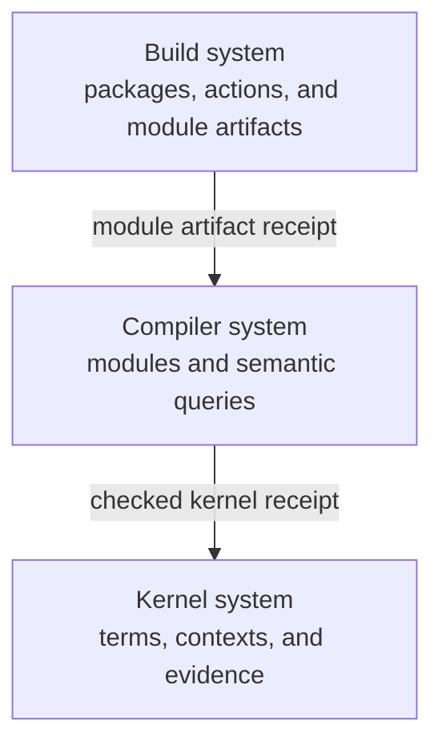
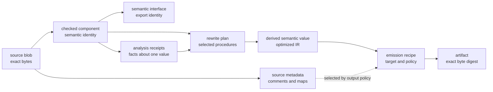

# Language system incremental architecture

## Status

This document records an architecture direction. It does not freeze a wire
format, hash algorithm, storage engine, or build tool.

The agent-facing kernel contract remains a tagged JSON document. A Merkle graph
can be a derived internal representation. It must not leak into the public
language contract without a separate decision.

## Purpose

The language system has three nested feedback loops:

1. The kernel checks explicit semantic terms.
2. The compiler transforms and checks one module.
3. The build system coordinates modules and packages.

Each loop has a different unit of work. Each loop also has a different useful
cache lifetime. One universal cache model would hide these differences.

The same nested-loop model also applies above the build system. Portfolio,
project, feature, and agent supervisors operate at larger time scales. They
exchange accepted receipts instead of sharing one universal work state. See
[`autonomous-project-system-architecture.md`](autonomous-project-system-architecture.md).



## The scale model

| System       | Scope of one operation           | Typical reusable component                  | Expected loop                |
| ------------ | -------------------------------- | ------------------------------------------- | ---------------------------- |
| Kernel       | One explicit semantic judgment   | Term, context, or evidence node             | Microseconds to milliseconds |
| Compiler     | One edited module                | Parse, resolve, check, lower, or emit query | Milliseconds to seconds      |
| Build system | One package or workspace request | Module artifact or build action             | Seconds to minutes           |

This model needs one qualification. An AST node is not usually an honest
compiler cache key by itself. Name resolution, typing, and lowering can depend
on the surrounding semantic environment.

The compiler can use AST nodes as structural inputs. Its reusable units should
be explicit semantic queries. A query key must include all context that can
change its result.

## Separate graph meanings

The three systems can all use directed graphs. Their edges do not have the same
meaning.

### Kernel graph

A kernel edge names a semantic dependency. Examples include a child term, a
binder context, a type, or checking evidence.

The kernel asks:

> Which meaning or checked judgment can this operation reuse?

### Compiler graph

A compiler edge records a query dependency. Examples include a parsed file, a
resolved declaration, an imported interface, or a lowering result.

The compiler asks:

> Which computations must run again after this edit?

### Build graph

A build edge records an artifact or action dependency. Examples include a
module interface, generated source, linked library, toolchain, or package
output.

The build system asks:

> Which artifacts must this request build, fetch, or retain?

The implementation must not treat these edge types as interchangeable.

## Authority and ownership

| Fact             | Authoritative owner                       | Derived consumers                            |
| ---------------- | ----------------------------------------- | -------------------------------------------- |
| Authored source  | Source repository                         | Parser, compiler, and build system           |
| Kernel document  | Compiler front end or explicit API caller | Kernel checker                               |
| Kernel judgment  | Kernel checker under a named policy       | Compiler                                     |
| Module interface | Compiler                                  | Downstream compiler queries and build system |
| Module artifact  | Compiler or linker action                 | Build system and runtime                     |
| Package recipe   | Build description                         | Build executor                               |
| Cache entry      | Cache implementation                      | The layer that validates its receipt         |

A cache never becomes semantic authority. It returns a candidate result and its
receipt. The consuming layer validates the receipt before it uses the result.

## Receipt boundaries

Each layer hides its internal graph behind a small receipt.

```text
package action
  └─ module artifact receipt
       └─ semantic interface receipt
            └─ checked kernel receipt
                 └─ term, context, and evidence graph
```

### Checked kernel receipt

A checked kernel receipt should identify:

- the canonical kernel document;
- every explicit context that affects the judgment;
- the checker and semantic policy;
- the judgment result;
- the evidence root;
- declared bounds and assumptions.

A naked variable index is not a self-contained cache key. Its binder context
must affect the checked identity.

### Semantic interface receipt

A semantic interface receipt should identify:

- the package and module;
- exported semantic identities;
- normalized exported types, effects, and obligations;
- imported interface receipts;
- the checked kernel roots that warrant the interface;
- the compiler configuration that changes interface meaning.

An internal implementation edit can preserve this receipt. Downstream modules
can then remain valid.

### Module artifact receipt

A module artifact receipt should identify:

- the semantic interface receipt;
- the compiler and target configuration;
- relevant toolchain and generated-input identities;
- emitted artifact digests;
- source-to-artifact explanation data;
- unresolved assumptions or unsupported claims.

### Build action receipt

A build action receipt should identify:

- the normalized action recipe;
- declared input artifacts;
- dependency module receipts;
- toolchain inputs;
- output content digests;
- the execution observations needed by the selected build policy.

Recipe identity and output identity are different facts. The system should keep
both when both are useful.

## Cache rules

Use the smallest cache unit that meets both conditions:

1. Its dependencies can be stated completely.
2. Its lookup and validation cost less than recomputation.

This rule prevents two common errors. The system must not hash every trivial
syntax node when parsing is cheaper. It must also not rebuild a package when a
stable module interface proves that downstream meaning did not change.

Each cache key must include:

- a domain tag;
- the canonical input identity;
- all semantic dependencies;
- the policy or configuration that changes the result;
- the producer format version.

Runtime observations, diagnostics, performance measurements, and semantic
judgments require separate identities. Equal result bytes do not make their
evidence equal.

## Invalidation

Invalidation follows the graph for the affected layer.

- A text edit invalidates syntax nodes that overlap the edit.
- A syntax change invalidates dependent compiler queries.
- A changed semantic interface invalidates downstream module queries.
- A changed module artifact invalidates dependent build actions.
- A package recipe or toolchain change invalidates its build action.

An unchanged interface can stop invalidation at the module boundary. An
unchanged output digest can stop transfer or publication work at the build
boundary. These are different observations and can occur independently.

## Effects and observations

Pure normalization, hashing, query selection, and dependency comparison should
remain separate from effects.

Effects include:

- reading source or cached objects;
- writing a cache entry;
- running a compiler or build action;
- fetching a remote object;
- publishing an artifact;
- collecting runtime measurements.

Each effect returns a typed observation. A request to write, fetch, or publish
is not evidence that the effect occurred.

## Liveness and bounds

The fast loop must not wait for the slow loop when its dependencies are already
available.

- Kernel checks need explicit size and work bounds.
- Compiler queries need cancellation and bounded dependency walks.
- Build actions need bounded waits and visible external dependencies.
- Cache misses must fall back to computation.
- Cache failures must not silently become successful judgments.
- Background publication must not hold the interactive compiler loop open.

The system should measure the following values before it changes cache
granularity:

- lookup and validation time;
- recomputation time;
- fan-out after a representative edit;
- reusable node and query ratio;
- stored byte count;
- transfer byte count;
- eviction and rebuild frequency.

## Content-addressed semantic values

The native language build system follows the strongest part of Unison's model.
A checked definition or recursive component receives an identity from its
canonical semantic value and semantic dependencies. Names and source locations
remain separate metadata.

Feature 0019 already establishes this rule for one closed kernel program. Its
`semantic_identity` excludes source metadata. Its `artifact_identity` includes
the source correspondence. The build system must compose these accepted
identities. It must not replace them with a digest of surface syntax or raw
kernel JSON.

The semantic cache stores accepted semantic values and their receipts. Other
digests still have useful custody roles. They are not interchangeable semantic
identities.



### Stage-relative identity

Each stage identifies only the facts that can change its derived value.

| Stage                 | Identity includes                                                                       | Identity can exclude                                      |
| --------------------- | --------------------------------------------------------------------------------------- | --------------------------------------------------------- |
| Source custody        | Exact source bytes                                                                      | Nothing in the source blob                                |
| Surface structure     | Meaning-bearing syntax                                                                  | Whitespace, comments, and source locations                |
| Checked component     | Canonical checked terms, types, effects, obligations, policy, and semantic dependencies | Names, display metadata, and source locations             |
| Semantic interface    | Exported checked values and imported interface identities                               | Private implementation with no exported semantic effect   |
| Runtime closure       | Reachable runtime values and verified runtime dependencies                              | Unreachable definitions and verified static-only material |
| Emission recipe       | Runtime closure, target, optimizer, and output policy                                   | Inputs that the selected policy declares irrelevant       |
| Artifact custody      | Exact emitted bytes                                                                     | Nothing in the emitted artifact                           |
| Execution observation | Artifact identity, declared environment, inputs, outputs, and observed effects          | Unobserved ambient state                                  |

An output policy decides whether comments enter an emitted artifact. A bundle
that retains comments gets a different exact artifact digest when they change.
A pure binary can exclude comments because they never enter its emitted bytes.
Both artifacts can still derive from the same checked semantic identity.

Static propositions and proof terms require two distinct records. The checked
receipt retains the proposition, checking policy, and accepted evidence. A
runtime projection can erase that material only after the checker warrants the
erasure. Proof implementations can share a semantic identity only when the
kernel explicitly grants proof irrelevance.

A zero-use binder does not prove that its defining computation is removable.
The computation can still have an effect under strict evaluation. The runtime
projection excludes code only after a reachability and effect analysis proves
that exclusion valid for the selected semantics.

Unreachable declarations remain valid content-addressed values in the store.
They do not enter a requested runtime closure. This preserves local reuse while
keeping output identities precise.

### Artifact graph, not pass history

The first implementation can materialize coarse phase artifacts. A fixed chain
such as source, typed AST, runtime IR, optimized IR, and output is easy to
inspect. The durable model is a derivation graph, not that one pass order.

Comments illustrate the difference. The checked semantic AST never needs to
contain them. A source-metadata artifact retains comments and source maps in a
parallel branch. An emitter joins that branch only when its output policy needs
the metadata.

Analysis and optimization also remain separate:

```text
AnalysisReceipt :=
  analysis procedure identity
  + procedure configuration
  + target semantic value identity
  + derived fact set

RewriteProposal :=
  optimization procedure identity
  + targeted IR element identities
  + required analysis facts
  + compatibility constraints

OptimizationReceipt :=
  input semantic value identity
  + selected rewrite proposals
  + optimizer policy and version
  + output semantic value identity
  + validation evidence
```

One analysis can support several rewrites. One rewrite can require several
analyses. The planner selects a compatible proposal set and records its exact
inputs. Batching passes is then an execution optimization, not a change to the
semantic model.

The output of a rewrite is another immutable semantic value. The store can
therefore reuse either the original or optimized value. Procedure order enters
the recipe when two rewrites do not commute.

The first tracer uses module-level facts and rewrites. Later versions can move
to definition or IR-element targets after measurements justify the added graph
and lookup cost.

Every rewrite needs evidence at its owning boundary. Initially, this includes
type and effect rechecking plus interpreter/compiler property comparisons.
Later proof-carrying rewrites can add stronger evidence without changing the
artifact graph.

### Categorical reading

The same graph has a direct string-diagram interpretation:

- typed artifacts are objects;
- compiler procedures are morphisms;
- sequential passes are morphism composition;
- independent artifact branches use a monoidal product;
- analysis facts are typed outputs, not hidden pass state; and
- projection or erasure is an explicit morphism.

For example, a release emitter has this input shape:

```text
emitRelease : OptimizedIR ⊗ TargetPolicy -> Binary
```

A debug emitter retains the parallel metadata wire:

```text
emitDebug : OptimizedIR ⊗ SourceMetadata ⊗ TargetPolicy -> DebugBundle
```

A license-preserving minifier first projects the metadata it needs:

```text
selectLicenseComments : SourceMetadata -> LicenseComments
emitMinified : OptimizedIR ⊗ LicenseComments ⊗ TargetPolicy -> Bundle
```

No procedure forgets metadata for the whole compiler. One morphism either
consumes, transforms, forwards, or explicitly discards that wire. A receipt
records that choice and its policy.

The semantic identity depends on the resulting semantic value. The derivation
receipt separately identifies the procedure, configuration, input identities,
and evidence. Two different diagrams can therefore reach one equal semantic
value without making their histories equal.

### Recursive components

Mutually recursive definitions form one semantic component. The component
identity includes its normalized dependency graph. Each member receives a
stable identity under that component root.

Canonical member ordering cannot depend on source order or authored names.
Structurally symmetric components require an explicit policy. The first tracer
must either resolve symmetry with a bounded canonical graph procedure or reject
the ambiguous component visibly. It must not hide a name-based tie-breaker.

### Nix outer boundary

Nix remains useful at the package, toolchain, and release scale. It provides:

- reproducible compiler environments;
- normalized external build recipes;
- complete dependency closures;
- verified reusable artifacts;
- roots that retain reachable objects; and
- transport of complete release closures.

The Semantic compiler owns checked-definition identity and semantic reuse. Nix
owns the reproducible environment that builds, checks, and releases it. The two
layers can share storage techniques. They do not share one namespace or one
equivalence relation.

### Prior art boundary

Unison hashes definition structure after replacing dependencies with their
hashes. It also assigns one component identity to a recursive group. See the
[Unison hash reference](https://www.unison-lang.org/docs/language-reference/hashes/)
and [the Unison big idea](https://www.unison-lang.org/docs/the-big-idea/).

The implementation is useful evidence for binder normalization and recursive
component handling. See Unison's
[ABT hashing](https://github.com/unisonweb/unison/blob/trunk/unison-hashing-v2/src/Unison/Hashing/V2/ABT.hs)
and [term hashing](https://github.com/unisonweb/unison/blob/trunk/unison-hashing-v2/src/Unison/Hashing/V2/Term.hs).
Semantic adopts the content-addressed definition model. It does not inherit an
implementation detail without a local contract and counterexample.

## First tracer path

The first implementation should follow one vertical path:

1. Accept one strict kernel JSON document.
2. Check it under one explicit context and policy.
3. Reuse the 0019 semantic identity as the checked value identity.
4. Bind one authored name to that identity outside the semantic value.
5. Derive one reachability analysis receipt from an explicit root.
6. Select one dead-code rewrite from that receipt.
7. Produce one derived runtime semantic value and optimization receipt.
8. Emit one deterministic artifact and exact byte digest.
9. Repeat the request and observe reuse at each layer.
10. Change only comments and confirm that the checked identity remains stable.
11. Change unused pure code and confirm that the runtime value remains stable.
12. Change an effectful zero-use computation and confirm that the runtime value changes.
13. Change an exported semantic value and confirm downstream invalidation.
14. Measure which kernel, compiler, and build work repeats.

This tracer tests the receipt boundaries. It does not require a distributed
cache, remote execution, or a universal Merkle store.

## Falsifiers

Revise this architecture if any of these conditions occurs:

- a cache key omits context that changes its result;
- a raw syntax identity is treated as a checked semantic identity;
- one generic hash is reused across different stage equivalence relations;
- a cache hit bypasses receipt validation;
- a proof or proposition is erased without a checker-warranted policy;
- zero binder usage is treated as proof that an effectful computation is dead;
- an implementation-only edit invalidates all downstream work without a
  measured reason;
- a module interface hides an exported semantic change;
- build success is reported from a requested effect without an observation;
- one layer claims authority over a fact owned by another layer;
- cache maintenance costs more than the work it avoids;
- the public kernel JSON contract depends on an internal storage layout.
