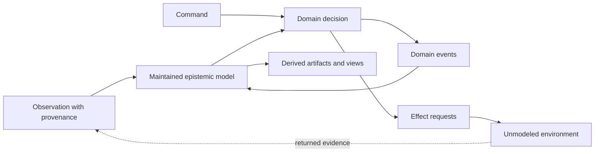

# Open semantic system design lens

Use this lens before freezing a design for any stateful program, component, or
workflow. Apply only the parts relevant to the declared boundary; do not force
actors, CQRS, event sourcing, supervision, or distributed protocols onto a
local calculation that does not need them.

The lens makes boundaries and claims discussable. It does not prove that a
design is correct.

## The model

A program is an open semantic system relative to one declared boundary:

```text
step : State × Input
    -> State × DomainEvent* × Artifact* × EffectRequest*
```

`State` is the maintained epistemic model whose invariants the system owns. It
is what the program currently warrants according to its rules and evidence,
not a perfect copy of the world.

`Input` is a typed semantic message:

| Input           | Semantic force                                     | Typical treatment                                          |
| --------------- | -------------------------------------------------- | ---------------------------------------------------------- |
| Command         | “Please decide whether to do this”                 | Accept or reject under domain policy                       |
| Observation     | “This source reports this”                         | Validate provenance, reconcile, and derive facts           |
| Query           | “Return information without changing domain state” | Read an appropriate projection                             |
| Acknowledgement | “A peer reports reception or progress”             | Interpret as evidence of exactly the acknowledged stage    |
| Snapshot/batch  | “This source claims state was X at T”              | Diff and reconcile under explicit completeness assumptions |

`DomainEvent` says that a transition occurred according to the system's domain
rules. `Artifact` is a value derived from maintained state: a response, report,
plan, rendered tree, explanation, or materialized view. `EffectRequest` asks an
outer handler or environment to attempt an interaction.

The system can establish that it issued a request. It cannot establish the
worldly consequence until a returned observation supplies new evidence.



## Artifact, request, and consequence

Keep these claims distinct:

| Output                     | What it establishes                                         |
| -------------------------- | ----------------------------------------------------------- |
| Domain event               | The domain transition was accepted under the system's rules |
| Materialized view          | This value is a projection of the maintained model          |
| Artifact                   | This value was derived from the maintained model            |
| Effect request             | The system requested an attempted interaction               |
| Actual worldly consequence | Nothing internally, without returned evidence               |
| Returned observation       | A source reported an outcome with some evidential strength  |

Examples:

- Constructing HTML is artifact production; mutating the DOM is an effect.
- Deriving a report is artifact production; writing it to a filesystem is an
  effect.
- Constructing a log record is artifact production; transmitting it to a
  collector is an effect.
- `EmailSendRequested` establishes issuance. `EmailAcceptedByGateway`
  establishes what that gateway acknowledged. Neither establishes that a
  person read the email.

Misleading names are semantic bugs. Prefer the strongest name justified by the
observation, not the outcome the system hoped for.

## Effects are boundary-relative open protocols

An effect handler expands the modeled system and moves the remaining open
interaction outward:

```text
domain core
  -> repository request
application + repository handler
  -> SQL/network request
application + database
  -> disk/replication request
OS + hardware
  -> physical interaction
```

Do not model an effect as a synchronous function when the environment can
delay, duplicate, reject, reinterpret, or lose it. Model the protocol:

```text
SendRequested(id, payload)
  -> Accepted(id)
   | Rejected(id, reason)
   | TimedOut(id)
   | Unknown(id)
  -> possibly later DeliveredObserved(id)
   | BouncedObserved(id)
```

`TimedOut` means that no response was observed before the deadline. It does not
mean that the effect did not occur. Retries therefore require an explicit
idempotency, deduplication, reconciliation, compensation, or deliberately
weaker delivery policy.

## Factor the global machine without losing its graphs

A system of components is still a global transition system mathematically.
Decomposition makes it comprehensible only when the semantic boundaries are
real:

- an actor or owner controls one evolving state;
- a state machine or reducer defines local reactions;
- a typed protocol defines communication;
- a structured-concurrency scope bounds work spawned by one reaction;
- a supervisor owns persistent availability and recovery;
- STM or a coordinating owner protects a cross-component atomic invariant;
- handlers interpret external requests; and
- projections serve read-oriented artifacts.

Several overlapping structures coexist:

| Structure                 | Typical shape                 | Meaning                                  |
| ------------------------- | ----------------------------- | ---------------------------------------- |
| Authority/state ownership | Forest or aggregate hierarchy | Who may mutate or end a resource         |
| Supervision               | Static-ish tree               | Who owns lifecycle and recovery          |
| Communication             | Often cyclic graph            | Who exchanges messages                   |
| Structured tasks          | Dynamic forest                | Which operation owns concurrent work     |
| Data derivation           | DAG or incremental graph      | Which facts produce and invalidate views |
| Deployment                | Nodes and placements          | Where computation executes               |

The supervision tree is not the communication topology. The browser-process
race observed during this feature is a small example: two tab-sessions were
logically distinct, but both mutated one process-global active-tab/focus
resource. A session label did not create ownership. Either one browser owner
must serialize complete exact-tab stories, or truly separate processes must
use non-shared mutable profiles.

Locks and STM coordinate shared mutable state. An actor avoids sharing it by
owning the resource and accepting immutable requests. Irreversible GUI or
network effects cannot be rolled back merely because reservation metadata was
updated transactionally.

### Layers, messages, and terminating slices

A source-code directory, service, or deployment tier is not a semantic layer
merely because it is drawn as a box. A boundary earns the name **layer** when a
typed message crosses into a different vocabulary, authority, evidential
force, or effect interpretation. Message and object types are the explicit
intermediates that make such a boundary reviewable.

Keep two transformations distinct:

- a representation-preserving translation changes encoding while retaining
  the same semantic type and stays within the layer; and
- a semantic translation consumes one message under the source layer's rules
  and produces a different message with the target layer's meaning, so the
  boundary and its assumptions must be explicit.

A **vertical slice** is one end-to-end message journey through the necessary
semantic boundaries to a declared terminal outcome: a value, rejection,
durable suspension, handoff, or outward effect request. Trace the slice by
message type and owner, not only by call stack or package.

An acyclic derivation or workflow graph gives a finite structural route when
the graph is finite and every node reaction is bounded. It does not by itself
prove runtime termination: a node may diverge, expand unbounded work, wait
forever, or depend on an unbounded environment.

Cycles are legitimate for persistent actors, feedback controllers, retries,
reconciliation, and observation loops, but each cycle needs an explicit
progress story. State at least one of:

- a decreasing well-founded measure or finite retry/fuel budget;
- a bounded reaction that returns to an explicit wait state;
- a convergence, fairness, or quiescence assumption;
- a cancellation, deadline, escalation, or durable-suspension boundary; or
- an intentional non-termination claim for a supervised persistent process.

Without one of these, a cyclic message graph exposes possible livelock,
amplification, or non-termination rather than establishing a valid loop.

## Bounded autonomy

Persistent actors and services may live indefinitely. Each reaction should
still be locally bounded:

```text
persistent component
  -> bounded reaction
      -> bounded task tree
      -> state transition
      -> messages + artifacts + effect requests
  -> wait for next input
```

Declare the policies the design needs:

- mailbox or queue capacity;
- concurrent work and fan-out;
- retries and retry delay;
- payload and retained-history size;
- resource acquisition, transfer, and release;
- cancellation and interruption;
- suspension and wake-up dependencies;
- progress, fairness, or starvation assumptions; and
- recovery/escalation after a component cannot continue.

Semantic resource grades describe what the program controls: requests emitted,
payload sizes, maximum retries, capabilities transferred, or internal work.
Machine cost, latency, money, and energy belong to realization evidence and
environmental assumptions.

## Design worksheet

Every new or changed feature design fills the versioned worksheet in
[`design-specs/TEMPLATE.md`](../design-specs/TEMPLATE.md):

1. **Boundary and warranted state** — What is inside, what state and invariants
   are owned, and what remains environmental?
2. **Semantic inputs** — Which commands, observations, queries, snapshots, or
   acknowledgements exist? What does each observation establish?
3. **Semantic outputs** — Which values are events, artifacts/views, requests,
   or diagnostics?
4. **Effect protocols and uncertainty** — What can be delayed, duplicated,
   rejected, lost, or remain unknown? What are retry and reconciliation rules?
5. **Components and orthogonal structures** — How do ownership, supervision,
   communication, task scope, derivation, deployment, and atomicity differ?
   Which message transformations stay within a layer, which cross a semantic
   boundary, and why do message cycles terminate, suspend, or intentionally
   persist?
6. **Bounded autonomy and resources** — What bounds one reaction and its
   resource use?
7. **Evidence, assumptions, and unsupported claims** — What supports each
   claim, and what remains unknown?

The repository gate checks that these accounts exist. Reviewers and executable
oracles evaluate their substance.

## Review prompts

- Does any name claim a consequence stronger than the observation?
- Can replay rebuild state without repeating an external effect?
- Can an adapter bypass the typed internal protocol?
- Is a generated view being edited as canonical state?
- Does timeout get confused with non-execution?
- Could retry duplicate an external consequence?
- Is mutable resource ownership explicit?
- Does one lock cover the whole critical story, including identity verification
  and postcondition, rather than isolated commands?
- Are supervision, communication, task ownership, derivation, and deployment
  accidentally collapsed?
- Does each claimed layer correspond to a semantic message boundary, or only
  to packaging?
- Is a representation conversion being mistaken for a semantic transition, or
  vice versa?
- Does each important vertical slice reach a declared terminal outcome?
- For every message cycle, what bounds one reaction and what establishes
  progress, quiescence, suspension, or intentional persistence?
- Can locally correct components deadlock, livelock, overload a queue, reorder a
  protocol, or violate a cross-component invariant?
- Are semantic bounds separated from environment-specific estimates?
- Is evidence reported in its actual category?

## Prior art and authority

The lens composes, but does not equate, several established ideas:

- [CQRS](https://martinfowler.com/bliki/CQRS.html) separates update and read
  models; it does not imply every other separation in this document.
- [Elm commands and subscriptions](https://guide.elm-lang.org/effects/) keep
  pure update logic distinct from runtime interpretation.
- [Erlang/OTP design principles](https://www.erlang.org/doc/system/design_principles.html)
  distinguish workers and supervision; `gen_statem` supplies event-driven
  state-machine behavior.
- [Handlers of Algebraic Effects](https://www.research.ed.ac.uk/en/publications/handlers-of-algebraic-effects/)
  formalizes effect operations and interpretations.

These are prior art, not project authority. The project constitution and frozen
feature contracts define Semantic Systems meanings.
