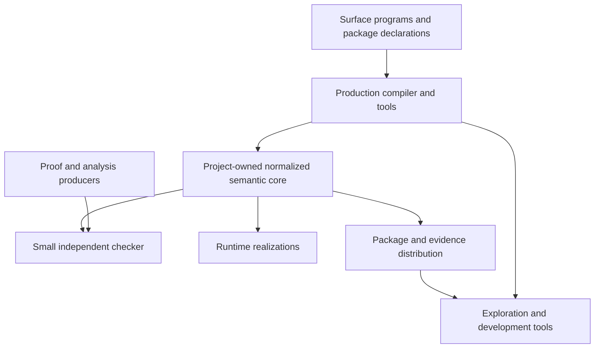

# Realization Strategy

## Purpose

This document describes how the semantic systems project can become a durable
research and engineering programme without prematurely committing the project
semantics to one host language, theorem prover, runtime, or package registry.

The project is realized as a **portfolio of cooperating systems** around a
project-owned semantic center:



No external technology is the meaning of the language. External systems are
proof producers, lowering targets, execution hosts, query engines, or transport
mechanisms.

## Design values

### Semantic primacy

A feature is accepted because it expresses a useful semantic distinction, not
because a host language or backend happens to expose it. Host-specific concepts
must be translated into project concepts at an explicit boundary.

### Small trusted base

The elaborator, optimizer, package resolver, proof automation, runtime, and
registry may all be complex. Trust should concentrate in independently
checkable artifacts and compact checkers rather than the whole implementation.

### Replaceability through contracts

Every major subsystem has an abstract contract and may have several
realizations. Replacing the Rust compiler host, Lean proof producer, Wasm
backend, or registry must not require redefining the language's semantic
contracts.

### Evidence without false equivalence

Proof, model checking, static analysis, testing, benchmarking, runtime checks,
assertions, and assumptions remain distinct. Policies select acceptable
combinations instead of assigning one misleading universal confidence score.

### Explainability

The compiler and resolver should be able to explain:

- how source elaborated into core;
- which effects and usage grades were inferred;
- why a realization was selected;
- which obligations were generated;
- which evidence discharged them;
- which assumptions remain in the artifact.

### Incremental refinement

A theory may begin as an asserted contract, later gain property tests, model
checking, and eventually a proof. The package identity and evidence model must
support improving confidence without rewriting every client.

### Executable tracer bullets

Each abstraction must be exercised in a vertical slice that crosses syntax,
semantics, checking, realization, packaging, and tooling. The inventory domain
machine remains the first such slice.

## Recommended system decomposition

### Semantic specification plane

Owns:

- normalized theories and contracts;
- typed core syntax;
- definitional equality and proof obligations;
- operational and observational semantics;
- the contract identity algorithm;
- evidence predicate definitions.

This plane should have a textual representation for review, a structured
representation for tools, and a compact representation for distribution.

### Production tooling plane

Owns:

- parsing and source preservation;
- elaboration and inference;
- incremental queries;
- diagnostics and explanations;
- realization and evidence resolution;
- lowering, optimization, and artifact assembly;
- language-server and command-line interfaces.

A memory-safe systems language is preferred here because this plane will become
large, performance-sensitive, concurrent, and responsible for processing
untrusted source and package metadata.

### Formal evidence plane

Owns:

- metatheory of selected core fragments;
- proofs of standard theories and realizations;
- proof-producing adapters;
- translation certificates;
- independent checking of imported evidence.

The formal plane should not be on the critical path for every edit during early
development. It should validate stable semantic seams and grow with the
project's confidence requirements.

### Runtime plane

Owns realizations of:

- memory management;
- effect handlers and resumptions;
- actor scheduling;
- transactional stores;
- commit-action dispatch;
- replicated data types;
- component hosting and foreign boundaries.

The runtime plane must make its guarantees explicit. For example, an STM
handler may claim serializability under stated memory-model and scheduler
assumptions; it does not silently become trusted merely because it implements
the correct interface.

### Ecosystem plane

Owns:

- package manifests;
- theory and realization discovery;
- content-addressed artifact transport;
- signatures and attestations;
- trust-policy evaluation;
- compatibility and migration metadata.

### Exploration plane

Owns:

- recursive system views;
- theory-realization maps;
- evidence graphs;
- source-to-core explanations;
- work and agent-delegation views;
- benchmarks and comparison dashboards.

## Reference realization portfolio

The recommended portfolio is:

| Concern | Preferred role | Durable project boundary |
|---|---|---|
| Production compiler and runtime tooling | Rust | Serialized semantic core and subsystem interfaces |
| Trusted mathematical evidence | Lean 4 | Proof certificates and normalized obligation identities |
| Fast executable-semantics experiments | Redex or K, selectively | Conformance traces and counterexamples |
| Graph/model and research tooling | TypeScript, Bun, and Effect v4 | Canonical project graph schema and portable capability boundary |
| Large recursive project and analysis queries | Datalog/Soufflé | Fact schema and derived relations |
| Local indexes and caches | SQLite or embedded key-value storage | Rebuildable projections, never canonical truth |
| Low-level optimization bridge | Project IR with optional MLIR/LLVM adapters | Translation contracts and validators |
| Portable component execution | WebAssembly Component Model | Generated external interface subset |
| Artifact transport | OCI-compatible registry | Project-owned package manifest and media types |
| Attestation and provenance | in-toto, Sigstore, SLSA vocabulary | Typed project evidence predicates |
| Interactive browser | TypeScript web client | Introspectable project query API |

These are initial recommendations, not constitutional requirements.

## Architectural patterns

### Functional core, effectful shell

Parsing aside, semantic transformations should behave as deterministic queries
from explicit inputs to explicit outputs. File systems, clocks, networks,
registries, schedulers, and solvers sit behind effects or ports.

This supports reproducibility, testing, alternate handlers, and future use of
the language's own effect concepts inside its implementation.

### Untrusted producer, trusted checker

Complex stages produce artifacts that smaller stages check:

```text
elaborator produces typed core       -> core checker validates
optimizer produces transformed IR    -> validator checks relation
solver produces certificate          -> certificate checker validates
package resolver produces selection  -> policy checker validates
```

The project should prefer checking over trusting whenever a useful certificate
can be generated economically.

### Multi-level representation

No single IR should serve source tooling, semantic proof, whole-program
analysis, and machine optimization. Representations are specialized but linked
through stable identities, source maps, and translation evidence.

### Git as authoring substrate, registry as distribution substrate

Human-authored theories, specifications, and package declarations should remain
reviewable as source. Published normalized artifacts and evidence should be
content-addressed and distributable independently of repository layout.

### Derived views, not replicated truth

Search indexes, diagrams, work boards, language-server caches, Datalog facts,
and registry metadata are projections of canonical artifacts. They should be
rebuildable.

## Realization stages

### Stage A: semantic laboratory

Goal: establish vocabulary and executable meaning.

Outputs:

- small surface language fragment;
- normalized core;
- reference evaluator;
- inventory domain machine;
- explicit theories, realizations, obligations, and assumptions;
- generated project views.

Formal work concentrates on definitions and small preservation/progress
results, not a complete verified compiler.

### Stage B: evidence-carrying toolchain

Goal: prove the architecture of checking and distribution.

Outputs:

- independent core checker;
- evidence bundle format;
- one external proof adapter;
- one analysis/test adapter;
- policy-aware realization resolution;
- content-addressed packages;
- pure and actor inventory deployments.

### Stage C: runtime plurality

Goal: demonstrate that one domain contract supports materially different
realizations.

Outputs:

- effect-runtime realization;
- actor realization;
- STM realization;
- deterministic simulation handler;
- generated comparison and conformance reports.

### Stage D: optimization and external composition

Goal: preserve semantics through increasingly operational representations.

Outputs:

- typed CBPV lowering;
- ownership and representation lowering;
- translation validation at selected seams;
- Wasm component deployment;
- foreign implementation packages.

### Stage E: distributed semantic selection

Goal: derive concurrency requirements from laws.

Outputs:

- semilattice and CRDT theories;
- monotonicity and stability analyses;
- invariant-confluence obligations;
- actor, transactional, replicated, and coordinated deployment alternatives.

## Decision discipline

A technology or pattern enters the recommended stack only after answering:

1. Which project-owned semantic boundary does it implement?
2. Can it be replaced without changing theory identities?
3. What does it add to the trusted computing base?
4. Which artifacts can be checked independently?
5. Does it preserve source and semantic provenance?
6. Can its outputs be cached and reproduced?
7. Does it improve the inventory tracer bullet?
8. What result would cause the project to remove it?

## Non-goals

The initial realization does not attempt to:

- build a universal proof assistant;
- replace mature optimization infrastructures;
- define a globally distributed STM;
- make every package fully formally verified;
- infer every domain law automatically;
- expose one giant universal IR;
- make project correctness depend on a specific registry or cloud platform.
