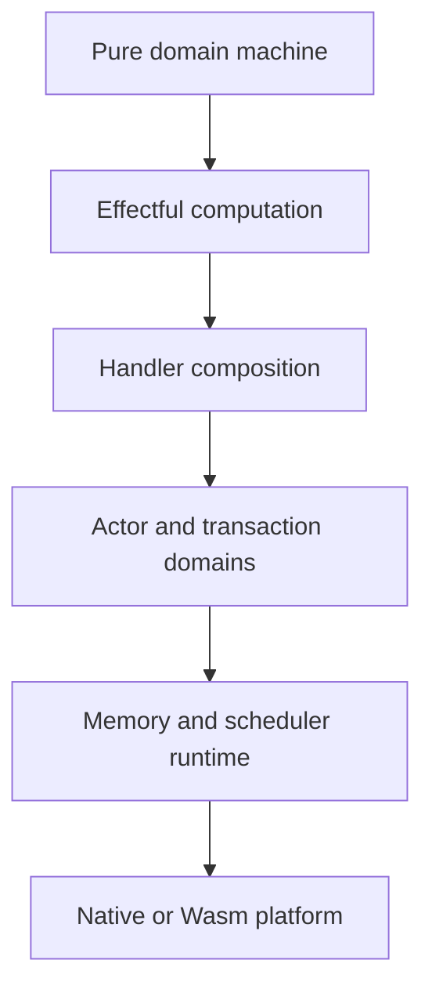

# Runtime, Memory, and Concurrency Design Specification

## Objective

The runtime should offer several lawful execution models without making any one
of them the universal semantics of state. The semantic program requests
capabilities; selected handlers and runtimes determine operational realization.

## Runtime strata



## Functional decision core

Domain transitions should preferentially have the shape:

```text
Message -> State -> Effects Step<State, Event>
```

or a pure description of requested effects. This TEA-inspired pattern separates
business decisions from execution and enables:

- deterministic simulation;
- replay;
- model checking;
- event sourcing;
- actor realization;
- transactional realization;
- alternate deployment handlers.

The runtime may optimize representation, but the transition contract remains
observable.

## Effects as runtime contracts

An effect is an abstract operation family with types, continuation behavior,
and optional laws. A handler is an implementation package.

Runtime effects should describe capabilities rather than vendors or mechanisms:

```text
Clock
Random
FileStore
ActorMessaging
TransactionalStore<S>
EventSink<E>
Replication<D>
Coordination<D>
```

A handler records:

- operations implemented;
- effects introduced or eliminated;
- continuation multiplicity;
- resource and thread-safety requirements;
- behavioral claims;
- evidence and assumptions;
- target availability.

## Continuations

The initial runtime should prefer one-shot resumptions. One-shot continuations
fit affine resource capture and can be implemented more predictably.

Multi-shot resumptions, if added, require explicit capture rules:

- captured values are copyable or immutable shared;
- uniquely owned resources cannot be duplicated;
- transactional captures are replay safe;
- region references outlive all resumptions;
- effect laws state whether repeated resumption is observable.

## Actor realization

### Semantic role

Actors provide isolated mutable authority. Each actor owns its private state and
processes one logical transition at a time.

### Actor definition

An actor realization contains:

- state type;
- accepted message sum;
- transition function;
- emitted events or commands;
- supervision and failure policy;
- mailbox ordering guarantee;
- persistence and replay policy;
- protocol evidence.

### Message data

Messages remain ordinary values. Sending is an effect. Typed actor references
restrict which messages may be offered.

### Ownership

Messages cross actor boundaries by:

- ownership transfer;
- immutable sharing;
- serialization/copy;
- capability handle.

Actor-private mutable references cannot be sent directly.

### Scheduling guarantees

Do not claim more than the runtime supplies. Distinguish:

- per-sender FIFO;
- per-receiver FIFO;
- global ordering;
- at-most-once delivery;
- at-least-once delivery;
- exactly-once *effect* semantics, which generally requires stronger protocols.

These are realization metadata, not implicit actor properties.

## STM as a library effect

### Semantic role

STM provides composable atomic transitions over an explicitly shared local
transaction domain. It does not replace actor isolation and does not imply
distributed transactions.

### Abstract operations

A transactional effect may expose:

```text
read(TVar<S, A>) -> A
write(TVar<S, A>, A) -> Unit
retry() -> Never
orElse(Txn<S, A>, Txn<S, A>) -> Txn<S, A>
```

The `atomic` handler interprets these operations through a runtime strategy.

### Required semantic claims

A realization may claim:

- atomic visibility;
- rollback of speculative writes;
- isolation level;
- serializable committed histories;
- retry dependency wake-up;
- fairness or absence of fairness;
- progress guarantees.

Each claim requires evidence or an explicit assumption.

### Speculation and commitment

A transaction attempt may run multiple times. The definitive act is atomic
publication of the validated write set, not a second execution of the source
body.

Separate lifecycle hooks:

```text
per attempt cleanup
successful commit actions
permanent abort actions
```

`finally`-style cleanup is not equivalent to `afterCommit` because cleanup runs
on failed attempts while commit effects must run once after successful
publication.

### Commit actions as values

Transaction bodies should emit typed commit actions rather than execute
irreversible effects:

```text
Send(message)
Publish(event)
Schedule(timer)
Release(resource-token)
```

The STM handler returns or persists the committed action log. A separate
interpreter executes it once. This supports transactional outboxes, auditing,
replay, and ownership tracking.

### Resource capture

Retryable computations cannot directly consume affine resources. Supported
patterns include:

- immutable observation;
- transactionally deferred ownership transfer;
- logical ownership tokens stored in transactional cells;
- post-commit actions holding moved resources.

## Actor and STM composition

Recommended default:

- actors own ordinary mutable state;
- an actor or runtime domain owns a transactional store;
- other components receive restricted transactional capabilities;
- transactions span TVars in one store domain;
- transactions do not directly mutate private state belonging to unrelated
  actors.

Cross-actor atomicity uses explicit coordination protocols, reservations,
sagas, or consensus where required.

## CRDT realization

### Semantic role

CRDTs support independently evolving replicas whose states or operations merge
according to stated algebraic laws.

### State-based contract

A typical state-based realization requires:

- partial order;
- join operation;
- associativity;
- commutativity;
- idempotence;
- inflationary local updates;
- eventual dissemination assumptions.

### Operation-based contract

An operation-based realization instead requires conditions such as:

- reliable causal delivery assumptions;
- commutation of concurrent operations;
- duplicate handling policy.

### Invariants

Convergence is not application correctness. A replicated realization must also
state whether local updates and merge preserve the domain invariant.

The system should generate obligations such as:

```text
valid(s1) and valid(s2) and compatible-history(s1, s2)
    implies valid(join(s1, s2))
```

## CALM-guided deployment analysis

The project should track whether outputs and propositions are stable under
additional information.

### Stable claims

Once true, remain true as knowledge grows. These are candidates for
coordination-free dissemination.

### Unstable claims

May be invalidated by later knowledge, such as absence, uniqueness, final
counts, or winner selection. They require a completeness boundary, ownership,
lease, coordination, or a redesign into monotone facts.

### Analysis result

The compiler or project analyzer should not automatically promise a distributed
implementation. It should explain:

- which operation or query is non-monotone;
- which invariant fails under independent merge;
- which additional evidence would make the claim stable;
- available actor, STM, escrow, CRDT, or consensus realizations.

## Memory realization

### Semantic categories

The language distinguishes authority and use:

```text
Owned<T>
Borrow<T>
BorrowMut<T>
Shared<T>
Observe<T>
RegionRef<R, T>
Handle<D, T>
TVar<S, T>
```

These may elaborate from usage grades and capabilities rather than all being
primitive types.

### Default strategy

A promising runtime portfolio is:

1. unique affine ownership by default;
2. temporary borrowing for non-owning access;
3. immutable sharing when aliasing escapes;
4. reference counting only where shared lifetime is required;
5. weak or generational observation for semantically non-owning links;
6. arenas or regions for cyclic aggregate-owned graphs;
7. uniqueness-based in-place reuse;
8. optional specialized cycle handling inside explicit domains.

### Domain ownership versus dependency

Keep separate graphs:

- ownership determines lifetime;
- dependency determines invalidation or derivation;
- causality determines propagation.

A derived value may observe a source weakly, but derivation semantics must not
be reduced to reference-count mechanics.

### Destruction observability

Ordinary memory deallocation should not be an arbitrary user-visible effect.
External resources use linear or scoped resource protocols. This permits
last-use destruction, region release, and reuse optimizations without changing
program meaning.

## Deterministic simulation runtime

Before building parallel runtimes, implement a deterministic handler that:

- runs actors under a controlled scheduler;
- records every message and effect;
- simulates STM conflicts and retries;
- injects clocks and randomness;
- explores alternative schedules within bounds;
- emits replayable traces.

The simulator becomes a conformance oracle for optimized runtimes and a source
of model-checking scenarios.

## Platform boundary

### Native

Native deployments may use direct threads, atomics, OS I/O, and architecture-
specific optimization. The artifact records memory model and platform
assumptions.

### Wasm Components

Wasm component deployments expose only declared imports and exports. Generated
interfaces encode data and resource shapes; companion semantic metadata records
laws and effects.

Component composition is especially suitable for alternative realization
packages and sandboxed evidence producers.

## Runtime evidence

Runtime packages should publish evidence for claims at several levels:

- unit and property tests for data structures;
- schedule exploration and model checking;
- stress and fault-injection tests;
- static analysis and sanitizers;
- proofs of selected algorithms;
- platform conformance tests;
- benchmarks for progress and latency claims;
- explicit hardware and scheduler assumptions.

## First runtime tracer bullet

The inventory example should run under:

1. pure deterministic update;
2. single actor;
3. STM store with commit actions;
4. deterministic simulated actor/STM composition.

The same message and event contracts should be used. Generated reports should
compare traces, effects, assumptions, and evidence rather than only final
outputs.
