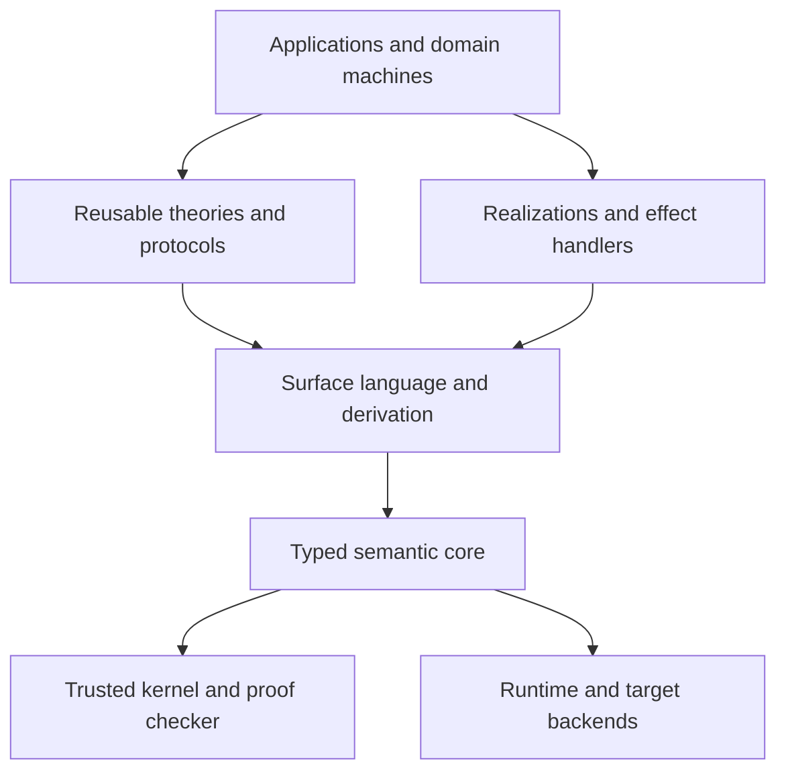

# Stratified Language and Ecosystem Design



## 0. Trusted kernel

The smallest trusted layer checks normalized syntax, typing, usage, equality,
proof terms, termination or productivity where required, and the operational
rules needed by the core.

Candidate foundations:

- value/computation separation inspired by call-by-push-value;
- dependent functions and products where justified;
- sums, products, inductive and coinductive definitions;
- quantitative usage;
- algebraic effects and one-shot handlers;
- a total, erased proposition fragment.

## 1. Typed semantic core

The compiler-facing core makes evaluation order, effects, resource usage, and
proof erasure explicit. It is optimized for clear metatheory and reliable
elaboration rather than source ergonomics.

## 2. Surface language

The surface language may provide:

- algebraic data types and pattern matching;
- traits, associated types, higher-kinded polymorphism, and laws;
- effect declarations and handlers;
- actor, machine, transaction, and protocol syntax;
- ownership and region sugar;
- propositions, refinements, and theorem declarations;
- derivations for implementations, evidence, serializers, adapters, diagrams,
  tests, and model-checker inputs.

Messages and events remain sum-type values. Actors, STM, and protocols may be
standard abstractions and elaborations rather than kernel primitives.

## 3. Theories

A theory contains:

- abstract types;
- operations;
- effects;
- equational laws;
- safety invariants;
- behavioral guarantees;
- observational semantics;
- compatibility requirements.

A theory is a semantic contract, not merely a method interface.

## 4. Realizations

A realization supplies:

- concrete representations;
- executable operations;
- handlers and runtime requirements;
- target and ABI constraints;
- evidence and assumptions;
- operational metadata such as complexity or progress guarantees.

Several realizations may implement one theory.

## 5. Evidence

Every obligation may be supported by one or more evidence artifacts:

- kernel-checked proof;
- imported certificate;
- static analysis;
- bounded or finite model checking;
- property and example tests;
- benchmark;
- runtime check;
- assertion;
- explicit assumption.

A trust policy decides what evidence is sufficient for a deployment.

## 6. Packages

Package roles include:

- theory;
- model;
- realization;
- handler;
- evidence;
- adapter;
- runtime;
- application;
- deployment.

Normalized semantic contracts receive content identities. Evidence targets exact
contract and realization identities.

## 7. Domain machines

A domain machine combines:

```text
State
+ Messages
+ Events
+ Transition function
+ Requested effects
+ Invariants
+ Transition laws
```

Possible realizations include pure update loops, TEA-style applications,
single-owner actors, STM components, event-sourced actors, CRDT replicas, and
coordinated services. Law evidence determines which realizations are valid.
