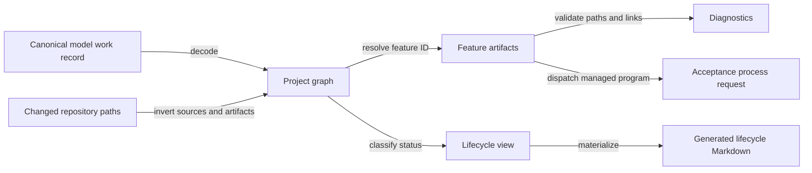

# Design spec 0049: canonical work lifecycle

Status: frozen for implementation

Date: 2026-08-02

Design-Lens-Version: open-semantic-system-v1

Migrates-Feature-IDs: 0001-inventory-resolution-tracer, 0002-reference-baselines-deep-research, 0003-independent-resolution-checker, 0004-reference-source-custody, 0005-autonomous-development-control-loop, 0007-reuse-first-engineering, 0010-typescript-effect-v4-runtime, 0012-minimal-actor-runtime, 0013-bounded-actor-trace-retention, 0014-stm-effect-handler-laws, 0015-open-semantic-system-design-lens, 0016-executable-semantic-system-kernel, 0017-control-room-reconstruction, 0018-minimal-kernel-calculus, 0019-normalized-core-format, 0020-agent-facing-kernel-json, 0020-lossless-kernel-source, 0021-pbk-portfolio-control-room, 0022-kernel-reference-interpreter, 0031-control-room-interactive-skill-tree, 0046-effect-graph-execution-index, 0048-pbk-control-room-acceptance-reconciliation

## Problem

Work lifecycle is authored in several independent places:

- `model/work/*.json` records work status, phase, plan path, and completion evidence;
- plan directory names and headings, plus `design-specs/superseded/`, encode
  `active`, `completed`, or `superseded`;
- plan `Status:` prose repeats current execution or review state;
- acceptance programs repeat lifecycle-dependent plan paths; and
- `CONTRIBUTING.md` and design spec 0005 prescribe only the active path and do not define the completion transition.

Observed drift includes:

- `0017`, `0018`, `0019`, `0031`, and `0046`, whose canonical status is
  `complete` while plan headings, status prose, or acceptance metadata still
  describe an earlier lifecycle;
- `0016`, which had the same drift at `b99535d` and was corrected by
  `bd7ede1`;
- `0012`, whose actor-runtime and inventory-actor work items both claim one
  feature's paths; and
- pre-loop features `0001` through `0004`, which have no feature-loop acceptance
  programs and are not superseded.

The project model already treats canonical JSON as authored truth and generated
Markdown as projection. Work lifecycle must follow the same rule.

The important claim is:

> One decoded canonical work record determines a feature's lifecycle and stable
> artifacts; every lifecycle view and acceptance lookup is a deterministic,
> checked projection of that record.

## Felt journey

An operator completes one feature by changing its canonical work record from
`in_progress` to `complete` and recording completion evidence. The operator does
not move the plan or edit its heading, current-status prose, acceptance program,
or navigation links.

`semproj validate` accepts the one coherent feature record. Each feature owner
lives alone at `model/work/features/<feature_id>.json`, so changing that source
selects exactly its feature even when no plan changes; a model-only lifecycle
transition is a valid feature range.
`semproj generate` then moves the feature from the active section to the
completed section of the generated lifecycle view. `just accept <id>-<slug>`
resolves the same stable design spec, plan, model record, and acceptance
availability by feature ID.

A missing artifact, duplicate feature ID, invalid status, lifecycle-dependent
plan or design path, or terminal state without completion evidence fails with a
typed, source-located diagnostic. No derived view is presented as canonical
state.

## Open semantic system design lens

### Boundary and warranted state

The feature boundary is the repository-local work-lifecycle module inside the
TypeScript/Effect project-model tooling.

It owns:

- the work-status vocabulary and lifecycle classification;
- the decoded feature metadata attached to canonical `work_item` entities;
- stable resolution from feature ID to design spec, plan, model source, and
  acceptance program;
- structural coherence diagnostics; and
- deterministic lifecycle projections.

Warranted state is a successfully decoded and validated `ProjectGraph` plus
filesystem observations made for the same repository root. Markdown prose,
directory names, generated views, Git history, agent reports, and Control Room
screens are not lifecycle authority.

The following state remains environmental:

- who is authorized to edit the canonical model;
- whether a claimed commit, review, test, deployment, or external observation
  actually occurred;
- Git branch protection and remote merge policy; and
- filesystem and process behavior outside the returned Effect observations.

### Semantic inputs

| Input                       | Category                                | Authority and limits                                                                                     |
| --------------------------- | --------------------------------------- | -------------------------------------------------------------------------------------------------------- |
| `model/**/*.json` document  | Authored assertion decoded at runtime   | Canonical only after schema and repository validation; does not establish semantic completion by itself. |
| `validate` command          | Query                                   | Requests diagnostics; never changes canonical state.                                                     |
| `generate` command          | Command                                 | Requests deterministic projection writes; does not change lifecycle authority.                           |
| `generate --check` command  | Query                                   | Compares expected and observed projection bytes; performs no write.                                      |
| feature ID                  | Query input                             | Selects exactly one canonical feature record or returns a typed rejection.                               |
| repository path observation | Runtime observation                     | Establishes local existence/type for this checkout only.                                                 |
| changed Git paths           | Runtime observation                     | Scopes feature-loop execution; does not establish acceptance or completion.                              |
| completion evidence fields  | Authored evidence references/assertions | Preserve their declared categories; they are not converted into proof.                                   |

Feature-owning `work_item` entities canonically declare:

```text
feature_id   = <four digits>-<slug>
feature_loop = "managed" | "pre_loop"
completion   = absent for nonterminal work; required for complete work
replacement  = required for superseded work
```

The feature ID derives stable artifact paths. Status and feature-loop class
control acceptance availability, never where identity-bearing documents live:

```text
all feature statuses and loop classes:
  model/work/features/<feature_id>.json
  design-specs/<feature_id>.md
  plans/<feature_id>.md

managed + active or complete:
  scripts/accept/<feature_id>.ts is required and runnable

pre_loop:
  no feature-loop program is required; resolution is explicitly non-runnable

superseded:
  any existing scripts/accept/<feature_id>.ts is historical and not runnable
```

The model does not repeat those derivable paths. The model entity ID remains a
semantic work identity such as `work.control-room-reconstruction`; it is not
replaced by the numeric feature identity.

### Semantic outputs

| Output                              | Kind                                            | Canonical status                                              |
| ----------------------------------- | ----------------------------------------------- | ------------------------------------------------------------- |
| Decoded feature record              | Returned observation                            | Projection of one canonical work entity.                      |
| Validation issue                    | Diagnostic                                      | Evidence of one observed structural inconsistency.            |
| Resolved feature artifacts          | Returned observation                            | Deterministic projection used by feature dispatch.            |
| `generated/08-feature-lifecycle.md` | Materialized view                               | Generated, noncanonical, and linked to model sources.         |
| Feature acceptance process launch   | Effect request interpreted by the command layer | Runtime validation only for the invoked program and checkout. |
| Exit status and captured output     | Runtime observation                             | Does not prove semantic validity or external policy.          |

No plan file is generated. Its execution ledger remains authored mutable state
at a stable path. Its first heading is lifecycle-neutral:

```text
# Plan <feature_id>: <title>
```

In a plan, the leading block is the Markdown after that level-one heading and
before the first level-two heading, excluding fenced code. It contains no
definition-style or heading-style `Status` label, including emphasized forms.
Removed status text is not discarded: migration appends it verbatim to a dated
ledger entry labelled as historical evidence, not current authority. Review,
deployment, and acceptance observations remain append-only ledger evidence or
typed model evidence.

### Effect protocols and uncertainty

Resolution fails closed for:

- an unknown or duplicate feature ID;
- a missing, malformed, or non-`work_item` feature record;
- a status outside the work-status vocabulary;
- a lifecycle-dependent plan or design path, or an artifact missing from its
  derived path;
- a missing or non-executable acceptance program for active or complete
  `managed` work;
- an acceptance request for `pre_loop` or superseded work;
- a terminal `complete` record without valid completion evidence;
- a `superseded` record without a named replacement or invalidation;
- a plan heading that embeds an obsolete lifecycle label; or
- a plan whose leading block contains a current `Status` label.

Validation returns all deterministic diagnostics it can collect for the decoded
graph. An undecodable canonical document prevents a warranted project graph and
therefore prevents feature resolution and generation.

Changed design contracts receive the current open-system design-lens gate after
feature resolution. A superseded historical contract is exempt because changing
its frozen shape would destroy the preserved checkpoint; its typed superseded
record and replacement remain mandatory.

Projection generation has no retry loop. `--check` is read-only. Write mode
requests bounded filesystem writes through the existing Effect filesystem
layer. An I/O failure returns a typed error and does not authorize changing the
canonical model to match a partial projection.

Acceptance dispatch launches only a resolved `managed` program with an argv
array. It never constructs shell input. Direct, PR, and range dispatch report
`pre_loop` and superseded records as explicitly non-runnable without failing
the gate. Release dispatch enumerates canonical feature records, runs active and
complete `managed` programs, reports non-runnable records with their reason or
replacement, and fails on an acceptance script with no canonical feature owner.
Timeout, interruption, nonzero exit, or unknown process outcome is reported as
runtime evidence, not completion.

Range migration ownership uses only declarations whose design path changed in
that range. An unchanged contract's prior `Migrates-Feature-IDs` marker is
historical and inert. Changed declarations still fail on duplicate ownership.
This 0049 declaration therefore owns the 22 path migrations without colliding
with the unchanged 0010, 0015, 0020, or 0048 declarations.

### Components and orthogonal structures



Legend: solid arrows are deterministic derivations or explicit effect requests;
only the model work record is lifecycle authority.

The work-lifecycle module is one deep module at the project-model seam. Its
small interface hides status decoding, feature indexing, artifact-path rules,
completion checks, and lifecycle-view ordering. The existing loader remains the
canonical JSON decoder. The command layer remains the interpreter of filesystem
and process effects.

The following structures stay distinct:

- **authority:** authored model records;
- **work dependency:** `blocks` and `requires` relations;
- **derivation:** feature resolution and generated lifecycle views;
- **observation:** filesystem, Git, process, test, and review results;
- **execution ledger:** authored plan history;
- **contract lifecycle:** design-spec status and semantic diffs;
- **work lifecycle:** the canonical `work_item.status`; and
- **evidence state:** typed completion and review evidence.

No message cycle exists in resolution or generation. Acceptance programs may
contain their own bounded process graphs; this feature does not redefine them.

### Bounded autonomy and resources

- One invocation scans the finite checked-in model and resolved feature
  artifacts under one repository root.
- Feature resolution returns at most one record and never searches the network.
- Lifecycle generation emits one deterministic document ordered by feature ID.
- Validation accumulates finite diagnostics; it does not repair files.
- No watcher, daemon, retry queue, background task, or provider mutation is
  introduced.
- Existing command timeouts and process custody remain unchanged.
- Migration is one clean cutover. No aliases, duplicate plan paths, or deprecated
  resolver remain afterward.

### Evidence, assumptions, and unsupported claims

| Claim                                                                     | Evidence category and gate                                                         |
| ------------------------------------------------------------------------- | ---------------------------------------------------------------------------------- |
| Status and feature metadata decode to one typed record                    | Type/Schema boundary plus focused tests.                                           |
| Known historical drift is rejected                                        | Example tests from 0012/0016/0017/0018/0019/0031/0046 and pre-loop records.        |
| Stable forward and inverse resolution is deterministic and duplicate-safe | Focused example and property tests.                                                |
| Generated lifecycle bytes are stable                                      | Bun/Node parity observation and `semproj generate --check`.                        |
| Acceptance dispatch uses the resolved program without shell construction  | Static inspection, focused command tests, and runtime observation.                 |
| Migrated feature programs remain compatible                               | Exact-head model-aware release replay, including observed program and skip counts. |
| Full repository remains compatible after migration                        | `just check` plus 0049 and release acceptance runtime observations.                |
| Contract and implementation match                                         | Independent exact-head review assertion.                                           |

Assumptions:

- canonical model authors state work and evidence truthfully;
- the repository root and filesystem observations refer to one coherent
  checkout during an invocation;
- Git reports the requested changed paths and executable bits correctly; and
- Effect filesystem/process adapters preserve their documented semantics.

Unsupported claims:

- that a `complete` status proves semantic correctness, deployment, merge,
  review independence, or absence of defects;
- that local filesystem existence establishes remote availability;
- that generated navigation replaces the authored execution ledger;
- that one scalar status captures contract, work, review, evidence, deployment,
  and question lifecycles; or
- that lifecycle validation can judge the quality or truth of prose evidence.

## Deep-module contract

### Work status

All `work_item` entities use exactly these statuses:

| Status        | Meaning                                                                | Lifecycle projection |
| ------------- | ---------------------------------------------------------------------- | -------------------- |
| `planned`     | Contract or prerequisites are not ready for execution.                 | active               |
| `ready`       | Frozen contract and prerequisites permit execution.                    | active               |
| `in_progress` | Bounded execution is underway.                                         | active               |
| `blocked`     | Execution is paused on an explicit unresolved dependency.              | active               |
| `complete`    | The bounded work item is accepted and completion evidence is recorded. | completed            |
| `superseded`  | A named replacement or invalidation ends this work item.               | superseded           |

`accepted` is a decision/evidence term, not a work status.
`resolved_negative` is a question outcome, not a work status. A negatively
resolved experiment is `complete` work with an explicit negative result.

### Feature record

A feature-owning work item has one `feature_id` and one `feature_loop`.
`managed` is the normal feature loop. `pre_loop` is a finite migration fact
permitted only for:

- `0001-inventory-resolution-tracer`;
- `0002-reference-baselines-deep-research`;
- `0003-independent-resolution-checker`; and
- `0004-reference-source-custody`.

The validator rejects `pre_loop` on every other ID. Pre-loop is not a synonym
for superseded: it records that no executable feature-loop contract existed.

Feature `0012-minimal-actor-runtime` is owned only by `work.actor-runtime`.
`work.inventory-actor` remains a distinct non-feature work item linked through
the work-dependency graph. This preserves the distinction while giving the
combined frozen 0012 contract one artifact owner.

Each feature-owning record is the only entity in
`model/work/features/<feature_id>.json`. This stable source path prevents a
path-only Git observation from over-selecting unrelated feature records.
Non-feature work remains in other canonical model documents.

The work-lifecycle module derives the stable model source, design spec, and plan
paths from the feature ID, then acceptance availability from feature-loop class
and work status. The canonical entity does not store those path strings.

Every `complete` work item, including non-feature work, has:

```text
completion = {
  outcome: "positive" | "negative"
  implementation_head?: GitSha
  integration_head?: GitSha
  evidence: NonEmptyArray<{
    role:
      | "feature_acceptance"
      | "integration_test"
      | "integration_analysis"
      | "equivalence"
      | "independent_review"
      | "status_basis"
    category: EvidenceCategory
    method: NonEmptyString
    source:
      | { kind: "repository_artifact", path: RepositoryRelativePath }
      | { kind: "git_commit", object_id: GitSha }
      | { kind: "external_observation", uri: AbsoluteUri }
      | { kind: "authored_assertion" }
    claim: NonEmptyString
  }>
}
```

A complete `managed` feature additionally requires `implementation_head`.
Pre-loop and non-feature complete work may omit commit heads. They must include
at least one `status_basis` entry with category `assertion`; other evidence can
remain separate.
Repository artifacts are normalized relative regular-file paths observed in
the current checkout. Commit and external references are syntax-checked
authored references; validation does not establish that they exist remotely.

The current completion keys migrate without silently becoming evidence
categories:

| Existing key and value                       | Canonical mapping                                                                                                                                                     |
| -------------------------------------------- | --------------------------------------------------------------------------------------------------------------------------------------------------------------------- |
| `implementation_head: <sha>`                 | same typed field                                                                                                                                                      |
| `integration_head: <sha>`                    | same optional typed field                                                                                                                                             |
| `feature_acceptance: runtime_validation`     | `feature_acceptance` / `runtime_check` evidence; method remains `runtime_validation`; source is the stable plan ledger                                                |
| `integration_gate: test_and_static_analysis` | separate `integration_test` / `test` and `integration_analysis` / `analysis` entries; both retain method `test_and_static_analysis`; source is the stable plan ledger |
| `equivalence_evidence: runtime_validation`   | `equivalence` / `runtime_check` evidence; method remains `runtime_validation`; source is the stable plan ledger                                                       |
| `independent_review: assertion`              | `independent_review` / `assertion` evidence with `authored_assertion` source                                                                                          |
| `public_url`                                 | a deployment entity and external observation, never completion evidence                                                                                               |

These mappings preserve the old method strings, distinguish the evidence
categories they combined, and make no proof or review-independence upgrade.

Every `superseded` work item has exactly:

```text
replacement = {
  target: FeatureId | EntityId
  reason: NonEmptyString
}
```

The target must resolve to another canonical feature or model entity.
Superseded feature work has no runnable acceptance program.

### Module interface

The semantic interface is:

```text
resolveFeature(ProjectGraph, FeatureId)
  -> FeatureArtifacts | FeatureDiagnostic
classifyWorkStatus(WorkStatus)
  -> active | completed | superseded
featuresForChangedPaths(ProjectGraph, RepositoryRelativePath[])
  -> FeatureId[]
validateFeatureRepository(ProjectGraph, RepositoryRoot)
  -> Effect<FeatureDiagnostic[], never, FileSystem | Path>
renderFeatureLifecycle(ProjectGraph)
  -> deterministic Markdown bytes
```

`featuresForChangedPaths` maps a canonical feature source or each derived
design, plan, and acceptance path back to its one owner. Callers do not retain
path regexes. Feature-contract scripts become Effect programs under the
existing Bun and Node runtimes.

`FeatureArtifacts` exposes the canonical model source, stable design and plan,
and a typed acceptance result: runnable, pre-loop non-runnable, or superseded
non-runnable. An existing superseded acceptance program remains historical.
The exact TypeScript representation and internal module split remain
implementation freedom.

### Invariants

1. **WL1 — one authority:** one canonical work entity owns each feature ID.
2. **WL2 — stable artifacts:** lifecycle changes never change feature artifact
   paths.
3. **WL3 — typed axes:** work, contract, review/evidence, question, and deployment
   statuses are never collapsed into one field.
4. **WL4 — fail-closed resolution:** missing, duplicate, malformed, or incoherent
   feature metadata cannot dispatch acceptance.
5. **WL5 — neutral authored plan:** plan heading and path contain identity, not
   current lifecycle, and its leading block has no current `Status` label that
   duplicates ledger or model state.
6. **WL6 — derived navigation:** lifecycle indexes and Control Room status derive
   from canonical work records and retain source provenance.
7. **WL7 — evidence honesty:** terminal status requires evidence references but
   does not upgrade their evidence category.
8. **WL8 — clean cutover:** no lifecycle-path alias, caller-side path
   reconstruction, or plan-change selection dependency remains after migration.

## Oracle-first counterexamples

The implementation must first demonstrate failures for:

1. a checked-in artifact under `plans/active/`, `plans/completed/`,
   `plans/superseded/`, or `design-specs/superseded/`;
2. a plan heading that labels itself active, completed, or superseded;
3. a plan leading block with a definition-style, emphasized, or heading-style
   `Status` label;
4. an old lifecycle prefix in non-test executable source or current acceptance
   artifact metadata;
5. a feature plan with no canonical feature-owning work row;
6. two work entities claiming the same feature ID;
7. an invalid or cross-axis work status such as `accepted`;
8. `complete` work without typed completion evidence, or `superseded` work
   without a valid replacement;
9. a feature whose derived model source, design, plan, or required
   managed-acceptance artifact is absent;
10. `pre_loop` on any ID outside the four frozen migration exceptions;
11. a changed canonical feature source that does not select its one derived
    feature ID;
12. release dispatch that runs a superseded or pre-loop program, or ignores an
    acceptance script without a canonical owner;
13. an unresolved intra-repository Markdown link after relocation;
14. nondeterministic lifecycle ordering under permuted model-file order; and
15. a generated lifecycle view edited by hand.

Positive oracles cover one active managed, completed managed, superseded,
pre-loop, and negatively completed work item; feature 0012 with one owner and a
distinct non-feature inventory-actor item; a superseded historical contract
that is not subjected to the current design-lens shape; stable artifact
resolution before and after a status transition; model-only changed-path
selection; Bun/Node projection parity; exact source links in generated output;
and valid links in every relocated plan and design contract.

## Acceptance

The feature is accepted only when:

1. `model/work` is the sole work-lifecycle authority;
2. every checked-in feature plan has one canonical feature-owning work record
   alone at `model/work/features/<feature_id>.json`, with only 0001-0004
   classified `pre_loop` and only `work.actor-runtime` owning feature 0012;
3. every plan has one stable `plans/<feature_id>.md` path and lifecycle-neutral
   heading; its leading block has no current `Status` label, and every removed
   review/deployment/status note survives in a dated historical ledger entry;
4. every design contract has one stable `design-specs/<feature_id>.md` path;
   the superseded 0020 checkpoint remains content-preserved except for
   mechanically repaired relative links and is exempt from the current
   design-lens gate;
5. active and complete `managed` features derive one executable acceptance
   program, while pre-loop and superseded features resolve as typed
   non-runnable results;
6. no module under `src/`, `apps/`, or `scripts/` outside `tests/**`, and no
   acceptance-program artifact list, contains a literal lifecycle path prefix;
   every acceptance list cites feature model sources only through
   `model/work/features/<feature_id>.json`; test fixtures may construct rejected
   layouts only when they assert rejection;
7. the lifecycle-named plan directories and `design-specs/superseded/` no longer
   exist;
8. work status, phase, feature identity, feature-loop class, terminal evidence,
   replacement, and artifact coherence are runtime-decoded and validated; all
   legacy completion keys follow the declared mapping, and the Control Room
   public URL is a deployment observation rather than completion metadata;
9. feature contract selection and acceptance dispatch use canonical forward and
   changed-path inverse resolution; a model-only lifecycle transition is a
   valid selectable range;
10. release dispatch enumerates the canonical model, reports runnable and
    non-runnable counts, and rejects orphan acceptance scripts;
11. the generated lifecycle view is deterministic, source-linked, and checked
    for drift;
12. known-bad fixtures for live 0012/0017/0018/0019/0031/0046 drift, the 0016
    drift observed at `b99535d`, and the pre-loop boundary fail for their
    intended reasons before correction;
13. every intra-repository Markdown link under `plans/**` and
    `design-specs/**` resolves to an existing file on the exact head;
14. design spec 0005 revises its stale-migration rule so only changed design
    declarations own a range migration, and records the path-custody semantic
    diff; current instructions in `AGENTS.md`, `CONTRIBUTING.md`, and
    `references/README.md` prescribe the stable path and one-record completion
    transition; other old path mentions are explicitly historical, not
    instructions;
15. focused project-model and feature-contract tests pass under Bun and Node
    where runtime parity is claimed;
16. `bun run semproj -- validate` and `bun run semproj -- generate --check`
    succeed;
17. `just accept 0049-canonical-work-lifecycle` succeeds on the exact head;
18. range mode succeeds from `<recorded-0049-base>` to `<exact-head>` and
    reports 0049 as the sole owner of all 22 contract migrations;
19. `bun scripts/run-feature-acceptance.ts --mode release` succeeds on the exact
    head and reports the observed runnable, non-runnable, and failed program
    counts;
20. `just check` succeeds on the exact head; and
21. independent review reports no unresolved Critical or Important findings.

The acceptance program must report exact commands, counts, revisions, and
unrun checks. Tests and validation are evidence over their observed scope, not
proof of lifecycle truth.

## Kill or redesign criteria

Stop or recut the feature if:

- one numeric feature legitimately owns multiple independent work entities such
  that one canonical feature record cannot resolve artifacts without hiding
  semantic distinctions;
- stable plan and design-spec paths cannot preserve required external references
  and a checked redirect mechanism is unavailable;
- terminal evidence cannot be modeled without collapsing evidence categories;
- the project graph cannot validate repository artifacts without importing
  process or Git authority into the pure graph core; or
- the migration requires compatibility aliases or dual canonical sources.

If one work status cannot represent execution without overloading review,
contract, question, or deployment state, add an orthogonal typed field. Do not
expand the status string into prose.

## Non-goals

- Generate or rewrite plan ledger prose beyond mechanical relative-link repair
  and verbatim relocation of removed leading status notes into dated history.
- Infer completion from tests, commits, reviews, merges, or deployments.
- Make plan frontmatter a second lifecycle authority.
- Replace design-spec contract status or semantic-diff handling.
- Redefine evidence categories, branch policy, merge authority, or acceptance
  semantics outside the declared range migration-ownership correction.
- Add a lifecycle mutation daemon, watcher, provider integration, or network
  service.
- Repair unrelated canonical model drift.
- Preserve old lifecycle-dependent plan paths through aliases or compatibility
  shims.

## Semantic diff

This feature changes feature lifecycle custody:

```text
Before: model status + lifecycle directory + plan heading/status + caller literals
After:  canonical model status -> checked resolution + generated projections
```

Canonical feature-source identity becomes path-stable at
`model/work/features/<feature_id>.json`; non-feature work stays in other model
documents. Plan and design-spec identity also become path-stable.
Active/completed/superseded become derived classifications rather than authored
directory structure. Managed/pre-loop is an orthogonal feature-loop class.
Acceptance programs receive resolved canonical artifacts rather than
reconstructing paths. Release enumeration follows the canonical model. Range
migration ownership ignores unchanged historical declarations.
Historical superseded contracts remain frozen and bypass only the newer
design-lens shape gate. Deployment observations such as the Control Room public
URL move to deployment entities instead of work completion metadata.

Unchanged:

- design specs remain frozen problem contracts;
- plans remain mutable authored execution ledgers;
- canonical model JSON remains the federated graph source;
- acceptance programs remain executable runtime-validation artifacts;
- generated Markdown and the Control Room remain projections;
- evidence categories and unsupported claims retain their meanings; and
- operator authority remains required for external effects and truth-bearing
  completion assertions.
