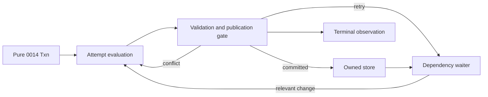

# Design spec 0050: bounded STM runtime

Status: frozen for implementation

Date: 2026-08-02

Depends-On-Feature-IDs: 0014-stm-effect-handler-laws

Design-Lens-Version: open-semantic-system-v1

## Problem

Feature 0014 defines pure STM descriptions and a deterministic law model. The
project still has no runtime that owns one live store, coordinates concurrent
attempts, suspends retry, and closes without lost wake-ups.

The pinned Effect 4.0.0-beta.102 transaction implementation is useful prior
art, but it cannot be the runtime adapter for this feature. A disposable runtime
probe observed this schedule:

1. one transaction read a `TxRef` and requested `Effect.txRetry`;
2. another fiber changed that reference before retry registration completed;
3. the waiting transaction did not wake within one second.

This observation is runtime-validation evidence for the selected schedule. It
is not a proof over all Effect schedules. Direct source inspection identifies a
registration window between retry detection and callback installation in
`node_modules/effect/src/Effect.ts:24590-24643`.

The runtime must close that window without polling. It must reuse the accepted
0014 transaction language instead of admitting arbitrary callback effects into
retryable attempts.

## Felt journey

A developer creates a scoped runtime from one 0014 store and explicit resource
bounds. Two concurrent transactions start from the same store snapshot. One
commits first. The other detects a conflict, discards its first action log,
reruns, and returns one commit action from its terminal attempt.

A third transaction reads one cell and retries. An unrelated commit does not
wake it. A relevant commit wakes it without a timer or polling. The developer
can inspect a deterministic runtime snapshot that shows the store, pending
retry dependencies, bounds, and lifecycle state.

## Open semantic system design lens

### Boundary and warranted state

Feature 0050 owns one process-local STM runtime module under `src/stm/`. Each
runtime owns:

- one immutable 0014 store lineage;
- one acceptance sequence for submitted transactions;
- one exclusive validation and publication gate;
- the retry suspensions accepted by that runtime;
- one bounded in-flight permit pool; and
- one open or closed lifecycle state.

Only the runtime can replace its current store or register and remove its
suspensions. Callers retain immutable transaction descriptions and store
snapshots. They receive no mutable store, attempt, suspension, semaphore,
`Ref`, or `Deferred`.

Warranted state is the runtime-owned state under its publication gate. A caller
snapshot is a derived observation. Host scheduling, process survival, and
external action delivery remain environmental.

### Semantic inputs

| Input              | Category                    | Authority and limits                                                                                                          |
| ------------------ | --------------------------- | ----------------------------------------------------------------------------------------------------------------------------- |
| 0014 `Store`       | Authenticated initial state | Establishes one domain and immutable initial cells. It does not establish runtime ownership until `makeRuntime` accepts it.   |
| `RuntimeBounds`    | Configuration               | Sets positive safe-integer limits for in-flight calls and attempts per call.                                                  |
| 0014 `Txn`         | Command payload             | Contains pure data and composition. It has no callback, Promise, clock, random, file, network, process, or console authority. |
| `atomically` call  | Command                     | Requests one terminal commit or typed abort. It can wait on retry or in-flight capacity.                                      |
| `snapshot` call    | Query                       | Returns one deterministic projection. It does not change runtime state.                                                       |
| `close` call       | Command                     | Prevents later publication and releases pending retry calls with a typed failure.                                             |
| fiber interruption | Runtime observation         | Cancels one caller wait. It does not imply process termination or external rollback.                                          |

A transaction description does not establish that it belongs to the runtime
store domain. The runtime checks that condition before it starts an attempt.

### Semantic outputs

`atomically` returns one terminal transaction observation:

```text
Committed(requestOrdinal, attemptCount, value, commitActions)
Aborted(requestOrdinal, attemptCount, error, abortActions)
```

It can fail through a typed runtime channel:

```text
Closed
TransactionRejected(reason)
AttemptsExhausted(maximumAttempts)
```

Commit and abort actions remain inert 0014 JSON values. The runtime never
executes them. A separate action interpreter owns external effects.

`snapshot` and `close` return a deeply immutable projection:

```text
RuntimeSnapshot {
  status: open | closed
  bounds
  nextRequestOrdinal
  store
  pending: [requestOrdinal, transactionId, attemptOrdinal, dependencies...]
}
```

The runtime sorts pending rows by exact request ordinal. Decimal strings project
exact counters without JSON rounding.

### Effect protocols and uncertainty

`atomically` acquires one in-flight permit with interruptible backpressure. The
permit remains owned until the call returns, fails, or is interrupted. Thus the
configured limit bounds active attempts plus retry waiters.

One attempt reads an immutable store snapshot and evaluates through the pure
0014 handler. The runtime gives concurrent fibers one cooperative scheduling
point before validation. Validation and publication then run under one gate.

A stale successful attempt returns `conflict`. The runtime discards its writes
and actions, increments the attempt count, and starts the original description
again. It fails with `AttemptsExhausted` before an attempt beyond the configured
limit.

A retry settlement and waiter registration occur under the publication gate.
Before registration, the runtime compares the suspension dependencies with the
current store. If any dependency already changed, it starts a fresh attempt
without waiting. A commit checks registered suspensions under the same gate and
wakes exactly those with changed dependencies. This protocol closes the
observed lost-wake window without polling.

An empty dependency set waits until interruption or runtime close. No timer,
backoff, fairness, or progress guarantee is fabricated.

Interruption before publication commits nothing. Interruption during a retry
wait removes that waiter before it releases the in-flight permit. Interruption
after publication cannot retract the committed store. The returned action log
is not a durable outbox and is not crash-safe delivery evidence.

`close` is idempotent. It changes the lifecycle under the publication gate,
fails all registered waiters, and prevents later publication. Calls that have
started but not published observe `Closed` when they next enter the gate.

### Components and orthogonal structures



The diagram shows one transaction call. The gate owns publication. The waiter
owns no store and resumes only through a gate-observed dependency change.

These structures remain distinct:

- the in-flight permit pool bounds accepted work;
- the publication gate serializes state transitions;
- the immutable store carries semantic state;
- the 0014 attempt carries speculative state;
- a suspension records observed dependencies;
- a caller fiber owns its completion and interruption; and
- a returned action log requests later effects.

No background worker or detached fiber is required. Scope finalization calls the
same idempotent close path.

### Bounded autonomy and resources

`maximumInFlight` and `maximumAttempts` are required positive safe integers.
Invalid bounds fail before runtime resources exist.

The runtime retains at most `maximumInFlight` active calls. Therefore it retains
at most that many retry waiters. Each attempt and suspension is finite because
the accepted 0014 description is finite. The store contains the fixed cells of
the initial 0014 store.

The runtime has no time, network, file, process, random, or console authority.
It does not select a universal safe bound. Configuration owns that operational
choice.

### Evidence, assumptions, and unsupported claims

The following evidence can support this feature:

- pure 0014 laws and custodied values;
- type and import analysis over the portable runtime closure;
- focused runtime tests for selected schedules;
- deterministic Bun and genuine Node tracer observations;
- source inspection of the pinned Effect transaction implementation; and
- independent exact-head review.

The runtime assumes one JavaScript process, one Effect scheduler, and the
correctness of Effect `Ref`, `Deferred`, `Semaphore`, scope, and interruption
primitives. Tests do not prove those primitives.

This feature does not establish serializability for arbitrary runtimes, host
memory bounds, fairness, lock freedom, starvation freedom, termination, durable
commit-action delivery, process-crash recovery, or TypeScript linearity.

## Deep-module contract

The public seam exports only:

```text
makeRuntime(initialStore, bounds) -> Effect<StmRuntime, InvalidRuntimeDefinition, Scope>

StmRuntime.atomically(transaction)
  -> Effect<Committed | Aborted, RuntimeFailure>

StmRuntime.snapshot -> Effect<RuntimeSnapshot>
StmRuntime.close    -> Effect<RuntimeSnapshot>
```

The runtime accepts only authenticated 0014 `Store` and `Txn` values. It does
not accept an opaque `Effect`, Promise, callback, mutable journal, or external
action handler.

The exact TypeScript generics can preserve the transaction error, value, commit
action, and abort-action types. The observable fields and failure codes in this
contract are fixed.

A committed result contains actions from exactly one validated terminal
attempt, in program order, after publication. An aborted result contains abort
actions from exactly one permanent typed abort. Conflict and retry return no
actions.

The runtime snapshot contains values from one state observed under the
publication gate. It exposes no live collection or object that can mutate the
runtime.

## Oracle-first counterexamples

Retain executable observations for these cases:

1. two concurrent attempts start from one store and both partially publish;
2. a conflicted attempt contributes a commit action;
3. one terminal commit action appears twice;
4. a retry wakes after only an unrelated cell changes;
5. a dependency changes before waiter registration and the retry loses its wake;
6. an empty dependency retry fabricates a timer or poll;
7. interruption leaves a retained waiter or consumed permit;
8. attempts continue beyond `maximumAttempts`;
9. accepted calls exceed `maximumInFlight` without backpressure;
10. a cross-domain or forged transaction reaches publication;
11. close permits a later commit or leaves a retry waiter unresolved;
12. a snapshot exposes mutable runtime state;
13. nested same-domain work publishes before the outer transaction;
14. Bun and Node produce different normalized tracer observations; and
15. the runtime imports `Effect.tx`, `Effect.txRetry`, `TxRef`, or ambient authority.

## Acceptance

`bun scripts/accept/0050-bounded-stm-runtime.ts` must establish:

1. a dedicated runtime source, test suite, tracer report, and managed feature record exist;
2. the runtime reuses the pure 0014 transaction and store model;
3. deterministic contention causes a conflict and returns one terminal commit-action log;
4. no snapshot observes a partial two-cell publication;
5. unrelated changes do not wake retry and relevant changes do;
6. the pre-registration change schedule does not lose a wake;
7. empty retry, interruption cleanup, in-flight bounds, attempt bounds, and close follow this contract;
8. nested transactions and typed abort retain the accepted 0014 meaning;
9. Bun and genuine Node emit byte-identical normalized runtime reports;
10. the portable runtime closure imports only Effect and local portable modules;
11. the closure contains no `Effect.tx`, `Effect.txRetry`, `TxRef`, polling, timer, random, file, network, process, or console authority;
12. exact 0014 acceptance remains green;
13. project-model validation and generated-view drift checks pass; and
14. focused type, lint, and formatting gates pass.

## Kill or redesign criteria

Stop and revise this contract if any condition holds:

- the runtime requires an opaque callback inside a retryable attempt;
- retry correctness requires polling or a timer;
- a dependency change and waiter registration cannot share one exclusive gate;
- interruption cannot remove retained waiters and permits;
- deterministic contention requires exposing mutable attempts through the public seam;
- the accepted 0014 model cannot represent the required runtime transition;
- a maintained library supplies the same contract and passes the lost-wake oracle with less project-owned code; or
- the runtime must claim durable or distributed semantics to be useful.

## Non-goals

- the inventory STM realization;
- the separate STM model-checking frontier;
- a general deterministic scheduler;
- changing the 0014 transaction language or laws;
- optimized parallel STM;
- `orElse` redesign;
- distributed or durable transactions;
- durable outbox delivery;
- arbitrary Effect-program analysis;
- source-language syntax;
- fairness, lock freedom, starvation freedom, or termination; and
- changes to inventory, actor, kernel, resolver, or Control Room semantics.

## Prior art and provenance

The implementation must reuse the accepted 0014 model. It must evaluate, but
must not copy, the MIT-licensed Effect 4.0.0-beta.102 transaction source at
`node_modules/effect/src/Effect.ts` and `node_modules/effect/src/TxRef.ts`.

The runtime can use Effect `Ref`, `Deferred`, `Semaphore`, scope, and structured
interruption. No upstream code defines the Semantic Systems transaction
meaning. The implementation plan must record any additional reused technique
and its license.

## Semantic diff

Before this feature, Semantic Systems has a pure STM law model and no live STM
runtime. After this feature, one scoped runtime interprets that exact model with
bounded concurrency, conflict reruns, dependency wake-up, cancellation, and
close.

The 0014 transaction language, law evidence, inventory semantics, action-effect
separation, and unsupported progress claims remain unchanged.
