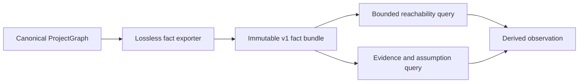

# Design spec 0053: relational fact export

Status: frozen for implementation

Date: 2026-08-02

Depends-On-Feature-IDs: 0049-canonical-work-lifecycle

Design-Lens-Version: open-semantic-system-v1

## Problem

The canonical project graph contains typed entities, typed relations, tags,
attributes, and source custody. Current reports answer fixed questions by
walking that graph directly. A recursive analysis tool would otherwise need to
read repository files, depend on loader internals, or invent a second graph
schema.

The project needs one stable, lossless fact projection for dependencies,
effects, ownership, obligations, evidence, and source correspondence. The
projection must remain read-only and must not turn a Datalog engine, query, or
materialized result into semantic authority.

## Felt journey

A developer loads the canonical project graph and exports one deterministic
`semantic.relational-facts/v1` bundle. Every entity and relation identifies its
canonical model source. The developer runs an incoming reachability query from
`work.stm-runtime` and sees the dependent inventory and model-check work. They
run an evidence query for `obligation.inventory.conformance` and see exact
evidence rows, relation kinds, source documents, and transitive assumptions.

Bun and Node emit the same canonical bundle summary and query results. A caller
cannot mutate the exported rows or the canonical project graph through the
query interface.

## Open semantic system design lens

### Boundary and warranted state

Feature 0053 owns a pure projection and query module under
`src/relational-facts/`. The canonical input is the accepted
`src/project-model/types.ts` `ProjectGraph` produced by the existing loader.
The module does not read `model/`, choose a repository revision, or validate the
canonical graph. Those responsibilities remain with the loader, validator, and
composition root.

The exported bundle is derived state. It owns no canonical entity, relation,
status, work decision, evidence judgment, or file. Every row retains a relative
source-document key. Queries derive observations from the bundle and cannot
write through it.

### Semantic inputs

| Input | Category | Authority and limits |
| --- | --- | --- |
| `ProjectGraph` | Authenticated in-process state | Establishes the loaded canonical graph and absolute project root. The exporter accepts no raw JSON graph. |
| reachability query | Query | Declares roots, direction, relation kinds, maximum depth, and maximum result rows. It does not declare an authoritative meaning for reachability. |
| evidence query | Query | Names one claim, obligation, realization, or other target. It does not decide whether evidence is sufficient. |

All query IDs and relation kinds must exist in the bundle. Bounds are required
positive safe integers. Unknown roots, unknown relation kinds, and invalid
bounds return typed diagnostics rather than empty success.

### Semantic outputs

`exportRelationalFacts` returns one deeply immutable bundle:

```text
RelationalFactBundle {
  format: semantic.relational-facts/v1
  schema: {
    revision: 1
    fact_kinds: [entity, relation, tag, attribute, source_document]
  }
  source_documents: SourceDocumentFact[]
  entities: EntityFact[]
  relations: RelationFact[]
  tags: TagFact[]
  attributes: AttributeFact[]
}
```

The closed row shapes are:

```text
SourceDocumentFact(source_key)
EntityFact(entity_id, kind, name, summary, status, source_key)
RelationFact(relation_ordinal, source_id, target_id, kind, summary,
             attributes, source_key)
TagFact(entity_id, tag, source_key)
AttributeFact(entity_id, key, value, source_key)
```

`source_key` is the normalized POSIX path relative to `<project.root>/model`.
An absolute path, path escape, backslash, empty segment, or source outside
`model/` is a typed export failure. The exporter does not fabricate a Git
revision or content digest it was not given.

`relation_ordinal` is the zero-based decimal index in the canonical loader's
relation sequence. It preserves parallel and duplicate authored relations
without inventing a semantic edge identity. Adding an earlier relation can
change later ordinals; consumers must not treat the ordinal as a durable
cross-version identity.

Rows sort deterministically by their full closed key. Entity attributes remain
one lossless JSON value per top-level key. The exporter must snapshot and deep
freeze nested JSON data so later mutation of a caller-owned object cannot
change the bundle.

A reachability result contains deterministic nodes, traversed relation rows,
shortest paths, a `truncated` flag, the exact query, and source keys. An evidence
result contains direct evidence entities connected to the target by
`supports`, `covers`, `discharges`, `validates`, or `invalidates`; the exact
connecting relations; and assumptions reached from each evidence entity by
outgoing `assumes` edges. An invalidating relation remains visibly invalidating
and is never folded into positive support.

### Effect protocols and uncertainty

The reusable module is pure. It opens no files, invokes no process, and uses no
clock, random source, network, console, or mutable global. Bun and Node entry
points own loading and output through the established Effect platform layers.

Reachability uses breadth-first traversal. Neighbors sort by relation ordinal,
then target or source ID. The result contains one shortest path per reached
entity. Direction is exactly `outgoing` or `incoming`; `both` is not admitted
because it hides edge direction. Traversal stops before crossing `maximumDepth`
or `maximumRows` and reports `truncated: true`.

Evidence lookup is a structural query only. It does not apply a trust policy,
compare evidence categories, verify identities, check a certificate, or infer
that an obligation is discharged. It preserves every authored relation kind and
assumption row so a later policy checker can decide.

### Components and orthogonal structures



The canonical graph owns authored state. The exporter owns representation
projection. Query algorithms own derivation. A future Datalog adapter may
consume the bundle, but it does not own any of these meanings.

### Bounded autonomy and resources

Export emits exactly one entity row per canonical entity, one relation row per
canonical relation, one tag row per authored tag occurrence, one attribute row
per top-level entity attribute, and one row per distinct source document. It
performs no recursive flattening of arbitrary JSON attributes.

Queries require:

```text
1 <= maximumDepth <= 64
1 <= maximumRows <= 10000
```

Traversal retains at most `maximumRows` result rows and one predecessor per
visited entity. The fixed graph size still determines input memory. No
background worker, index daemon, cache, database, or incremental invalidation
loop is introduced.

### Evidence, assumptions, and unsupported claims

Exact row counts, golden bundle bytes, focused query cases, mutation rejection,
Bun/Node parity, type analysis, strict lint, formatting, and project-model gates
can support this feature. They are tests and static analysis, not proof of query
completeness for every future relation vocabulary.

The feature assumes `ProjectGraph.source` values came from the accepted loader
and that the graph passed the existing validator before external publication.
The pure exporter still fails closed if source custody is outside `model/`.

This feature does not establish truth of model claims, closed-world completeness,
evidence sufficiency, policy acceptance, logical entailment, Datalog
stratification, termination of arbitrary future queries, or stable identities
for relations across versions.

## Deep-module contract

The public seam exports:

```text
exportRelationalFacts(project)
  -> RelationalFactBundle | RelationalExportError

queryReachability(bundle, query)
  -> ReachabilityResult | RelationalQueryError

queryEvidence(bundle, targetId)
  -> EvidenceQueryResult | RelationalQueryError

encodeRelationalFacts(bundle)
  -> canonical UTF-8 JSON bytes
```

Callers learn one versioned row vocabulary. They do not learn loader file
walking, internal Maps, graph adjacency representation, or a database engine.
The same immutable bundle is the interface for tests and future adapters.

## Oracle-first counterexamples

Retain executable observations for these cases:

1. an entity or relation loses its canonical source document;
2. an absolute host path appears in portable facts;
3. a source path escapes `model/`;
4. two parallel relations collapse into one row;
5. nested attributes remain live aliases to caller-owned data;
6. a query mutates the bundle or canonical graph;
7. incoming and outgoing traversal are silently mixed;
8. an unknown relation kind returns an empty successful query;
9. traversal crosses a depth or row bound without `truncated`;
10. evidence `invalidates` is rendered as positive support;
11. evidence assumptions disappear from the result;
12. source-document or Map insertion order changes canonical bytes.

## Acceptance

The exact acceptance program is
`scripts/accept/0053-relational-fact-export.ts`. It must establish:

1. canonical export row counts match the loaded graph and every row has one
   valid relative source key;
2. entity, relation, tag, attribute, and source-document rows are deterministic
   and deeply immutable;
3. incoming reachability from `work.stm-runtime` returns the expected dependent
   work through exact authored relation directions;
4. evidence lookup for `obligation.inventory.conformance` returns its direct
   evidence relation and explicit assumptions without a sufficiency claim;
5. invalid roots, relation kinds, bounds, and source custody are typed failures;
6. Bun and genuine Node emit byte-identical canonical report bytes; and
7. project-model validation and generated-view checks still pass.

## Kill or redesign criteria

Stop and recut if the current `ProjectGraph` drops information required for a
lossless row, if portable provenance requires a fabricated repository revision,
if relation multiplicity cannot be retained, or if a query needs to mutate or
own canonical state. Extend the canonical model first rather than hiding loss in
the exporter.

## Non-goals

No Soufflé dependency, Datalog parser, database, incremental index, daemon, UI,
policy engine, proof engine, generic SQL schema, network API, public deployment,
or mutation command. A future engine must adapt from this bundle rather than
replace canonical authored JSON.

## Semantic diff

The project gains one stable read-only projection and two bounded recursive
queries over canonical graph state. Canonical authorship, relation meaning,
evidence force, work readiness, and generated Markdown views remain unchanged.
