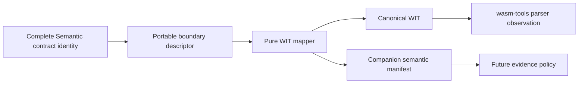

# Design spec 0054: semantic contract to WIT mapping

Status: frozen for implementation

Date: 2026-08-02

Depends-On-Feature-IDs: 0019-normalized-core-format

Design-Lens-Version: open-semantic-system-v1

## Problem

A Semantic theory contract contains more meaning than a portable component
interface can carry. WIT can carry component-visible data shape, worlds,
interfaces, import/export direction, resources, owned and borrowed handles, and
current native asynchronous shapes. It cannot carry Semantic laws, effect
handler meaning, usage grades, evidence force, assumptions, or a proof that a
component realizes a theory.

The project needs a deterministic mapper for an explicitly declared portable
subset and a companion manifest that makes every omitted semantic dimension
visible. Structural WIT compatibility must never be reported as theory
realization.

The current baseline is not the former WASI 0.2 surface. The mapper must support
current WIT `async func`, `stream<T>`, and `future<T>` syntax. These are the WIT
features documented as additions for WASI 0.3. The pinned Nix package
`wasm-tools` 1.254.0 parses these forms. WebAssembly core 3.0 is a separate
standard layer; its official live-standard release is dated 2025-09-17.

Primary syntax sources:

- <https://component-model.bytecodealliance.org/design/wit.html>
- <https://component-model.bytecodealliance.org/design/async.html>
- <https://github.com/WebAssembly/component-model/blob/main/design/mvp/WIT.md>
- <https://webassembly.org/news/2025-09-17-wasm-3.0/>

## Felt journey

A developer supplies one frozen portable-boundary descriptor for the inventory
contract. The mapper emits:

1. one canonical WIT package with an imported fresh-identifier capability, an
   exported async inventory interface, a reservation resource, and a
   `stream<event>` plus completion `future<result<...>>`; and
2. one canonical companion manifest linking every WIT item to the full theory
   identity and classifying laws, effects, assumptions, evidence, grades, and
   unsupported types as companion-only or rejected.

`wasm-tools component wit` accepts the emitted package. Bun and genuine Node
emit byte-identical WIT and manifest bytes. Removing a law changes the companion
identity even though the WIT bytes may remain unchanged. A thunk, higher-order
function, open effect row, unrestricted recursive type, or unbounded integer is
rejected rather than silently narrowed.

## Open semantic system design lens

### Boundary and warranted state

Feature 0054 owns a pure mapper under `src/wit-mapping/` and a thin Effect-based
acceptance composition root. Its canonical input is a decoded,
`semantic.wit-mapping-input/v1` portable-boundary descriptor. The descriptor is
an explicit projection request linked to an existing complete semantic contract;
it is not itself the theory and cannot replace it.

The mapper owns only generated WIT text, the companion manifest, deterministic
identities over those artifacts, and typed diagnostics. It does not own theory
identity, WIT runtime behavior, component implementation, handler selection,
evidence policy, signature verification, or deployment compatibility.

### Semantic inputs

The closed input contains:

```text
PortableBoundaryInput {
  format: semantic.wit-mapping-input/v1
  package: { namespace, name, version }
  theory: {
    identity
    source_key
    complete_contract_identity
    laws[]
    assumptions[]
    evidence_requirements[]
  }
  interfaces[]
  world: { name, imports[], exports[] }
}
```

An interface contains named type declarations and functions. Supported WIT
shape forms are exactly:

- primitives `bool`, `s8`, `s16`, `s32`, `s64`, `u8`, `u16`, `u32`, `u64`,
  `f32`, `f64`, `char`, and `string`;
- `list`, `option`, `result`, and `tuple` over supported value shapes;
- named `record`, `variant`, `enum`, `flags`, and `type` declarations;
- named `resource` declarations with constructors, sync or async methods, and
  sync or async static functions;
- plain resource names for owned handles and `borrow<resource>` for temporary
  borrowed handles;
- freestanding `func` and `async func` operations;
- `stream<T>` and `future<T>` values; and
- worlds that import or export whole named interfaces.

Each function declares optional `effect_labels`. Each type or operation declares
one `semantic_path` into the full contract. Each resource declares the exact
ownership statement and drop assumption it projects. Descriptor collections
are bounded and identifiers must already satisfy current WIT package and
kebab-case identifier grammar. The mapper diagnoses invalid names; it never
repairs or escapes them silently.

The input decoder requires positive bounds of at most 128 interfaces, 512 types,
1,024 functions, 2,048 fields or cases, nesting depth 32, and string length
1,024 Unicode scalar values.

### Artifacts and returned observations

Successful mapping returns:

```text
WitMappingArtifact {
  wit: canonical UTF-8 text
  manifest: SemanticWitMappingManifestV1
  wit_identity: SHA-256 over exact WIT bytes
  manifest_identity: SHA-256 over canonical manifest bytes
}
```

The manifest contains:

```text
SemanticWitMappingManifestV1 {
  format: semantic.wit-mapping/v1
  theory_identity
  complete_contract_identity
  theory_source_key
  wit_identity
  package
  world
  mappings[]
  semantic_dimensions[]
  assumptions[]
  evidence_requirements[]
  unsupported_claims[]
}
```

Every `mappings` row links a WIT item path to a semantic path and classifies the
projection as one of:

- `shape`: representable value or interface shape;
- `capability_boundary`: world import/export direction for a declared effect
  capability;
- `ownership_boundary`: resource owned/borrowed handle shape and declared drop
  assumption;
- `operational_async_shape`: `async func`, `stream<T>`, or `future<T>` transport
  and suspension shape; or
- `companion_only`: a semantic dimension deliberately absent from WIT.

`semantic_dimensions` must contain an exhaustive row for every declared law,
effect label, usage grade, assumption, and evidence requirement. Laws, grades,
assumptions, and evidence requirements are always `companion_only`. Effect
labels may have one `capability_boundary` mapping but their algebra, handler,
resumption behavior, and laws remain `companion_only`.

The manifest always includes these unsupported claims verbatim in substance:

1. WIT validation does not establish Semantic theory realization.
2. `async func`, `stream<T>`, and `future<T>` expose asynchronous transport
   shape, not scheduling, fairness, cancellation, ordering, delivery, backpressure,
   or liveness guarantees beyond the applicable Component Model/WASI contract.
3. A WIT resource exposes handle ownership shape, not the Semantic usage grade
   calculus, arbitrary linearity, host cleanup correctness, or leak freedom.
4. An imported interface names a capability boundary; it does not prove the
   implementation performs, observes, or authenticates an external effect.
5. Companion laws and evidence are declarations until independently checked
   under their stated policy and assumptions.

### Effect protocol and current async semantics

The reusable mapper is pure. SHA-256 is injected through the existing Effect
`Crypto` capability at the artifact composition boundary. The acceptance
program may invoke pinned `wasm-tools` through the existing command helper and
must record its exact version and parse result as tool observation.

The mapper emits current WIT syntax directly:

```wit
reserve: async func(request: reservation-request)
  -> result<reservation, inventory-error>;

watch: func()
  -> tuple<stream<inventory-event>, future<result<_, inventory-error>>>;
```

A stream and future are Canonical ABI values, not resources. A plain resource
name denotes transfer of an owned handle; `borrow<name>` denotes a temporary
borrow for the call. The mapper must not encode streams or futures as opaque
resources and must not desugar `async func` to a handwritten polling protocol.

World direction is authority-bearing metadata: an import is a capability the
component requires; an export is a capability it offers. The mapper rejects the
same interface appearing as both import and export in this slice. It does not
infer direction from function names or effect labels.

### Orthogonal component structure



WIT owns structural component compatibility. The companion manifest preserves
Semantic correspondence and omissions. `wasm-tools` owns syntax parsing, not
Semantic validation. Future component execution and evidence acceptance are
separate realizations.

### MoonBit realization seam

MoonBit is a promising downstream guest implementation language, not part of
the mapper's trusted core. Its current official component tutorial demonstrates
WIT-driven MoonBit binding generation with maintained `wit-bindgen`, compilation
to a core Wasm module, and component wrapping and inspection with `wasm-tools`.
That is a direct fit for consuming this feature's generated WIT without teaching
the mapper about a guest language.

The present MoonBit component example pins WASI 0.2.7, and its 2025-11-05
Wassette tutorial says Component Model asynchronous support from WASIp3 is
upcoming. MoonBit's language-level coroutine runtime and JavaScript
`ReadableStream` support are not evidence that MoonBit bindings implement WIT
`async func`, `stream<T>`, or `future<T>`. Therefore feature 0054 does not gate
on a MoonBit component. A follow-on tracer bullet may add one only after the
installed `wit-bindgen moonbit` accepts this feature's native async golden and a
real MoonBit component passes `wasm-tools component wit` inspection plus runtime
execution.

The compiler currently uses the MoonBit Public License, described by its
repository as a relaxed SSPL; generated source and artifacts may use the
operator's chosen license. This permits evaluation but requires an explicit
toolchain-custody and licensing decision before MoonBit becomes a required
project build dependency.

### Bounded autonomy and resources

Mapping performs one bounded depth-first pass over the decoded descriptor and
one canonical sort per declaration family. It emits at most 2 MiB of WIT and
4 MiB of canonical manifest bytes; exceeding either limit returns a typed
failure. It opens no network, spawns no worker, caches nothing, and has no
background lifecycle.

The acceptance program invokes `wasm-tools` once per positive golden and once
for the focused invalid-syntax oracle. Tool absence or version mismatch is a
failed acceptance gate, not a warning.

### Evidence, assumptions, and unsupported claims

Golden artifacts, parser acceptance, focused counterexamples, identity changes,
Bun/Node parity, type analysis, strict lint, formatting, and predecessor gates
support this slice. They establish tested deterministic generation for the
covered descriptor and syntax parser. They are not proof of Component Model
runtime conformance, source/target semantic equivalence, or theory realization.

The slice assumes the complete contract identity and source key were produced
and custodied elsewhere. It assumes pinned `wasm-tools` implements the current
WIT grammar accurately. The assumption is visible in the acceptance report and
does not make that tool Semantic authority.

## Deep-module contract

The public seam exports:

```text
decodePortableBoundary(input, bounds?)
  -> PortableBoundaryInput | WitMappingDecodeError

generateWitMapping(decoded, Crypto)
  -> WitMappingArtifact | WitMappingError

encodeWitMappingManifest(manifest)
  -> canonical UTF-8 JSON bytes
```

Callers learn a closed portable-subset descriptor and one generated artifact.
They do not learn pretty-printer state, hash implementation, `wasm-tools` JSON,
or future runtime binding representation.

## Oracle-first counterexamples

Retain executable observations for:

1. the former WASI 0.2 assumption rejects current native async forms;
2. `async func` is downgraded to plain `func` or a polling resource;
3. `stream<T>` or `future<T>` is emitted as a resource;
4. an imported capability becomes an export;
5. owned and borrowed resource handles are exchanged;
6. a law or evidence requirement disappears from the companion manifest;
7. deleting a companion-only law fails to change the manifest identity;
8. structural WIT validity is labeled theory realization;
9. a thunk, higher-order function, open effect row, unrestricted recursive type,
   or unbounded integer is silently narrowed to a WIT type;
10. an invalid identifier is silently rewritten;
11. reordered descriptor maps change canonical bytes; and
12. emitted WIT fails `wasm-tools component wit` parsing.

## Acceptance

The exact acceptance program is
`scripts/accept/0054-semantic-contract-wit-mapping.ts`. It must establish:

1. the inventory tracer descriptor emits the frozen WIT and companion manifest
   goldens;
2. emitted WIT includes an imported fresh-identifier capability, exported async
   inventory operations, a reservation resource with owned and borrowed uses,
   and native `async func`, `stream<T>`, and `future<T>`;
3. pinned `wasm-tools` 1.254.0 parses the generated WIT and reports async
   freestanding or method function kinds plus native stream and future types;
4. every declared law, effect label, usage grade, assumption, and evidence
   requirement has one explicit manifest disposition;
5. unsupported Semantic types and claims fail closed with typed diagnostics;
6. changing only companion-only semantics preserves WIT bytes when shape is
   unchanged but changes manifest bytes and identity;
7. Bun and genuine Node emit byte-identical WIT, manifest, and summary bytes;
   and
8. finite-sum normalized-core and project-model predecessor gates still pass.

## Kill or redesign criteria

Stop and recut if current WIT cannot express the required async, stream, future,
world-direction, or ownership shape; if the generator needs to invent semantic
meaning; if the companion mapping cannot be exhaustive; if `wasm-tools` parsing
requires network or an unpinned tool; or if unsupported source types can reach
output through an implicit narrowing.

## Non-goals

No component compilation, runtime execution, bindgen, language-specific guest
bindings, OCI publication, Sigstore signing, SLSA attestation, WIT package
registry, network fetch, automatic extraction from arbitrary theories, generic
WIT parser, full Semantic type lowering, proof transport, or claim that WIT is
Semantic authority.

## Semantic diff

The project gains a checked, current-WIT structural projection and an explicit
semantic correspondence artifact. It does not change any theory, law, effect,
usage grade, evidence category, handler, runtime, package identity, or
deployment policy.

Revision 1, 2026-08-02: the repository's pinned nixpkgs lock provides
`wasm-tools` 1.254.0. This invalidates and replaces the frozen 1.253.0 parser
version only; parser evidence meaning, acceptance requirements, and the semantic
boundary are unchanged.
