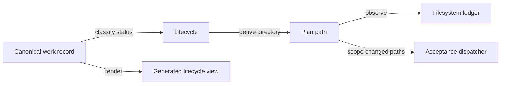

# Design spec 0055: lifecycle-derived plan layout

Status: frozen for implementation

Date: 2026-08-02

Depends-On-Feature-IDs: 0049-canonical-work-lifecycle

Replaces-Feature-IDs: 0049-canonical-work-lifecycle

Migrates-Feature-IDs: 0001-inventory-resolution-tracer, 0002-reference-baselines-deep-research, 0003-independent-resolution-checker, 0004-reference-source-custody, 0005-autonomous-development-control-loop, 0007-reuse-first-engineering, 0010-typescript-effect-v4-runtime, 0012-minimal-actor-runtime, 0013-bounded-actor-trace-retention, 0014-stm-effect-handler-laws, 0015-open-semantic-system-design-lens, 0016-executable-semantic-system-kernel, 0017-control-room-reconstruction, 0018-minimal-kernel-calculus, 0019-normalized-core-format, 0020-agent-facing-kernel-json, 0020-lossless-kernel-source, 0021-pbk-portfolio-control-room, 0022-kernel-reference-interpreter, 0031-control-room-interactive-skill-tree, 0046-effect-graph-execution-index, 0048-pbk-control-room-acceptance-reconciliation, 0049-canonical-work-lifecycle, 0050-bounded-stm-runtime, 0051-kernel-finite-sums, 0052-stm-schedule-explorer, 0053-relational-fact-export, 0054-semantic-contract-wit-mapping

Design-Lens-Version: open-semantic-system-v1

## Problem

Feature 0049 made each plan path stable at `plans/<feature_id>.md`. The current
operator charter instead defines `plans/active/` as the location of mutable
execution state. New frozen features 0052 through 0054 follow that charter.
The accepted resolver still reconstructs the old root path, so it rejects those
features and cannot close their feature loops.

Supporting both layouts would create two conventions and make directory state
ambiguous. Moving only the new plans back to the root would satisfy the old
implementation while violating the current charter. The repository needs one
clean, lifecycle-derived plan layout.

## Felt journey

A developer creates an `in_progress` feature record and its ledger at
`plans/active/<feature_id>.md`. Feature resolution returns that path. When the
feature reaches `complete`, the developer changes the one canonical work record,
records typed completion evidence, and moves the same ledger byte-for-byte to
`plans/completed/<feature_id>.md`. A superseded feature moves its ledger to
`plans/superseded/<feature_id>.md` and names its replacement.

`semproj validate` rejects a ledger in the wrong lifecycle directory, a duplicate
or root-level ledger, and an authored `plan` field. Generated views link to the
resolved directory. Acceptance dispatch receives the same resolved artifact and
never guesses a legacy path.

## Open semantic system design lens

### Boundary and warranted state

The existing `src/project-model/work-lifecycle.ts` deep module remains the sole
resolver. The canonical `work_item.status` and typed lifecycle metadata warrant
the lifecycle classification. The plan directory is a checked projection of that
classification; it is not an independent lifecycle authority.

The feature owns:

- lifecycle-to-plan-directory derivation;
- exact plan relocation for every canonical feature;
- callers, acceptance programs, links, and tests that name a plan path;
- the 0049-to-0055 replacement record; and
- deterministic lifecycle projections.

It does not own plan ledger prose, completion claims, implementation behavior of
other features, Git history, remote policy, or operator authority.

### Semantic inputs

| Input                       | Category                              | Authority and limits                                                                     |
| --------------------------- | ------------------------------------- | ---------------------------------------------------------------------------------------- |
| Canonical work record       | Authored assertion decoded at runtime | Owns status, feature identity, completion, and replacement metadata after validation.    |
| Resolved feature ID         | Query input                           | Selects exactly one canonical owner or returns a typed diagnostic.                       |
| Plan filesystem observation | Runtime observation                   | Establishes local existence and placement for this checkout only.                        |
| Changed Git paths           | Runtime observation                   | Selects affected features through current resolved paths; does not establish completion. |
| Plan move                   | Effect request                        | Relocates the authored ledger without changing its claims or bytes.                      |

The closed derivation is:

```text
status in planned | ready | in_progress | blocked
  -> plans/active/<feature_id>.md

status = complete
  -> plans/completed/<feature_id>.md

status = superseded
  -> plans/superseded/<feature_id>.md
```

The model must not author `plan`, `design_spec`, `model_source`, or
`acceptance_script`. Those remain derived fields.

### Semantic outputs

| Output                                    | Kind                       | Warrant                                                           |
| ----------------------------------------- | -------------------------- | ----------------------------------------------------------------- |
| `FeatureArtifacts.planPath`               | Returned observation       | Pure projection of validated status and feature identity.         |
| Wrong-layout diagnostic                   | Diagnostic                 | Exact observed mismatch for one checkout.                         |
| Plan relocation                           | Repository artifact change | Preserves ledger bytes; does not change lifecycle authority.      |
| `generated/08-feature-lifecycle.md` links | Materialized view          | Deterministic noncanonical projection.                            |
| Acceptance dispatch                       | Effect request             | Runs the already-resolved program; does not establish completion. |

### Effect protocol and failure modes

Resolution and validation fail closed when:

- a canonical feature has no plan at its derived lifecycle path;
- a root-level feature plan remains;
- the same feature ledger exists in more than one lifecycle directory;
- a plan exists in a directory inconsistent with canonical status;
- a work record authors a derived path;
- a changed-path range names a stale plan path; or
- an acceptance program, document link, or generated projection still names the
  removed root layout.

The migration performs no automatic filesystem repair at runtime. Repository
moves are explicit implementation changes. There is no compatibility resolver,
alias, symlink, fallback search, retry loop, watcher, or background worker.

A completion transition has two distinct operations:

1. one canonical record update changes status and records typed evidence; and
2. one byte-preserving ledger move updates the derived repository projection.

Only the canonical record owns lifecycle meaning. The move is required structural
custody, not a second status edit. If either operation is missing, validation
fails instead of inferring intent.

### Components and orthogonal structures



Authority, dependency, derivation, observation, and execution remain separate:

- the work record owns lifecycle authority;
- graph relations own work dependencies;
- the resolver owns path derivation;
- filesystem checks return observations;
- the plan remains an authored execution ledger; and
- acceptance returns runtime evidence only.

No message cycle or concurrent mutable owner is introduced.

### Bounded autonomy and resources

One invocation scans the finite canonical graph and the three fixed lifecycle
directories. Path derivation is constant work per feature. Validation accumulates
finite diagnostics. Generation writes the existing bounded view set. No network,
provider, daemon, database, cache, or unbounded recursion is introduced.

### Evidence, assumptions, and unsupported claims

| Claim                                                          | Evidence category and gate                                                                     |
| -------------------------------------------------------------- | ---------------------------------------------------------------------------------------------- |
| Every feature resolves exactly one lifecycle-derived plan path | Example tests over active, complete, and superseded records.                                   |
| Legacy root paths are absent                                   | Repository validation and exact acceptance assertion.                                          |
| Plan bytes survive migration                                   | Git rename similarity plus focused byte comparison where a move is not exact.                  |
| Callers and generated views use current paths                  | Focused tests, reference check, and `semproj generate --check`.                                |
| Existing feature behavior is unchanged                         | Each affected acceptance program plus integration loop; this is runtime validation, not proof. |
| Implementation matches this contract                           | Independent exact-head review assertion.                                                       |

Assumptions:

- canonical work statuses and replacement rules from 0049 remain valid;
- Git preserves the authored ledger content through path moves;
- existing feature acceptance programs do not treat the old path string as
  semantic input beyond artifact custody; and
- the operator-owned `AGENTS.md` text is the current policy source and remains
  otherwise untouched.

Unsupported claims:

- filesystem atomicity across arbitrary crashes;
- remote branch protection or merge policy;
- truth of completion evidence;
- proof that tests cover every stale external link; and
- automatic relocation of future plans.

## Deep-module contract

The public resolver interface does not widen. `FeatureArtifacts.planPath` remains
one repository-relative string. The implementation absorbs lifecycle directory
selection. Callers consume the resolved path and do not reconstruct it.

The migration is a clean cutover. The following are forbidden after acceptance:

- `plans/<feature_id>.md` root ledgers;
- compatibility aliases or symlinks;
- fallback lookup across lifecycle directories;
- authored plan paths in model records; and
- acceptance code that reconstructs a plan path when `FeatureArtifacts` is
  available.

## Acceptance criteria

1. Active, completed, and superseded records resolve respectively to
   `plans/active`, `plans/completed`, and `plans/superseded`.
2. Every canonical feature ledger exists at exactly its derived path.
3. No feature ledger remains at the `plans/` root.
4. No alias, symlink, or fallback resolver preserves the old layout.
5. Plan headings and ledger prose remain unchanged except for relative links
   made invalid by relocation.
6. Feature records do not author derived path fields.
7. 0049 is superseded by 0055 with an explicit replacement reason; 0055 becomes
   the canonical managed lifecycle owner.
8. Changed-path feature selection recognizes each new plan path and rejects stale
   root paths.
9. Direct, range, and release acceptance use resolved lifecycle paths.
10. Generated lifecycle links and repository references match the new layout.
11. Bun and Node project-model behavior remains equivalent.
12. Existing feature acceptance programs remain runnable after path updates.
13. The exact 0055 acceptance program checks lifecycle tests, model validation,
    generated views, references, typecheck, lint, formatting, and root-plan
    absence.
14. An independent exact-head review reports no Critical or Important finding.
15. No product semantic claim is upgraded by this custody migration.

## Acceptance program

```text
just accept 0055-lifecycle-plan-layout
```

The program must run the focused lifecycle suite, `semproj validate`,
`semproj generate --check`, reference checks, typecheck, lint, formatting, and a
finite scan proving that all Markdown files directly under `plans/` are absent.
Release replay and `just check` remain integration gates before completion.

## Non-goals

- Changing feature status vocabulary, completion evidence categories, or design
  contract paths.
- Rewriting plan ledgers or completion evidence.
- Auto-moving plans during `semproj generate`.
- Supporting both old and new paths.
- Introducing frontmatter or plan prose as lifecycle authority.
- Proving semantic completion from filesystem placement.
