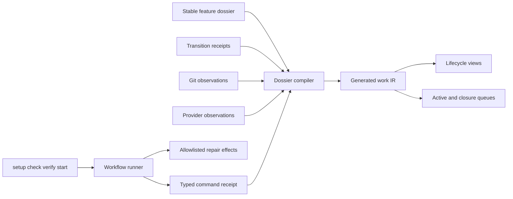

# Design spec 0058: feature dossier workflow

Status: frozen

Date: 2026-08-02

Depends-On-Feature-IDs: 0055-lifecycle-plan-layout

Replaces-Feature-IDs: 0055-lifecycle-plan-layout

Migrates-Feature-IDs: 0001-inventory-resolution-tracer, 0002-reference-baselines-deep-research, 0003-independent-resolution-checker, 0004-reference-source-custody, 0005-autonomous-development-control-loop, 0007-reuse-first-engineering, 0010-typescript-effect-v4-runtime, 0011-effect-v4-oxlint-domains, 0012-minimal-actor-runtime, 0013-bounded-actor-trace-retention, 0014-stm-effect-handler-laws, 0015-open-semantic-system-design-lens, 0016-executable-semantic-system-kernel, 0017-control-room-reconstruction, 0018-minimal-kernel-calculus, 0019-normalized-core-format, 0020-agent-facing-kernel-json, 0020-lossless-kernel-source, 0021-pbk-portfolio-control-room, 0022-kernel-reference-interpreter, 0031-control-room-interactive-skill-tree, 0046-effect-graph-execution-index, 0048-pbk-control-room-acceptance-reconciliation, 0049-canonical-work-lifecycle, 0050-bounded-stm-runtime, 0051-kernel-finite-sums, 0052-stm-schedule-explorer, 0053-relational-fact-export, 0054-semantic-contract-wit-mapping, 0055-lifecycle-plan-layout, 0056-project-json-language-tooling, 0057-control-room-agent-observation-correlation

Design-Lens-Version: open-semantic-system-v1

## Problem

The repository authors feature lifecycle state in several mutable locations.
These locations include model JSON, lifecycle directories, plan headings, and
status fields. The duplication creates stale indexes, path churn, and false
completion claims.

The local development commands also separate detection from deterministic
repair. Agents must manually run formatters and safe lint fixes before the same
checks can pass.

This feature replaces both sources of friction. A stable feature dossier owns
the authored lifecycle artifacts. Typed observations derive the lifecycle
view. The local `check` command repairs only known deterministic defects.
Authoritative verification never repairs its evidence.

## Felt journey

An agent starts one feature in `features/0058-feature-dossier-workflow/`. The
agent writes the proposal, research, design, specification, implementation
report, and verification artifacts without moving the directory.

The project model derives the current phase and readiness from accepted
artifact receipts. A file name alone cannot advance the feature. The active
index updates without a status edit.

The agent runs `just check`. The command formats changed files, applies safe
lint fixes, regenerates affected views, and reports all repairs. The command
then validates the repaired tree. The agent runs `just verify` before delivery.
That command observes an exact clean head and does not modify it.

After the candidate reaches canonical `main`, the feature view shows `done`.
Post-merge feedback and cleanup remain visible in a separate closure queue.

## Open semantic system design lens

### Boundary and warranted state

The feature contains two deep modules:

1. the feature-dossier compiler; and
2. the repository workflow runner.

The compiler owns strict artifact decoding, receipt decoding, lifecycle
derivation, invalidation, and deterministic project-model IR. It warrants only
facts supported by accepted repository artifacts and supplied observations.

The workflow runner owns command policy, repair allowlists, affected-path
selection, bounded execution, and typed command receipts. It warrants only the
observed result of one command in one declared mode.

Git providers, protected checks, reviews, merge authority, operator messages,
agent sessions, and worktrees remain environmental. Missing provider data
produces `unknown`. It never produces a successful transition.

### Semantic inputs

The dossier compiler accepts:

- one stable feature directory;
- authored Markdown artifacts with strict frontmatter;
- typed transition receipts bound to artifact blob hashes;
- one exact repository-head observation;
- optional provider observations; and
- optional closure observations.

The stable directory name supplies the feature ID. Frontmatter must not repeat
a mutable lifecycle status.

Each artifact owns one vocabulary:

| Artifact                     | Owned meaning                                                |
| ---------------------------- | ------------------------------------------------------------ |
| `proposal.md`                | proposed objective, owner, dependencies, and feature profile |
| `research.md` or `research/` | evidence, alternatives, and open uncertainty                 |
| `design.md`                  | selected structure and rationale                             |
| `spec.md`                    | normative contract, scope, falsifiers, and acceptance        |
| `plan.md`                    | mutable execution state and bounded implementation slices    |
| `implementation-report.md`   | candidate revision and observed semantic diff                |
| `accept.ts`                  | executable positive, rejection, and adversarial oracles      |
| `verification/`              | exact-revision observations and evidence categories          |
| `transitions/`               | typed lifecycle and historical-import receipts               |

A simple feature profile can omit separate research or design artifacts. The
profile cannot omit the normative specification or exact-revision verification.

Each Markdown artifact declares its artifact schema in frontmatter. Transition
receipts use `semantic.feature-transition/v1`. Unknown versions fail decoding.
Schema migrations are explicit, versioned transformations with fixture tests.

The workflow runner accepts:

- `setup`, `check`, `verify`, or `start`;
- a repository identity and exact working-tree observation;
- an optional feature ID;
- an execution mode;
- the checked repair policy; and
- the checked impact graph.

### Semantic outputs

The dossier compiler emits:

- normalized feature facts;
- a deterministic work-graph IR;
- a derived lifecycle projection;
- invalidation edges;
- active, review, merge, and closure queues; and
- typed diagnostics with source locations.

The checked-in work IR contains only dossier and receipt facts from the selected
tree. `generated/project-model/work-features.json` is its single materialized
JSON projection. Live Git, provider, delivery, and closure observations form a
query-time overlay. They never create checked-in generated drift.

The migration changes each canonical path:

| Before                               | After                                                           |
| ------------------------------------ | --------------------------------------------------------------- |
| `design-specs/<feature>.md`          | `features/<feature>/spec.md`                                    |
| `plans/<lifecycle>/<feature>.md`     | `features/<feature>/plan.md`                                    |
| `model/work/features/<feature>.json` | generated entry in `generated/project-model/work-features.json` |
| `scripts/accept/<feature>.ts`        | `features/<feature>/accept.ts`                                  |

The design-lens shape gate reads `features/*/spec.md`. Acceptance resolution
reads `features/*/accept.ts`. No final reader accepts an old path.

The workflow runner emits:

- a typed verdict of `prepared`, `started`, `clean`, `repaired`, or `failed`;
- the exact input and output tree identities;
- every changed path;
- every executed check and repair;
- evidence categories; and
- unsupported claims.

A repair is an effect. A successful repair is not exact-head verification.

### Effect protocols and uncertainty

A transition receipt binds the feature ID, artifact kind, artifact blob hash,
transition kind, issuer identity, authority role, time, and evidence category.
The checked transition policy maps each transition to its required authority
role. An unauthorized or unauthenticated receipt cannot advance lifecycle
state. It remains an inspectable assertion with a diagnostic.

Repeated receipt ingestion is idempotent by receipt identity. Conflicting
receipts fail closed. An implementation agent cannot accept its own normative
specification or independent review.

A changed accepted artifact no longer matches its receipt. The compiler
invalidates all dependent implementation and verification facts. An authorized
receipt for the new blob can establish a new state.

Migration uses `semantic.feature-historical-import/v1`. The import binds the
old artifact paths, blob hashes, status, completion evidence, and integration
revision. The operator-approved migration role can preserve those historical
facts. The import retains each prior evidence category and unsupported claim.
It cannot satisfy a new feature transition.

The transition policy also defines:

- `feature_withdrawn`, which requires the owning integration role and a reason;
- `feature_superseded`, which also requires a valid replacement feature ID; and
- `closure_observed`, which requires separate feedback and cleanup observations.

Closure becomes `closed` only after both closure observations are accepted.

Provider actions use request and observation pairs. A requested check, review,
merge, message, or cleanup action does not establish its outcome. Timeout and
transport failure produce `unknown`. A later observation can reconcile that
state.

The repair runner snapshots the tree before each fixer. It rejects a changed
path outside the declared output set. It runs each fixer at most twice. A
second change after the second run produces a non-idempotent-repair failure.

### Components and orthogonal structures



The diagram separates authored artifacts, external observations, generated IR,
and repair effects.

The following structures remain distinct:

- feature phase;
- review readiness;
- blocking condition;
- delivery state;
- closure state;
- dependency graph; and
- artifact derivation and invalidation graph.

The user interface can project these structures into one pipeline. The IR
retains the source receipt or observation for each projected value. Existing
ownership and evidence graphs remain linked external domains. This feature does
not reconstruct them.

### Bounded autonomy and resources

One feature directory has one stable identity. Each artifact has one active
blob and a finite receipt history. Compiler traversal is bounded by repository
files and configured size limits.

`check` operates only on changed or affected paths. Its repair set is finite
and checked in. The initial repair set contains:

- Oxfmt writes;
- Oxlint safe fixes; and
- deterministic generated-view regeneration.

`check` never stages, commits, deletes, migrates data, changes dependencies,
rewrites lockfiles, accepts snapshots, or performs provider effects.

`verify` requires a clean tracked tree and an exact base and head. It runs in
observe-only mode. It fails when any command changes the tree.

### Command contract

| Command                | Mode      | Allowed effects                                                                        | Result                           |
| ---------------------- | --------- | -------------------------------------------------------------------------------------- | -------------------------------- |
| `just setup`           | `mutate`  | install pinned dependencies, configure checked hooks, and write ignored setup receipts | `prepared` or `failed`           |
| `just check`           | `repair`  | run allowlisted deterministic repairs on changed or affected paths                     | `clean`, `repaired`, or `failed` |
| `just verify`          | `observe` | run the exact delivery simulation and emit a revision-bound receipt                    | `clean` or `failed`              |
| `just start <feature>` | `mutate`  | create one isolated branch and worktree after contract checks                          | `started` or `failed`            |

`.envrc` can run `just setup --if-needed` from a checked setup fingerprint. It
cannot create a branch or worktree. A direct `just setup` reports each local
mutation.

`just start` requires a frozen specification, one active plan, a unique feature
ID, an existing exact base, and no conflicting branch or worktree. It creates
at most one branch, one worktree, and one local lease. A repeated request
returns the existing matching checkout or fails on conflicting identity.

`just check` always runs cheap repository invariants. It selects additional
checks from the checked impact graph. An unknown path selects the larger set.

`just verify` resolves the exact base, head, feature dossier, and event context.
It runs full checks, acceptance, claim-specific assurance, and tree-cleanliness
checks. A local receipt remains preflight evidence. Protected CI remains merge
authority.

### Evidence, assumptions, and unsupported claims

Schema decoding and lifecycle laws provide static-analysis and test evidence.
Fixture execution and command runs provide runtime-validation evidence. Review
remains assertion. Provider observations retain their provider provenance.

The design assumes that Git blob identities and commit reachability are
available. Receipt authentication and provider authorization remain
environmental observations. If an authority observation is unavailable, the
compiler reports `unknown` and does not advance an authority-required
transition.

This feature does not prove:

- semantic correctness of a proposal, design, specification, or implementation;
- reviewer independence;
- provider honesty;
- complete test coverage;
- successful merge from a merge request alone;
- successful cleanup from an agent completion message; or
- future behavior from one successful command.

## Deep-module contract

```ts
compileFeatureDossier(input: FeatureDossierInput): Effect<
  FeatureDossierArtifact,
  FeatureDossierError,
  FileSystem | Path
>

runRepositoryWorkflow(input: WorkflowInput): Effect<
  WorkflowReceipt,
  WorkflowError,
  FileSystem | Path | CommandExecutor
>
```

`FeatureDossierArtifact` contains normalized facts, deterministic IR bytes,
lifecycle projections, invalidations, and diagnostics. Callers do not parse
Markdown, infer lifecycle from paths, or join receipts themselves.

`WorkflowInput.mode` is `mutate`, `repair`, or `observe`. `setup` and `start`
use `mutate`. `check` uses `repair` by default. Hooks, CI, and `verify` use
`observe`.

`semproj feature validate --feature <id>` is the CLI projection of
`compileFeatureDossier`. It decodes the live dossier, checks receipt hashes and
authority roles, and reports every derived value with its source.

## Lifecycle derivation

Phase, readiness, condition, delivery, and closure are separate values.

| Dimension | Values                                                                                                               |
| --------- | -------------------------------------------------------------------------------------------------------------------- |
| Phase     | `proposal`, `research`, `design`, `implementation`, `verification`                                                   |
| Readiness | `drafting`, `proposal_review_ready`, `design_review_ready`, `implementation_review_ready`, `accepted`, `merge_ready` |
| Condition | `active`, `blocked`, `withdrawn`, `superseded`                                                                       |
| Delivery  | `unmerged`, `done`                                                                                                   |
| Closure   | `open`, `closed`                                                                                                     |

The primary projection follows these accepted observations:

```text
accepted proposal
-> research or design
-> accepted frozen specification
-> implementation
-> nominated candidate revision
-> verification
-> authorized independent review and protected exact-revision checks
-> merge ready
-> candidate reachable from canonical main
-> done
```

`done` means delivered through merge. Operator feedback and execution cleanup
can remain `open` in the closure queue. They do not revert delivery.

A generic `ready_for_review` state is prohibited. Design review and
implementation review accept different artifacts and have different effects.

`feature_withdrawn` and `feature_superseded` set terminal conditions without
inventing delivery. Supersession requires a replacement reference.
`closure_observed` closes the closure queue only after feedback and cleanup.

## Oracle-first counterexamples

1. An empty or undecodable artifact in `verification/` does not advance a feature.
2. A feature directory moved to a lifecycle-named directory does not advance it.
3. A valid specification receipt advances the matching blob only.
4. An implementation-agent receipt cannot accept its own specification or review.
5. An edit to a frozen specification invalidates candidate and verification facts.
6. A blocked condition does not erase the current phase.
7. A merge request without a merge observation does not produce `done`.
8. A fixed synthetic main observation produces `done` while cleanup remains open.
9. Two compilations with the same tree and observation snapshot produce byte-identical IR.
10. Historical imports preserve evidence categories but cannot authorize new work.
11. Supersession without a valid replacement fails.
12. Closure remains open when feedback or cleanup is missing.
13. `check` repairs a format defect and reports `repaired` with the changed path.
14. `check` rejects a fixer that changes an undeclared path.
15. `check` rejects a non-idempotent fixer after the bounded second run.
16. `verify` rejects a dirty tree and never repairs it.
17. An unknown changed path selects the larger check set. It never skips work.
18. `start` rejects a duplicate identity with a conflicting base or worktree.

## Acceptance

1. A synthetic fixture dossier advances from proposal through `done` against a fixed observation snapshot.
2. The real 0058 dossier reaches `merge_ready` before merge.
3. A post-merge observation reports the real feature as `done` with closure still open.
4. The compiler generates deterministic work IR and active indexes from dossier artifacts and receipts.
5. File presence and directory placement cannot self-author lifecycle state.
6. A frozen-artifact edit invalidates all dependent facts.
7. Historical imports preserve prior evidence without authorizing new transitions.
8. Existing feature records, plans, design specs, and acceptance programs migrate without aliases or dual authority.
9. `just check` applies only allowlisted deterministic repairs and reports every changed path.
10. `just verify` runs the exact delivery simulation without modifying the tree.
11. Hooks and CI use observe-only execution.
12. Contributor and agent guidance names only `setup`, `check`, `verify`, and explicit feature lifecycle commands.

One acceptance program exists at each accepted head. Before cutover, it is
`scripts/accept/0058-feature-dossier-workflow.ts`. The atomic cutover moves that
same program to `features/0058-feature-dossier-workflow/accept.ts` and changes
the resolver in the same commit. The post-cutover head contains no old program.

## Kill or redesign criteria

- A filename or directory move can establish acceptance or completion.
- Generated IR becomes a second authoring source.
- A local repair result can authorize merge.
- Repair policy permits semantic edits or undeclared paths.
- A changed frozen artifact retains stale implementation evidence.
- Provider unavailability becomes success.
- The scalar lifecycle projection hides phase, readiness, condition, delivery, or closure facts.
- Migration requires permanent aliases or readers for both layouts.

## Non-goals

- Proving artifact semantics.
- Replacing Git or the pull-request provider.
- Building a general workflow engine.
- Adding distributed receipt storage in the first slice.
- Adding remote build caches before measured need.
- Deriving feature identity from branch names.
- Treating telemetry as workflow authority.
- Reconstructing the general ownership, evidence, or effect-request graphs.

## Semantic diff

Before this feature, model JSON authors lifecycle status. Plans move between
lifecycle directories. Several files repeat status and path facts. Local checks
do not repair known deterministic defects.

After this feature, a stable dossier authors feature artifacts. Typed receipts
and external observations derive lifecycle facts. Work JSON is generated IR.
`check` performs bounded deterministic repair. `verify` remains read-only and
exact-head.

Before cutover, the legacy validator requires one bootstrap model record for
feature 0058. That record repeats the current phase and acceptance criteria and
labels itself as legacy input. The atomic cutover removes it with all other
authored work JSON.

This feature supersedes design spec 0055. The cutover marks 0055 as superseded,
transfers managed-lifecycle ownership, and invalidates its path-layout
acceptance. This feature also amends the four canonical artifact paths in
design spec 0005. It does not change evidence-category meanings, language
semantics, operator effect authority, or merge authority.

Revision 1, 2026-08-02: adversarial review found incomplete migration custody,
receipt authority, query-time observation, command, and acceptance rules. This
revision declares the full migration set, path mapping, historical imports,
terminal transitions, atomic acceptance move, and pre-merge versus post-merge
observations. All review evidence for the earlier draft is invalidated.
