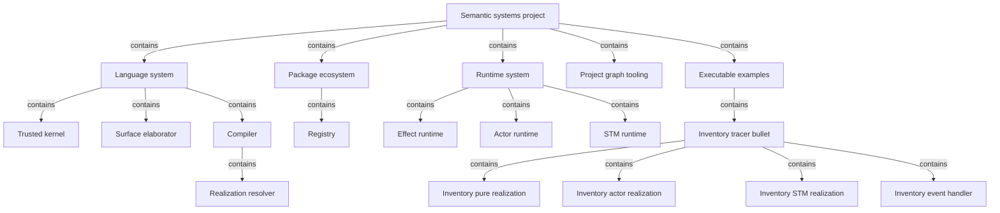

# System map

<!-- Generated. Edit model sources, not this file. -->

Recursive component and package containment.

```mermaid
flowchart TD
    component_compiler["Compiler"]
    component_ecosystem["Package ecosystem"]
    component_elaborator["Surface elaborator"]
    component_examples["Executable examples"]
    component_inventory["Inventory tracer bullet"]
    component_kernel["Trusted kernel"]
    component_language["Language system"]
    component_project["Semantic systems project"]
    component_project_model["Project graph tooling"]
    component_registry["Registry"]
    component_resolver["Realization resolver"]
    component_runtime["Runtime system"]
    handler_inventory_events["Inventory event handler"]
    realization_inventory_actor["Inventory actor realization"]
    realization_inventory_pure["Inventory pure realization"]
    realization_inventory_stm["Inventory STM realization"]
    runtime_actors["Actor runtime"]
    runtime_effects["Effect runtime"]
    runtime_stm["STM runtime"]
    component_project -->|contains| component_language
    component_project -->|contains| component_ecosystem
    component_project -->|contains| component_runtime
    component_project -->|contains| component_project_model
    component_project -->|contains| component_examples
    component_language -->|contains| component_kernel
    component_language -->|contains| component_elaborator
    component_language -->|contains| component_compiler
    component_compiler -->|contains| component_resolver
    component_ecosystem -->|contains| component_registry
    component_runtime -->|contains| runtime_effects
    component_runtime -->|contains| runtime_actors
    component_runtime -->|contains| runtime_stm
    component_examples -->|contains| component_inventory
    component_inventory -->|contains| realization_inventory_pure
    component_inventory -->|contains| realization_inventory_actor
    component_inventory -->|contains| realization_inventory_stm
    component_inventory -->|contains| handler_inventory_events
```
