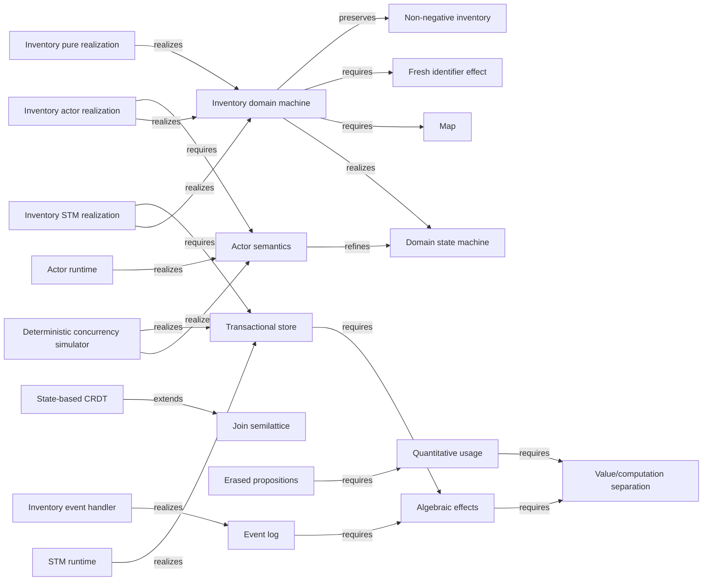

# Theory-realization map

<!-- Generated. Edit model sources, not this file. -->

Semantic contracts and executable interpretations.

```mermaid
flowchart LR
    domain_inventory_machine["Inventory domain machine"]
    effect_fresh["Fresh identifier effect"]
    handler_inventory_events["Inventory event handler"]
    invariant_inventory_nonnegative["Non-negative inventory"]
    realization_inventory_actor["Inventory actor realization"]
    realization_inventory_pure["Inventory pure realization"]
    realization_inventory_stm["Inventory STM realization"]
    runtime_actors["Actor runtime"]
    runtime_deterministic_simulator["Deterministic concurrency simulator"]
    runtime_stm["STM runtime"]
    theory_actor["Actor semantics"]
    theory_cbpv["Value/computation separation"]
    theory_crdt["State-based CRDT"]
    theory_effects["Algebraic effects"]
    theory_event_log["Event log"]
    theory_join["Join semilattice"]
    theory_machine["Domain state machine"]
    theory_map["Map"]
    theory_prop["Erased propositions"]
    theory_stm["Transactional store"]
    theory_usage["Quantitative usage"]
    runtime_actors -->|realizes| theory_actor
    runtime_stm -->|realizes| theory_stm
    realization_inventory_pure -->|realizes| domain_inventory_machine
    realization_inventory_actor -->|realizes| domain_inventory_machine
    realization_inventory_actor -->|requires| theory_actor
    realization_inventory_stm -->|realizes| domain_inventory_machine
    realization_inventory_stm -->|requires| theory_stm
    handler_inventory_events -->|realizes| theory_event_log
    runtime_deterministic_simulator -->|realizes| theory_actor
    runtime_deterministic_simulator -->|realizes| theory_stm
    theory_effects -->|requires| theory_cbpv
    theory_usage -->|requires| theory_cbpv
    theory_prop -->|requires| theory_usage
    theory_actor -->|refines| theory_machine
    theory_stm -->|requires| theory_effects
    theory_event_log -->|requires| theory_effects
    theory_crdt -->|extends| theory_join
    domain_inventory_machine -->|realizes| theory_machine
    domain_inventory_machine -->|requires| theory_map
    domain_inventory_machine -->|requires| effect_fresh
    domain_inventory_machine -->|preserves| invariant_inventory_nonnegative
```
