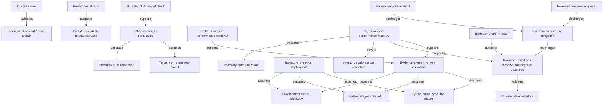

# Evidence and trust map

<!-- Generated. Edit model sources, not this file. -->

```mermaid
flowchart TD
    artifact_normalized_core["Normalized semantic core artifact"]
    assumption_inventory_fixture_coverage["Development fixture adequacy"]
    assumption_inventory_integer_arithmetic["Fixture integer arithmetic"]
    assumption_inventory_python_adapter["Python builtin execution adapter"]
    assumption_memory_model["Target atomic memory model"]
    claim_inventory_invariant["Inventory transitions preserve non-negative quantities"]
    claim_inventory_resolution["Evidence-aware inventory resolution"]
    claim_model_valid["Bootstrap model is structurally valid"]
    claim_stm_serializable["STM commits are serializable"]
    component_kernel["Trusted kernel"]
    deployment_inventory_reference["Inventory reference deployment"]
    evidence_inventory_broken_conformance_v0["Broken inventory conformance result v0"]
    evidence_inventory_proof["Inventory preservation proof"]
    evidence_inventory_pure_conformance_v0["Pure inventory conformance result v0"]
    evidence_inventory_tests["Inventory property tests"]
    evidence_model_tests["Project model tests"]
    evidence_stm_model["Bounded STM model check"]
    invariant_inventory_nonnegative["Non-negative inventory"]
    obligation_inventory_conformance["Inventory conformance obligation"]
    obligation_inventory_proof["Inventory preservation obligation"]
    realization_inventory_pure["Inventory pure realization"]
    realization_inventory_stm["Inventory STM realization"]
    work_inventory_proof["Prove inventory invariant"]
    component_kernel -->|validates| artifact_normalized_core
    evidence_model_tests -->|supports| claim_model_valid
    obligation_inventory_proof -->|discharges| claim_inventory_invariant
    evidence_inventory_tests -->|supports| claim_inventory_invariant
    evidence_inventory_proof -->|discharges| obligation_inventory_proof
    evidence_stm_model -->|supports| claim_stm_serializable
    claim_stm_serializable -->|assumes| assumption_memory_model
    claim_inventory_invariant -->|validates| invariant_inventory_nonnegative
    claim_stm_serializable -->|validates| realization_inventory_stm
    evidence_inventory_pure_conformance_v0 -->|supports| claim_inventory_resolution
    evidence_inventory_broken_conformance_v0 -->|supports| claim_inventory_resolution
    evidence_inventory_pure_conformance_v0 -->|supports| claim_inventory_invariant
    evidence_inventory_pure_conformance_v0 -->|covers| obligation_inventory_conformance
    evidence_inventory_pure_conformance_v0 -->|validates| realization_inventory_pure
    claim_inventory_resolution -->|assumes| assumption_inventory_python_adapter
    claim_inventory_resolution -->|assumes| assumption_inventory_integer_arithmetic
    claim_inventory_resolution -->|assumes| assumption_inventory_fixture_coverage
    deployment_inventory_reference -->|assumes| assumption_inventory_python_adapter
    deployment_inventory_reference -->|assumes| assumption_inventory_integer_arithmetic
    deployment_inventory_reference -->|assumes| assumption_inventory_fixture_coverage
    work_inventory_proof -->|discharges| obligation_inventory_proof
```

## Unsupported claims

- `claim.kernel.safety` — Kernel preserves typing
