# Work dependencies

```mermaid
flowchart LR
    decision_gated_autonomous_merges["Gate autonomous feature merges"]
    decision_one_shot["One-shot handlers by default"]
    decision_stm_library["STM is a library effect"]
    decision_theory_identity["Laws participate in semantic identity"]
    work_actor_runtime["Implement minimal actor runtime"]
    work_agent_facing_kernel_json["Design agent-facing kernel JSON"]
    work_autonomous_development_loop["Establish the autonomous development control loop"]
    work_baseline_bytecode_backend["Compile and independently execute baseline kernel bytecode"]
    work_control_room_alchemy_cli_compat["Align Control Room with the pinned Alchemy CLI"]
    work_control_room_interactive_skill_tree["Render the PBK roadmap as an interactive skill tree"]
    work_control_room_pinned_alchemy_workspace["Bind Control Room deploy to pinned Alchemy"]
    work_control_room_reconstruction["Reconstruct the Control Room on TypeScript and Effect v4"]
    work_core_checker["Implement core checker"]
    work_deterministic_simulator_spec["Design deterministic concurrency simulator"]
    work_effect_graph_execution_index["Adopt Effect Graph as a portfolio execution index"]
    work_executable_semantic_system_kernel["Build the executable semantic system kernel"]
    work_explorer_query_contract["Specify explorer query contract"]
    work_inventory_actor["Implement inventory actor realization"]
    work_inventory_design["Complete inventory domain contract"]
    work_inventory_proof["Prove inventory invariant"]
    work_inventory_pure["Implement pure inventory realization"]
    work_inventory_resolution_tracer["Complete inventory evidence-resolution tracer"]
    work_inventory_stm["Implement inventory STM realization"]
    work_kernel_reference_interpreter["Establish the kernel reference interpreter"]
    work_kernel_runner_cli["Expose the kernel reference interpreter as a command"]
    work_kernel_spec["Specify minimal kernel calculus"]
    work_lean_evidence_adapter["Specify Lean evidence adapter"]
    work_lossless_frontend_spec["Design lossless incremental frontend"]
    work_normalized_core_format["Specify normalized core artifact"]
    work_one_shot_external_effect_replay["Replay external effects through affine continuations"]
    work_package_resolver["Implement package and evidence resolver"]
    work_pbk_portfolio_control_room["Build PBK Technologies portfolio Control Room"]
    work_reachability_analysis_receipt["Derive a declared reachability analysis receipt"]
    work_relational_fact_schema["Define relational fact export"]
    work_reproducible_action_observation_receipt["Execute a reproducible closure action and record its observation"]
    work_resource_lifecycle_law_tracer["Establish resource lifecycle handler laws"]
    work_semantic_artifact_store["Establish the semantic artifact store tracer"]
    work_semantic_attestation_profile["Specify semantic attestation profile"]
    work_semantic_runtime_closure_manifest["Assemble a semantic runtime-closure manifest"]
    work_semantic_surface_language["Establish the Semantic surface language"]
    work_stm_laws["Specify STM effect and handler laws"]
    work_stm_model_check["Model-check STM interleavings"]
    work_stm_runtime["Implement minimal STM runtime"]
    work_surface_effect_driver_cli["Drive readable Semantic effects from a command"]
    work_surface_effect_replay["Replay external effects from readable Semantic source"]
    work_surface_runner_cli["Run readable Semantic source from a command"]
    work_theory_identity["Define normalized theory identity"]
    work_translation_validation_spec["Specify translation-validation seams"]
    work_user_defined_algebra_frontier["Define the user algebra promotion frontier"]
    work_wasm_contract_mapping["Research semantic contracts to WIT mapping"]
    work_baseline_bytecode_backend -->|requires| work_kernel_reference_interpreter
    work_baseline_bytecode_backend -->|requires| work_agent_facing_kernel_json
    work_control_room_alchemy_cli_compat -->|requires| work_pbk_portfolio_control_room
    work_control_room_interactive_skill_tree -->|requires| work_pbk_portfolio_control_room
    work_control_room_pinned_alchemy_workspace -->|requires| work_control_room_alchemy_cli_compat
    decision_gated_autonomous_merges -->|informs| work_autonomous_development_loop
    work_effect_graph_execution_index -->|requires| work_pbk_portfolio_control_room
    work_executable_semantic_system_kernel -->|blocks| work_actor_runtime
    work_inventory_resolution_tracer -->|requires| decision_theory_identity
    work_kernel_reference_interpreter -->|requires| work_agent_facing_kernel_json
    work_kernel_runner_cli -->|requires| work_agent_facing_kernel_json
    work_kernel_runner_cli -->|requires| work_kernel_reference_interpreter
    work_one_shot_external_effect_replay -->|requires| work_kernel_reference_interpreter
    work_one_shot_external_effect_replay -->|requires| work_baseline_bytecode_backend
    work_pbk_portfolio_control_room -->|requires| work_control_room_reconstruction
    work_reachability_analysis_receipt -->|requires| work_semantic_artifact_store
    work_normalized_core_format -->|blocks| work_kernel_spec
    work_lossless_frontend_spec -->|blocks| work_normalized_core_format
    work_agent_facing_kernel_json -->|blocks| work_normalized_core_format
    work_agent_facing_kernel_json -->|informs| work_lossless_frontend_spec
    work_lean_evidence_adapter -->|blocks| work_normalized_core_format
    work_translation_validation_spec -->|blocks| work_normalized_core_format
    work_semantic_attestation_profile -->|blocks| work_theory_identity
    work_wasm_contract_mapping -->|blocks| work_normalized_core_format
    work_deterministic_simulator_spec -->|blocks| work_stm_laws
    work_explorer_query_contract -->|informs| work_relational_fact_schema
    work_reproducible_action_observation_receipt -->|requires| work_semantic_runtime_closure_manifest
    work_resource_lifecycle_law_tracer -->|requires| work_user_defined_algebra_frontier
    work_semantic_artifact_store -->|requires| work_normalized_core_format
    work_semantic_runtime_closure_manifest -->|requires| work_reachability_analysis_receipt
    work_semantic_runtime_closure_manifest -->|requires| work_semantic_artifact_store
    work_semantic_surface_language -->|requires| work_agent_facing_kernel_json
    work_semantic_surface_language -->|requires| work_kernel_reference_interpreter
    work_surface_effect_driver_cli -->|requires| work_semantic_surface_language
    work_surface_effect_driver_cli -->|requires| work_one_shot_external_effect_replay
    work_surface_effect_driver_cli -->|requires| work_surface_runner_cli
    work_surface_effect_replay -->|requires| work_semantic_surface_language
    work_surface_effect_replay -->|requires| work_one_shot_external_effect_replay
    work_surface_runner_cli -->|requires| work_semantic_surface_language
    work_surface_runner_cli -->|requires| work_kernel_reference_interpreter
    work_user_defined_algebra_frontier -->|requires| work_kernel_spec
    work_user_defined_algebra_frontier -->|requires| work_semantic_surface_language
    work_stm_laws -->|blocks| work_user_defined_algebra_frontier
    work_user_defined_algebra_frontier -->|informs| decision_stm_library
    work_core_checker -->|blocks| work_kernel_spec
    work_kernel_spec -->|requires| decision_one_shot
    work_theory_identity -->|requires| decision_theory_identity
    work_package_resolver -->|blocks| work_theory_identity
    work_inventory_pure -->|blocks| work_inventory_design
    work_inventory_actor -->|blocks| work_inventory_design
    work_inventory_actor -->|blocks| work_actor_runtime
    work_stm_laws -->|informs| decision_stm_library
    work_stm_runtime -->|blocks| work_stm_laws
    work_inventory_stm -->|blocks| work_inventory_design
    work_inventory_stm -->|blocks| work_stm_runtime
    work_inventory_proof -->|blocks| work_inventory_design
    work_stm_model_check -->|blocks| work_stm_runtime
```

<!-- Generated. Edit model sources, not this file. -->

## Weighted critical path

Define the user algebra promotion frontier → Specify STM effect and handler laws → Implement minimal STM runtime → Model-check STM interleavings
