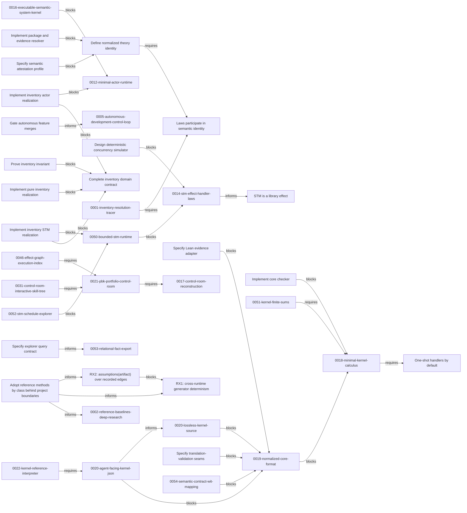

# Work dependencies

<!-- Generated. Edit model sources, not this file. -->

```mermaid
flowchart LR
    decision_gated_autonomous_merges["Gate autonomous feature merges"]
    decision_one_shot["One-shot handlers by default"]
    decision_reference_method_adoption["Adopt reference methods by class behind project boundaries"]
    decision_stm_library["STM is a library effect"]
    decision_theory_identity["Laws participate in semantic identity"]
    work_actor_runtime["0012-minimal-actor-runtime"]
    work_agent_facing_kernel_json["0020-agent-facing-kernel-json"]
    work_autonomous_development_loop["0005-autonomous-development-control-loop"]
    work_control_room_interactive_skill_tree["0031-control-room-interactive-skill-tree"]
    work_control_room_reconstruction["0017-control-room-reconstruction"]
    work_core_checker["Implement core checker"]
    work_deterministic_simulator_spec["Design deterministic concurrency simulator"]
    work_effect_graph_execution_index["0046-effect-graph-execution-index"]
    work_executable_semantic_system_kernel["0016-executable-semantic-system-kernel"]
    work_explorer_query_contract["Specify explorer query contract"]
    work_inventory_actor["Implement inventory actor realization"]
    work_inventory_design["Complete inventory domain contract"]
    work_inventory_proof["Prove inventory invariant"]
    work_inventory_pure["Implement pure inventory realization"]
    work_inventory_resolution_tracer["0001-inventory-resolution-tracer"]
    work_inventory_stm["Implement inventory STM realization"]
    work_kernel_finite_sums["0051-kernel-finite-sums"]
    work_kernel_reference_interpreter["0022-kernel-reference-interpreter"]
    work_kernel_spec["0018-minimal-kernel-calculus"]
    work_lean_evidence_adapter["Specify Lean evidence adapter"]
    work_lossless_frontend_spec["0020-lossless-kernel-source"]
    work_normalized_core_format["0019-normalized-core-format"]
    work_package_resolver["Implement package and evidence resolver"]
    work_pbk_portfolio_control_room["0021-pbk-portfolio-control-room"]
    work_reference_baselines_deep_research["0002-reference-baselines-deep-research"]
    work_relational_fact_schema["0053-relational-fact-export"]
    work_rx1_generator_determinism["RX1: cross-runtime generator determinism"]
    work_rx2_assumption_query["RX2: assumptions(artifact) over recorded edges"]
    work_semantic_attestation_profile["Specify semantic attestation profile"]
    work_stm_laws["0014-stm-effect-handler-laws"]
    work_stm_model_check["0052-stm-schedule-explorer"]
    work_stm_runtime["0050-bounded-stm-runtime"]
    work_theory_identity["Define normalized theory identity"]
    work_translation_validation_spec["Specify translation-validation seams"]
    work_wasm_contract_mapping["0054-semantic-contract-wit-mapping"]
    work_control_room_interactive_skill_tree -->|requires| work_pbk_portfolio_control_room
    decision_gated_autonomous_merges -->|informs| work_autonomous_development_loop
    work_effect_graph_execution_index -->|requires| work_pbk_portfolio_control_room
    work_executable_semantic_system_kernel -->|blocks| work_actor_runtime
    work_inventory_resolution_tracer -->|requires| decision_theory_identity
    work_kernel_finite_sums -->|requires| work_kernel_spec
    work_kernel_reference_interpreter -->|requires| work_agent_facing_kernel_json
    work_pbk_portfolio_control_room -->|requires| work_control_room_reconstruction
    work_normalized_core_format -->|blocks| work_kernel_spec
    work_lossless_frontend_spec -->|blocks| work_normalized_core_format
    work_agent_facing_kernel_json -->|blocks| work_normalized_core_format
    work_agent_facing_kernel_json -->|informs| work_lossless_frontend_spec
    work_lean_evidence_adapter -->|blocks| work_normalized_core_format
    work_translation_validation_spec -->|blocks| work_normalized_core_format
    work_semantic_attestation_profile -->|blocks| work_theory_identity
    work_wasm_contract_mapping -->|blocks| work_normalized_core_format
    work_deterministic_simulator_spec -->|blocks| work_stm_laws
    work_explorer_query_contract -->|informs| work_relational_fact_schema
    decision_reference_method_adoption -->|informs| work_reference_baselines_deep_research
    decision_reference_method_adoption -->|informs| work_rx1_generator_determinism
    decision_reference_method_adoption -->|informs| work_rx2_assumption_query
    work_rx2_assumption_query -->|blocks| work_rx1_generator_determinism
    work_core_checker -->|blocks| work_kernel_spec
    work_kernel_spec -->|requires| decision_one_shot
    work_theory_identity -->|requires| decision_theory_identity
    work_package_resolver -->|blocks| work_theory_identity
    work_inventory_pure -->|blocks| work_inventory_design
    work_inventory_actor -->|blocks| work_inventory_design
    work_inventory_actor -->|blocks| work_actor_runtime
    work_stm_laws -->|informs| decision_stm_library
    work_stm_runtime -->|blocks| work_stm_laws
    work_inventory_stm -->|blocks| work_inventory_design
    work_inventory_stm -->|blocks| work_stm_runtime
    work_inventory_proof -->|blocks| work_inventory_design
    work_stm_model_check -->|blocks| work_stm_runtime
```

## Weighted critical path

Define normalized theory identity → Implement package and evidence resolver
