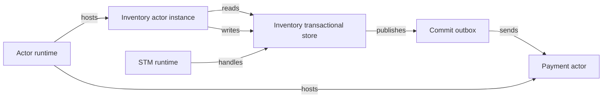

# Runtime interaction view

<!-- Generated. Edit model sources, not this file. -->

Actor ownership, STM access, commit publication, and message delivery.

```mermaid
flowchart LR
    runtime_actors["Actor runtime"]
    runtime_inventory_actor["Inventory actor instance"]
    runtime_inventory_outbox["Commit outbox"]
    runtime_inventory_store["Inventory transactional store"]
    runtime_payment_actor["Payment actor"]
    runtime_stm["STM runtime"]
    runtime_inventory_actor -->|reads| runtime_inventory_store
    runtime_inventory_actor -->|writes| runtime_inventory_store
    runtime_stm -->|handles| runtime_inventory_store
    runtime_inventory_store -->|publishes| runtime_inventory_outbox
    runtime_inventory_outbox -->|sends| runtime_payment_actor
    runtime_actors -->|hosts| runtime_inventory_actor
    runtime_actors -->|hosts| runtime_payment_actor
```
